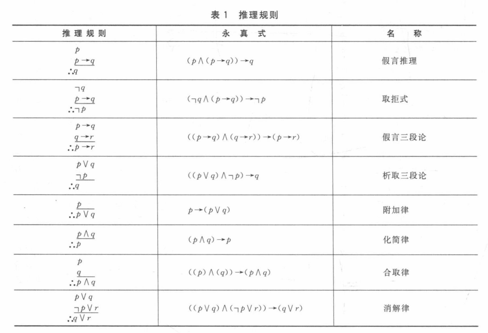
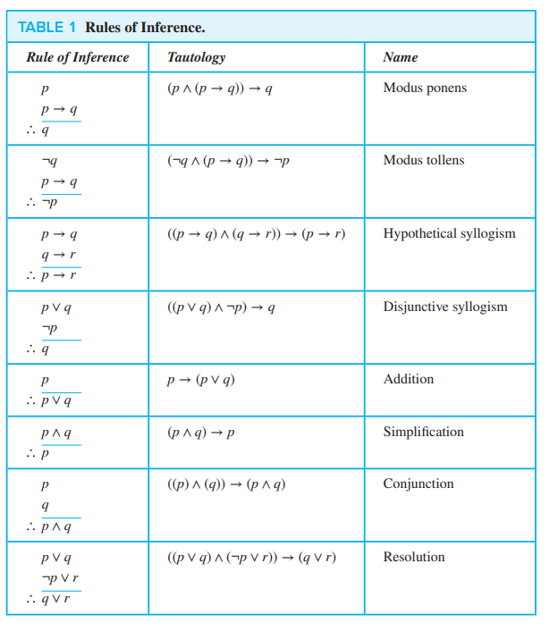

写在前面 离散数学本章的内容在定义一些我们经常会使用的一些逻辑 或许比看书 更好的学习方法就是做题+听讲解

# chap1-The Foundations : Logic and Proofs

The rules of logic specify the meaning of mathematical statements.

-   In this chapter, we will explain what makes up a correct mathematical argument and introduce tools to construct these arguments.
-   We will develop an arsenal( 工具集 军火库 ) of different proof methods that will enable us to prove many different types of results. 
-   After introducing many different methods of proof, we will introduce several strategies for constructing proofs. We will introduce the notion of a conjecture(猜想 推测) and explain the process of developing mathematics by studying conjectures.

## 1.1 Propositional Logic

### 1.1.1 Introduction

The rules of logic give precise meaning to mathematical statements. 

`The rules of logic`对数学命题的重要性不言自明.

### 1.1.2 命题与连接词

**命题**是一个陈述语句 它或真或假 但是不能既真又假 .

对于一个命题 我们也习惯于用字母表示 称为**命题变量(propositional variables)/语句变量(sentential variables)**.

不能用更简单的命题来表示的命题称之为 **原子命题** .

由**已知命题**用**逻辑运算符**组合而来的新命题就是**复合命题**.

>   [!NOTE]
>
>   好的,我们来清晰地介绍离散数学中三个核心的逻辑联结词：**合取**、**析取**和**异或**.这三个联结词是数字电路设计中逻辑门的基础.
>
>   ---
>
>   ### 1. 合取 Conjunction
>
>   - **符号**:  $p \land q$ 
>   - **定义**: 只有当命题 $  p $ 和命题 $ q $ **同时为真** 时,合取命题 $ p \land q $ 才为真.否则为假.
>   
>- **简单例子**:
>     - $ p $: "今天下雨"
>     - $ q $: "我带了伞"
>     - $ p \land q $: "今天下雨**并且**我带了伞".只有在下雨和带伞这两件事都发生时,这个陈述才是真的.
>   
>- **电路对应**: **与门**.只有当两个输入都为高电平(1)时,输出才为高电平(1).
>   
>---
>   
>### 2. 析取 Disjunction
>   
>- **符号**: $ p \lor q $
>   - **定义**: 只要命题 $ p $ **或者** 命题 $ q $ **中至少有一个为真**,析取命题 $ p \lor q $ 就为真.只有当两者都为假时,结果才为假.这种"或"也称为"兼或",因为它包含两者同时为真的情况.
>   - **简单例子**:
>     - $ p $: "我会喝茶"
>  - $ q $: "我会喝咖啡"
>     - $ p \lor q $: "我会喝茶**或者**喝咖啡".如果我喝了茶、喝了咖啡,或者两者都喝了,这个陈述都是真的.只有在我什么都没喝的情况下,它才是假的.
>   - **电路对应**: **或门**.只要至少有一个输入为高电平(1),输出就为高电平(1).
>   
>   ---
>
>   ### 3. 异或 exclusive or
>
>   - **符号**: $ p \oplus q $
>- **定义**: 当命题 $ p $ 和命题 $ q $ 的**真值恰好相反**(即一个真、一个假)时,异或命题 $ p \oplus q $ 才为真.如果两者相同(同真或同假),则结果为假.
>   - **简单例子**:
>  - $ p $: "走左边的路"
>     - $ q $: "走右边的路"
>     - $ p \oplus q $: "**要么**走左边的路,**要么**走右边的路".你只能选择其中一条路,不能同时走两条,也不能都不走(在这个情境下,假设必须二选一).
>   - **电路对应**: **异或门**.当两个输入的电平不同时,输出为高电平(1).
>
>   ### 总结对比
>   
>   | 联结词   |     符号     | 核心逻辑        |   电路门   | 为真的条件               |
>   | :------- | :----------: | :-------------- | :--------: | :----------------------- |
>| **合取** | $ \land $  | **并且**        |  **与门**  | **两个都**为真           |
>   | **析取** |  $ \lor $  | **或者** (兼或) |  **或门**  | **至少一个**为真         |
>| **异或** | $ \oplus $ | **要么…要么…**  | **异或门** | **两个之中恰好一个**为真 |
>   
>这个对应关系是数字逻辑设计的基石,计算机中所有复杂的计算和判断,最终都是由这些基本的逻辑门组合而成的.

### 1.1.3 Conditional Statements

本节的核心就是理解 是什么 **蕴含** / **条件命题** / $p \mathbf{\rightarrow} q$ / **实质蕴涵**

- $ p $ 称为 **前件** 或 **假设**.
- $ q $ 称为 **后件** 或 **结论**.

**定义**: 条件语句 $ p \rightarrow q $ 是一个复合命题.只有当 **p 为真而 q 为假** 时,这个命题才为假.在其他所有情况下,它都为真.

>   [!CAUTION]
>
>   ### 一个关键的例子 帮助你直观理解"实质蕴涵"的真假性
>
>   来看书中的例子：
>
>   - $ p $: "Maria 学习离散数学"
>   - $ q $: "Maria 会找到好工作"
>   - $ p \rightarrow q $: "如果 Maria 学习离散数学,那么她会找到好工作."
>
>   **[ 注 这里把命题看作一种承诺 承诺被违背 则承诺(命题)为假 / 承诺不被违背 则承诺(命题)为真 ]**
>
>   **分析**:
>
>   - 什么时候这个承诺是**假的**？只有当 **Maria 学习了离散数学但却没有找到好工作**.
>   - 如果 Maria 学习了离散数学并且找到了好工作,承诺为**真**.
>   - 如果 Maria 没有学习离散数学,那么无论她找没找到好工作,我们都<u>不能说她违背</u>了"**如果**学习**那么**找到工作"这个承诺,所以逻辑上<u>规定</u>为**真**.
>
>   ### 对"实质蕴含"真值情况的理论理解 :
>
>   ---
>
>   >   `p真,q真`,则命题真 .
>   >   `p真,q假`,则命题假 .
>
>   大家对这两个定义,是可以理解并接受的.
>
>   ---
>   底层逻辑是一种**规定** , 这种规定的目的是 **不违反四大基本规律,即同一律、排中律、矛盾律和充足理由律.**
>
>   [这里的结论是 如果不这样规定 会推导出"矛盾" 故只能规定为真]
>
>   [[可以看一下 [请问这个蕴含命题到底是什么 为什么 p 假 q 真时他们的蕴含命题仍然是真的? - HNBC的回答 - 知乎](
>   https://www.zhihu.com/question/1925159014951528174/answer/1925405847053370363) 但是我认为这里的有些推导是错误的 思路还是可以借鉴一下]

#### 多样的表述方式

在自然语言和数学中,条件命题 $ p \rightarrow q $ 有很多等价的表述方式,你需要识别它们：

- "如果 p,则 q"
- "p 蕴含 q"
- "p 是 q 的**充分条件**" (有p就足够了能推出q)
- "q 是 p 的**必要条件**" (如果p要成立,q**必须**成立)
- "q,如果 p"
- "p,仅当 q" (**这是最容易混淆的！** "p仅当q" 意思是p为真时,q**必须**为真,所以它逻辑上等价于 $ p \rightarrow q $,而不是 $ q \rightarrow p $)
    - 这个还真值得看一下 也就是说 p一定能推出q 而q不一定能推出p
    - 所以`p仅当q`等价于`仅当q , 有p`等价于$p \rightarrow q $


#### 由条件命题衍生的三种命题

从一个条件命题 $ p \rightarrow q $ 出发,我们可以构造出三个相关的命题：

1.  **逆命题**: $ q \rightarrow p $ ("如果q,那么p")
2.  **反命题**: $ \neg p \rightarrow \neg q $ ("如果非p,那么非q")
3.  **逆否命题**: $ \neg q \rightarrow \neg p $ ("如果非q,那么非p")

**核心结论**:

- **原命题 $ p \rightarrow q $ 和它的逆否命题 $ \neg q \rightarrow \neg p $ 是逻辑等价的**.它们在任何情况下的真值都完全相同.这是数学证明中常用的技巧(反证法的基础之一).
- **原命题与它的逆命题、反命题都**不等价.这是一个非常常见的逻辑错误.

**例子**:

- 原命题: "如果下雨,那么地湿." $ (p \rightarrow q) $
- 逆否命题: "如果地不湿,那么没下雨." $ (\neg q \rightarrow \neg p) $ (这和原命题是等价的)
- 逆命题: "如果地湿,那么下雨." $ (q \rightarrow p) $ (这不成立,地湿可能是洒水车造成的)
- 反命题: "如果没下雨,那么地不湿." $ (\neg p \rightarrow \neg q) $ (这也不成立,理由同上)

#### 双条件命题

- **符号**: $ p \leftrightarrow q $
- **读法**: "p 当且仅当 q"
- **定义**: 当 p 和 q 的**真值完全相同**(同真或同假)时,该命题为真.它本质上表示 $ (p \rightarrow q) \land (q \rightarrow p) $.
- **电路对应**: **同或门**.

#### 总结

条件命题 $ p \rightarrow q $ 是逻辑推理的核心.理解它的关键在于：
1.  牢记其**真值表**,特别是它**仅在"前真后假"时为假**.
2.  能识别其在自然语言中的**各种表述**,尤其是"仅当".
3.  明确**原命题只与逆否命题等价**,不要与逆命题、反命题混淆.

### 1.1.4 Truth Tables of Compound Propositions

The Truth Table of $(p \vee \neg q) \rightarrow (p \land q)$.

| $ p $ | $ q $ | $ \neg q $ | $ p \vee \neg q $ | $ p \land q $ | $ (p \vee \neg q) \rightarrow (p \land q) $ |
|:------:|:------:|:------------:|:------------------:|:--------------:|:-------------------------------------------:|
| T      | T      | F            | T                  | T              | T                                           |
| T      | F      | T            | T                  | F              | F                                           |
| F      | T      | F            | F                  | F              | T                                           |
| F      | F      | T            | T                  | F              | F                                           |

### 1.1.5 Precedence of Logical Operators

其实这个不是很有必要 但是考试还真可能爱考 见下
$$
\neg \\

\land \\

\lor \\

\rightarrow \\

\leftrightarrow
$$
这个有严格的大小关系 是"约定俗成"

### 1.1.6 Logic and Bit Operations

就是在用1和0表示True和False

## 1.2 Applications of Propositional Logic

### 1.2.1 Introduction

我们会使用逻辑语言消除自然语言中的歧义.

### 1.2.2 Translating English Sentences

我们考虑如何把`自然语言`翻译成`逻辑表达式`.

**例1** 将语句：
> "你可以在校园访问因特网,仅当你主修计算机科学或者你不是新生."

翻译成逻辑表达式.
- 定义了命题变量：
    - $ a $：你可以在校园访问因特网
    - $ c $：你主修计算机科学
    - $ f $：你是个新生
- 关键点："仅当"表示条件语句(→),后半部分是条件.
- 逻辑表达式为：$ a \rightarrow (c \lor \neg f) $

**例2** 将语句：
> "如果你身高不足4英尺,那么你不能乘坐过山车,除非你已年满16周岁."

翻译成逻辑表达式.
- 定义了命题变量：
    - $ q $：你能乘坐过山车
    - $ r $：你身高不足4英尺
    - $ s $：你已年满16周岁
- 关键点："除非"在这里的逻辑是：如果"身高不足4英尺"并且"未满16周岁",那么"不能乘坐过山车".
- 逻辑表达式为：$ (r \land \neg s) \rightarrow \neg q $

这些翻译方式并非唯一,但已足够用于当前的分析.

### 1.2.3 System Specifications

当有多个命题处在同一个系统中时,他们不能产生矛盾.如果是个题目 可能需要使用真值表来说明 . 或者证明对于一个命题`r`是否可以由不同的已有命题组合(我们先假设合理 即所有已知命题都为真)得到真/假两个结果 这样就违反了"命题不能既真又假"的原则.

### 1.2.4 Boolean Searches

在搜索时可以使用下面的形式搜索想要的内容(一般的浏览器支持 也有默认配置):

```text
(NEW AND MEXICO OR ARIZONA) AND UNIVERSITIES
```

根据逻辑运算符优先级 你会找到`universities in New Mexico or Arizona`的相关网页.

注意有时候会使用`AND NOT`来表示`NOT`同时避免歧义.

### 1.2.5 Logic Puzzles

有一些逻辑谜题很有趣.

1.  **例7：宝箱谜题**
    *   **场景**：三个箱子中只有一个有宝藏.箱子上分别写着：
        *   箱子1："这个箱子是空的"
        *   箱子2："这个箱子是空的"
        *   箱子3："宝藏在第二个箱子中"
    *   **关键信息**：皇后告知只有一个提示是真的,其他两个是假的.
2.  **例9：泥巴孩子谜题**
    *   **场景**：两个孩子(儿子和女儿)的额头上都沾了泥.他们能看到对方但看不到自己.
    *   **关键信息**：父亲首先声明"你们当中至少有一个人额头上有泥",然后连续两次询问每个孩子："你知道你额头上是否有泥吗？"
3.  **例8：骑士与无赖谜题**
    *   **场景**：一个岛上住着骑士(总是说真话)和无赖(总是说谎).
    *   **人物与陈述**：
        *   A说："B是骑士."
        *   B说："我们两个是两类人."

>   [!NOTE]
>
>   1.   **推理过程**：通过将提示转化为逻辑命题并进行等价推导,最终得出结论：**宝藏就在第一个箱子里**.第二个箱子上的提示是唯一为真的.
>   2.   **推理过程**：
>        *   **第一轮回答**：两个孩子都回答"否".因为他们都看到了对方额头上的泥,但无法确定自己是否有泥.
>        *   **第二轮回答**：两个孩子都回答"是".通过听到对方第一轮的回答"否",他们可以推断出自己额头上一定有泥.
>   3.   **推理过程**：通过假设和逻辑推导,得出结论：**A和B都是无赖**.
>        *   如果A是骑士,会导致矛盾.
>        *   如果A是无赖,则所有陈述都能自洽,且B也必须是无赖.

这些例题展示了如何运用命题逻辑和逻辑推理来解决经典的谜题和问题.

### 1.2.6 Logic Circuits

平平

## 1.3 Propositional Equivalences

### 1.3.1 Introduction

数学证明中使用的一个重要步骤就是**用真值相同的一条语句替换另一条语句**.因此,我们要学会**从给定复合命题生成具有相同真值命题**.

-   **永真式(重言式)** 无论内部原子命题是什么 其真值永远为 **真** 的复合命题 .
-   **矛盾式** 无论内部原子命题是什么 其真值永远为 **假** 的复合命题 .
-   既不是永真式也不是矛盾式的复合命题时 **可能式**

| $ p $ | $\neg p$ | $p \vee \neg p$ | $p \land \neg p$ |
| :-----: | :--------: | :---------------: | :----------------: |
| T       | F          | T                 | F                  |
| F       | T          | T                 | F                  |

### 1.3.2 Logical Equivalences

如果 $p \leftrightarrow q$ 是永真式,则称 $p$ 和 $q$ 是逻辑等价的.用记号 $p \equiv q$ 表示 $p$ 和 $q$ 是逻辑等价的. $p \equiv q$ 成立当且仅当 $p \leftrightarrow q$ 是永真式.

有时候用符号 $\Leftrightarrow$ 来代替 $\equiv$ 表示逻辑等价.

>   [!CAUTION]
>
>   $p \equiv q$ 不是一个复合命题,而是代表"$p \leftrightarrow q$ 是永真式"这一语句.

证明命题是不是永真式或者矛盾式或者两个命题是否逻辑等价都可以利用**真值表**.

>   [!NOTE]
>
>   比如 **证明 $p \lor (q \land r)$ 和 $(p \lor q) \land (p \lor r)$ 是逻辑等价的**
>
>   | $P$  | $q$  | $r$  | $q \land r$ | $p \lor (q \land r)$ | $p \lor q$ | $p \lor r$ | $(p \lor q) \land (p \lor r)$ |
| :--: | :--: | :--: | :---------: | :------------------: | :--------: | :--------: | :---------------------------: |
|  T   |  T   |  T   |      T      |          T           |     T      |     T      |               T               |
|  T   |  T   |  F   |      F      |          T           |     T      |     T      |               T               |
|  T   |  F   |  T   |      F      |          T           |     T      |     T      |               T               |
|  T   |  F   |  F   |      F      |          T           |     T      |     T      |               T               |
|  F   |  T   |  T   |      T      |          T           |     T      |     T      |               T               |
|  F   |  T   |  F   |      F      |          F           |     T      |     F      |               F               |
|  F   |  F   |  T   |      F      |          F           |     F      |     T      |               F               |
|  F   |  F   |  F   |      F      |          F           |     F      |     F      |               F               |
>
>
>   我们还有一个观察是 : 这个命题中一共有3个原子命题 那么这个真值表一共就有$2^3$行枚举
>
>   也就是说 **若一个复合命题一共由$n$个命题变量组成 则需要$2^n$行**
>
>   当然这个增长太惊人了 后面会介绍优化方案


下面列出一些`fancy`的逻辑等价式 .

|                         逻辑等价式                         | 名称       |
| :--------------------------------------------------------: | :--------- |
|                   $ p \land T \equiv p $                   | 恒等律     |
|                   $ p \lor F \equiv p $                    | 恒等律     |
|                   $ p \lor T \equiv T $                    | 支配律     |
|                   $ p \land F \equiv F $                   | 支配律     |
|                   $ p \lor p \equiv p $                    | 幂等律     |
|                   $ p \land p \equiv p $                   | 幂等律     |
|                 $ \neg (\neg p) \equiv p $                 | 双重否定律 |
|                $ p \lor q \equiv q \lor p $                | 交换律     |
|               $ p \land q \equiv q \land p $               | 交换律     |
|       $ (p \lor q) \lor r \equiv p \lor (q \lor r) $       | 结合律     |
|     $ (p \land q) \land r \equiv p \land (q \land r) $     | 结合律     |
| $ p \lor (q \land r) \equiv (p \lor q) \land (p \lor r) $  | 分配律     |
| $ p \land (q \lor r) \equiv (p \land q) \lor (p \land r) $ | 分配律     |
|       $ \neg (p \land q) \equiv \neg p \lor \neg q $       | 德·摩根律  |
|       $ \neg (p \lor q) \equiv \neg p \land \neg q $       | 德·摩根律  |
|              $ p \lor (p \land q) \equiv p $               | 吸收律     |
|              $ p \land (p \lor q) \equiv p $               | 吸收律     |
|                 $ p \lor \neg p \equiv T $                 | 否定律     |
|                $ p \land \neg p \equiv F $                 | 否定律     |

>   [!WARNING]
>
>   ### 条件命题的逻辑等价式
>
>   $
>   p \rightarrow q \equiv \neg p \lor q
>   $
>
>   $
>   p \leftrightarrow q \equiv (p \rightarrow q) \land (q \rightarrow p)
>   $
>
>   $
>   p \leftrightarrow q \equiv \neg p \leftrightarrow \neg q
>   $
>
>   $
>   \neg (p \rightarrow q) \equiv p \land \neg q
>   $
>
>   $
>   (p \rightarrow q) \land (p \rightarrow r) \equiv p \rightarrow (q \land r)
>   $
>
>   $
>   (p \rightarrow r) \land (q \rightarrow r) \equiv (p \lor q) \rightarrow r
>   $
>
>   $
>   (p \rightarrow q) \lor (p \rightarrow r) \equiv p \rightarrow (q \lor r)
>   $
>
>   $
>   (p \rightarrow r) \lor (q \rightarrow r) \equiv (p \land q) \rightarrow r
>   $
>
>   ### 涉及双条件命题的逻辑等价式
>
>   $
>   p \leftrightarrow q \equiv (p \rightarrow q) \land (q \rightarrow p)
>   $
>
>   $
>   p \leftrightarrow q \equiv \neg p \leftrightarrow \neg q
>   $

### 1.3.3 Using De Morgan’s Laws

德摩根率太重要了 所以下面详细讲一下德摩根率 .

---

#### 德摩根定律的定义

德摩根定律是逻辑学和布尔代数中的基本定律,描述了逻辑"与"($\land$)、"或"($\lor$)和"非"($\neg$)之间的等价关系.定律包括两个表达式:

1.   **第一定律**：  

     $$
     \neg (A \land B) \equiv \neg A \lor \neg B \\
     \neg (A_1 \land A_2 \land \dots \land A_n) \equiv \neg A_1 \lor \neg A_2 \lor \dots \lor \neg A_n
     $$

     -   含义：对 $A$ 和 $B$ 的"与"的否定等价于 $A$ 的否定或 $B$ 的否定. 
     -   否定"$A$ 和 $B$ 都成立"等于"$A$ 不成立或 $B$ 不成立"
     -   例：否定"既是猫又是狗"等于"不是猫或不是狗"

2.   **第二定律**：   
     $$
     \neg (A \lor B) \equiv \neg A \land \neg B \\
     \neg (A_1 \lor A_2 \lor \dots \lor A_n) \equiv \neg A_1 \land \neg A_2 \land \dots \land \neg A_n
     $$
     -   含义：对 $A$ 或 $B$ 的"或"的否定等价于 $A$ 的否定与 $B$ 的否定. 
     
     -   否定"$A$ 或 $B$ 成立"等于"$A$ 不成立且 $B$ 不成立(A与B都不成立)"
     -   例：否定"是猫或狗"等于"不是猫且不是狗".

### 1.3.4 Constructing New Logical Equivalences

这里需要**练习** 当然一个基础知识可以拿来直接用的就是 **如果$p$和$q$是等价的,$q$和$r$是等价的,那么$p$和$r$也是等价的** 这是 连等式 的基础.

1.   证明$\neg(p \rightarrow q)$和$p \land \neg q$是逻辑等价的
     $$
     左 = \neg(p \rightarrow q) \equiv \neg ((\neg p) \lor q) \equiv (\neg (\neg p)) \land ( \neg q) \equiv p \land (\neg q) = 右
     $$
2.  证明  $\neg (p \lor (\neg p \land q))$ 和 $p \land \neg q$是逻辑等价的
    $$
    \begin{aligned}
    \neg (p \lor (\neg p \land q)) &\equiv \neg p \land \neg (\neg p \land q) && \text{由德·摩根第二定律} \\
    &\equiv \neg p \land (\neg (\neg p) \lor \neg q) && \text{由德·摩根第一定律} \\
    &\equiv \neg p \land (p \lor \neg q) && \text{由双重否定律} \\
    &\equiv (\neg p \land p) \lor (\neg p \land \neg q) && \text{由分配律} \\
    &\equiv F \lor (\neg p \land \neg q) && \text{因为 } \neg p \land p \equiv F \\
    &\equiv \neg p \land \neg q && \text{由 } F \lor A \equiv A
    \end{aligned}
    $$

3.   证明 $ (p \land q) \rightarrow (p \lor q)$ 是永真式
     我们将用逻辑等价式来证明它逻辑上等价于 $T$
     $$
     \begin{aligned}
     (p \land q) \rightarrow (p \lor q) &\equiv \neg (p \land q) \lor (p \lor q) && \text{由例3} \\
     &\equiv (\neg p \lor \neg q) \lor (p \lor q) && \text{由德·摩根第一定律} \\
     &\equiv (\neg p \lor p) \lor (\neg q \lor q) && \text{由析取的结合律和交换律} \\
     &\equiv T \lor T && \text{由例1和析取的交换律} \\
     &\equiv T && \text{由支配律}
     \end{aligned}
     $$

### 1.3.5 Satisfiability

-   对于一个复合命题 如果存在一组命题变量的取值 使得这个命题为真 则称这个命题是 **可满足的** . 这个式子是 **永真式** 或者 **可满足式**
    -   对于这样的一个取值 我们称之为 "这个特定的可满足性问题的一个 **解** "
-   相对的 我们有 **不可满足式** , 也就是说 <u>不存在这样一个命题变量的取值 使得命题为真</u> 这等价于 <u>它的否定是永真式</u> / <u>矛盾式</u>
    -   注意 我们一般认为 矛盾式 更强调内在逻辑的矛盾 而 "不可满足式" 是语义上的定义——没有成真赋值.
    -   但外延完全一致：所有矛盾式都是不可满足式,所有不可满足式也都是矛盾式.

判断一个命题可否满足 使用真值表并不方便 参考下面的解题

>   [!NOTE]
>
>   ## 1. 第一个命题  
>   $$
>   (p \lor \neg q) \land (q \lor \neg r) \land (r \lor \neg p)
>   $$
>
>   当 $p, q, r$ 三个变量具有相同真值时,该式为真.因此确实当 $p, q, r$ 同真或同假时,该式为真.所以它是 **可满足的**.
>
>   ---
>
>   ## 2. 第二个命题  
>   $$
>   (p \lor q \lor r) \land (\neg p \lor \neg q \lor \neg r)
>   $$
>
>   - $p \lor q \lor r$ 要求至少一个为真.  
>   - $\neg p \lor \neg q \lor \neg r$ 等价于 $\neg (p \land q \land r)$,即 **并非三个全为真**.  
>
>   所以合起来就是：至少一个为真,且并非三个全为真 ⇒ 至少一个为真,且至少一个为假.因此它是 **可满足的**.
>
>   ---
>
>   ## 3. 第三个命题  
>   $$
>   (p \lor \neg q) \land (q \lor \neg r) \land (r \lor \neg p) \land (p \lor q \lor r) \land (\neg p \lor \neg q \lor \neg r)
>   $$
>
>   前三个子句 $(p \lor \neg q) \land (q \lor \neg r) \land (r \lor \neg p)$ 要求 $p, q, r$ 同真或同假(见第一段推理).  
>
>   后两个子句 $(p \lor q \lor r) \land (\neg p \lor \neg q \lor \neg r)$ 要求至少一个为真且至少一个为假.  
>
>   这两个条件矛盾：  
>   - 前三个子句 ⇒ 三者同真或同假.  
>   - 若同真：满足前三个,但 $\neg p \lor \neg q \lor \neg r$ 为假(因为 $p, q, r$ 全真时它假),不满足最后一个子句.  
>   - 若同假：满足前三个,但 $p \lor q \lor r$ 为假(三者全假时它为假),不满足第一个大子句的第四部分.  
>
>   因此 **没有赋值** 能同时满足所有五个子句 ⇒ **不可满足**(即矛盾式).
>

### 1.3.6 Applications of Satisfiability

[中文版 21 页 , P48 ; 英文版 33 页 , P56] 给了两个可满足性解题的例子 N 皇后问题 和 数独 .

### 1.3.7 Solving Satisfiability Problems

[提供了许多练习题]

## 1.4 Predicates and Quantifiers

### 1.4.2 Predicates

- 在命题逻辑中,命题是一个可以判断真假的陈述句.

- 但有些陈述依赖于变量,例如 "$x > 3$",它的真值取决于 $x$ 的值.

- **谓词** 就是这样一个包含变量的陈述,用符号 $P(x), Q(x,y)$ 等表示.

- <u>一旦变量被赋值,谓词就变成一个命题</u>.


In general, a statement involving the $n$ variables $x_1, x_2, … , x_n$ can be denoted by
$$
P(x_1, x_2, … , x_n)
$$
P也称为 n位谓词 或 n元谓词 .

>   [!NOTE]
>
>   #### 为什么需要这种形式化方法？
>- 测试只能覆盖有限的情况,不能证明程序对所有输入都正确.
>   - 用前置条件和后置条件,加上逻辑推理,可以**数学上证明**程序对所有满足前置条件的输入都能得到正确的后置条件.
>
>   #### 简单总结
>   - **前置条件**：程序执行前,输入变量的状态.
>- **后置条件**：程序执行后,输出变量的状态.
>   - **程序正确性**：从前提到后置的逻辑推导成立.
>   

### 1.4.3 Quantifiers

引入**谓词逻辑**以后 我们可以方便的生成命题 , 也就是说只要给定约束的输入 $x$ 可以得到具有某个真值的命题 $P(x)$.

注意到还有另外一种产生命题的方法 就是 **量化 quantification** , 表示在一定范围上 . 主要可以用来表示"对所有"或"存在"这样的概念 .

The area of logic that deals with predicates and quantifiers is called the **predicate calculus** .
处理谓词和量词的逻辑领域称为 **逻辑演算** .

我们事先要知道的一个概念是 **论域 domain of discourse** 或者叫 **全体域 universal of discourse** , 表示一个范围 我们在数学上已经很熟悉了 , 会和下面的量词搭配起来使用 .

#### 全称量词(Universal Quantifier)
- 符号：$\forall$
- 表示："对所有(every)"、"对任意(for all)"、"对每一个"
- 形式：$\forall x \, P(x)$ 表示"对所有 $x$ , $P(x)$ 为真".
- 只有在论域(domain)中所有 $x$ 都使 $P(x)$ 为真时,$\forall x P(x)$ 才为真.

---

#### 存在量词(Existential Quantifier)
- 符号：$\exists$
- 表示："存在(there exists)"、"至少有一个(for some)"
- 形式：$\exists x P(x)$ 表示"存在至少一个 $x$,使得 $P(x)$ 为真".
- 只要论域中至少有一个 $x$ 使 $P(x)$ 为真,$\exists x P(x)$ 就为真.

#### 唯一性量词

但是目前我们无法定义 "对数量有限制的命题" ,如"恰好有 2 个""有不超过 3 个""至少有 100 个"等.

一种常见的量词是 **唯一性量词**,用符号 $\exists!$ 或 $\exists_n$ 表示.
$\exists!\,x\,P(x)$或 $\exists_1 x\,P(x)$这种表示法是指 "存在一个唯一的 $x$ 使得 $P(x)$ 为真"  , 其他表示唯一性量词的词语有"恰好存在一个""有且只有一个"

比如,$\exists!\,x\,(x-1=0)$,其中论域是实数集合 , 表示存在一个唯一的实数元 $x$ 使得 $x-1=0$.

通常,最好只使用存在量词和全称量词,这样就可以使用这些量词的推理规则.

---

#### 量词顺序

当谓词有多个变量时,可以使用多个量词 ; 此时要注意顺序

例：论域为实数.  

- $\forall x \, \exists y \, (x + y = 0)$  

    对任意 $x$,存在 $y$ , 使得 $x+y=0$,这是真的.

- $\exists y \, \forall x \, (x + y = 0)$  

    存在一个 $y$,对任意 $x$ 都有 $x+y=0$,这是假的(因为 $y$ 固定的话,不可能对所有 $x$ 成立)

---

#### 量词否定

重要规则：

1. $\neg \forall x \, P(x) \equiv \exists x \, \neg P(x)$  

    "并非所有 $x$ 满足 $P$" 等价于 "存在 $x$ 不满足 $P$".

2. $\neg \exists x \, P(x) \equiv \forall x \, \neg P(x)$  

    "不存在 $x$ 满足 $P$" 等价于 "所有 $x$ 都不满足 $P$".

**例**：  

- "不是所有猫都是黑色的" $\iff$ "存在一只猫不是黑色的".  
- "没有一个人能永生" $\Leftrightarrow$"所有人都不能永生".

### 1.4.4 QUANTIFIERS OVER FINITE DOMAINS

这一节就是在说 有限数量的论域可以被展开 . 

例如:
$$
\forall (x < 4) P(x) \leftrightarrow P(1) \land P(2) \land P(3) \land P(4)
$$

可以看作是一种循环

### 1.4.5 Quantifiers with Restricted Domains

介绍了一种表示法 也是我们早已习惯的
$$
\exists z>0 (z^2 = 2)
$$
上式子表示 : 存在一个实数 $z$ 满足 $z$ 的平方等于$2$

### 1.4.6 Precedence of Quantifiers

"$\forall $"  和  "$\exists $"  的优先级比所有逻辑运算符都高 例子如下 :
$$
\forall x P(x) \lor Q(x) \leftrightarrow [\forall x P(x)] \lor Q(x) \neq \forall [x P(x) \lor Q(x)]
$$

### 1.4.7 Binding Variables

当量词作用于变量$x$时 我们说这个变量是 **约束的** , 如果没被量词修饰或者限定于某一特定值时 , 则称它是 **自由的** . 命题函数 也就是 谓词 中出现的所有变量的出现**必须**是约束的 , 才能转换成一个命题 .

逻辑表达式中一个量词作用到的部分称为这个量词的作用域 . 在所有量词的作用域之外的变量就是自由的 .

### 1.4.8 Logical Equivalences Involving Quantifiers

逻辑等价式意味着无论命题函数里面指定什么论域 , 无论用什么谓词带入 , 都具有相同的真值 . 记作
$$
\begin{align*}
S &\equiv T \\
\text{e.g.}\qquad
\forall x\bigl(P(x)\land Q(x)\bigr)
&\equiv \forall x P(x) \land \forall x Q(x)
\end{align*}
$$

### 1.4.9 Negating Quantified Expressions

也称为 **量词的德摩根率**
$$
\begin{align*}
\neg \forall xP(x) &\equiv \exists x \neg P(x) \\
\neg \exists xQ(x) &\equiv \forall x \neg Q(x)
\end{align*}
$$

-   对所有$x$都成立的否定 等价于 存在一个$x$使之不成立
-   对存在一个$x$使之成立的否定 等价于 对所有的都不成立

>   [!NOTE]
>
>   当谓词 $P(a)$ 的论域包含 $n$ 个个体时,其中 $n$ 是大于 $1$ 的正整数,则用于量化命题否定的规则和~\S1.3 讨论的德·摩根律完全相同.这就是为什么这些规则称为 **量词的德摩根律** 
>
>   当论域有 $n$ 个元素 $a_1,a_2,\dots,a_n$ 时,$\neg \forall x P(x)$ 与
>   
>   $$
>   \neg (P(a_1)\land P(a_2)\land \dots \land P(a_n))
>   $$
>   
>   相同,而由德·摩根律,后者等价于
>   
>   $$
>   \neg P(a_1)\lor \neg P(a_2)\lor \dots \lor \neg P(a_n),
>   $$
>   
>   该式又等同于 
>   
>   $$
>   \exists x \neg P(x)
>   $$
>
>   类似地,$\neg \exists x P(x)$ 与
>   $$
>   \neg (P(a_1)\lor P(a_2)\lor \dots \lor P(a_n))
>   $$
>   相同,由德·摩根律,后者等价于
>   $$
>   \neg P(a_1)\land \neg P(a_2)\land \dots \land \neg P(a_n),
>   $$
>   
>   该式又等同于 $\forall x \neg P(x)$.

## 1.5 Nested Quantifiers

这一节会详细介绍如何理解含有多个量词的命题 , 即如何理解相互嵌套的量词 , 从而可以理解和表示含有多个命题变量的命题 . 如 :

-   $\forall x \exist y ( x + y = 0)$

-   命题 " 两个正数的和一定是正数 "

-   命题 " 每个人恰好有一个最要好的朋友 "

### 1.5.2 Understanding Statements Involving Nested Quantifiers

比较复杂的一种情况如下 其实只要接收过一定的数学训练 也很容易看懂 :
$$
\forall x \forall y [(x>0)\land (y<0)\rightarrow (xy<0)]
$$
书中给出一个思路 把量词符号看作一种循环 表示在这个范围的循环内都成立 .

### 1.5.3 The Order of Quantifiers

量词相同时互换也不影响 但是不同时不可随意互换 .

|             语句              |                   何时为真                    |                   何时为假                    |
| :---------------------------: | :-------------------------------------------: | :-------------------------------------------: |
| $\forall x \forall y P(x, y)$ |       对每一对 $x, y$,$P(x, y)$ 均为真        |      存在一对 $x, y$,使得 $P(x, y)$ 为假      |
| $\forall x \exists y P(x, y)$ | 对每个 $x$,都存在一个 $y$ 使得 $P(x, y)$ 为真 | 存在一个 $x$,使得 $P(x, y)$ 对每个 $y$ 总为假 |
| $\exists x \forall y P(x, y)$ | 存在一个 $x$,使得 $P(x, y)$ 对所有 $y$ 均为真 |  对每个 $x$,存在一个 $y$ 使得 $P(x, y)$ 为假  |
| $\exists x \exists y P(x, y)$ |       存在一对 $x, y$,使 $P(x, y)$ 为真       |       对每一对 $x, y$,$P(x, y)$ 均为假        |

对于有更多量词逻辑的情形也需要注意 .

### 1.5.4 Translating Mathematical Statements into Statements Involving Nested Quantifiers

### 1.5.5 Translating from Nested Quantifiers into English

### 1.5.6 Translating English Sentences into Logical Expressions

上面三节 倒是没有什么道理可以讲 多看一些例子吧 .

1.   对于所有的正整数$x$和$y$ , $x+y$是正数 (这里只展示书上的写法 但是个人觉得没有表示出定义域来)
     $$
     \forall x \forall y [(x>0)\land(y>0) \rightarrow (x+y>0)]
     $$

2.   除了0以外的每一个实数都有一个乘法逆元
     $$
     \forall x [(x \neq 0) \rightarrow \exist y (xy = 1)]
     $$

3.   $$
     \forall x\,\Bigl(C(x)\vee \exists y\bigl(C(y)\wedge F(x,y)\bigr)\Bigr) , 其中 C(x) 是 x 有一台计算机，F(x,y) 是 x 和 y 是朋友 ，而 x 和 y 的共同论域是学校全体学生的集合。
     $$


     对学校中的每个学生 $x$,或者 $x$ 有一台计算机,或者另有一个学生 $y$,他有一台计算机,且 $x$ 和 $y$ 是朋友.
    
     换言之,学校的每个学生或者有一台计算机,或有一个有一台计算机的朋友.

4.   $$
     \exists x\,\forall y\,\forall z\,\Bigl(F(x,y)\wedge F(x,z)\wedge(y\ne z)\rightarrow \neg F(y,z)\Bigr) , 其中 F(a,b) 的含义是 a 和 b 是朋友，而 x,y,z 的论域是学校所有学生的集合。
     $$
     表示 存在一个学生 $x$ 他的任意两个朋友都不是朋友 .

5.   将语句 " 如果某人是女性且还是家长,那么这个人是某人的母亲 " 翻译成逻辑表达式,其中涉及谓词、量词(论域是所有人)以及逻辑联结词.

     可以表达为 : 对每个人 $x$,如果是女性且是家长,那么存在一个人 $y$ 使得 $x$ 是 $y$ 的母亲 . 
     我们引入谓词$F(x)$ 来表示 "$x$ 是女性",$P(x)$ 表示"$x$ 是家长",$M(x,y)$ 表示"$x$ 是 $y$ 的母亲"
     $$
     \forall x\bigl((F(x)\wedge P(x))\rightarrow\exists y\,M(x,y)\bigr)
     $$

6.  将语句 " 每个人恰好有一个最好的朋友 " 翻译成逻辑表达式,其中涉及谓词、量词(论域是所有人)以及逻辑联结词.

    可以表达为：对每个人 $x$,恰好存在一个人 $y$,使得 $y$ 是 $x$ 最好的朋友,并且任何不同于 $y$ 的人 $z$ 都不是 $x$ 最好的朋友 . 
    我们引入谓词 $B(x,y)$ 表示"$y$ 是 $x$ 最好的朋友"：
$$
\forall x\,\exists y\bigl(B(x,y)\wedge\forall z((z\ne y)\rightarrow\neg B(x,z))\bigr)
$$

---

7.  将语句 " 有一位妇女已搭乘过世界上每一条航线上的一个航班 " 翻译成逻辑表达式,其中涉及谓词、量词(论域分别为所有妇女、所有航班、所有航线)以及逻辑联结词.

    可以表达为：存在一位妇女 $w$,对每一条航线 $a$,都存在一个航班 $f$,使得 $w$ 搭乘过 $f$ 且 $f$ 属于航线 $a$. 

    我们引入谓词 $P(w,f)$ 表示"$w$ 搭乘过航班 $f$",$Q(f,a)$ 表示"航班 $f$ 是航线 $a$ 上的一个航班"：

$$
\exists w\,\forall a\,\exists f\bigl(P(w,f)\wedge Q(f,a)\bigr)
$$

### 1.5.7 Negating Nested Quantifiers

$$
\neg \forall x \exist y (xy=1) \Leftrightarrow \exist x \forall y \neg (xy=1) \tag{DeM}
$$

表达 <u>没有一个妇女$(w)$搭乘过世界上每一条航线$(a)$的一个航班$(f)$</u> , $P(w,f)$ 是"$w$ 搭乘过航班 $f$",而 $Q(f,a)$ 是"$f$ 是航线 $a$ 上的航班"

这个表示是对 存在一个妇女搭乘过世界上每一条航线的一个航班 的否定
$$
\begin{align}
\neg\exists w\,\forall a\,\exists f\,(P(w,f)\wedge Q(f,a)) 
&\equiv \forall w\,\neg\forall a\,\exists f\,(P(w,f)\wedge Q(f,a)) \\
&\equiv \forall w\,\exists a\,\neg\exists f\,(P(w,f)\wedge Q(f,a)) \\
&\equiv \forall w\,\exists a\,\forall f\,\neg(P(w,f)\wedge Q(f,a)) \\
&\equiv \forall w\,\exists a\,\forall f\,(\neg P(w,f)\vee\neg Q(f,a))
\end{align}
$$

## 1.6 Rules of Inference

### 1.6.1 Introduction

**核心概念**
- **证明**：建立数学命题真实性的**有效论证**
- **论证 argument**：一连串命题,以结论为终
- **有效性 valid**：如果论证是有效的 不可能出现所有前提(premise)为真而结论为假的情况 

**推理规则**
构造有效论证的模板,分为两类：

1. **命题逻辑推理规则**：处理复合命题,是有效论证的核心组件
2. **量化命题推理规则**：处理全称量词$\forall$和存在量词$\exist$,在计算机科学与数学中至关重要

**学习路径**
- 先掌握复合命题论证的有效性定义
- 学习命题逻辑推理规则
- 识别常见**谬误 fallacy**(错误推理)
- 再学习量化命题推理规则
- 最后综合应用两类规则处理复杂论证

### 1.6.2 Valid Arguments in Propositional Logic

如果论证是有效的 但是 前提是错误的 大概率结论也是错的 .

### 1.6.3 Rules of Inference for Propositional Logic

我们可以先确定一些相对简单的论证形式(称为**推理规则**)的有效性.这些推理规则可以作为基本构件用来构造更多复杂的有效论证形式.

现在我们将介绍**命题逻辑中最重要的推理规则:假言推理MP**.

永真式$(p \land (p \rightarrow q)) \rightarrow q$是称为**假言推理**$modus \, ponens$或**分离规则**$law \, of \, detachment$的推理规则的基础.(拉丁文$modus \, ponens$的意思是确认模式$(mode \, that \, affirms$.)

 Formally 假言推理告诉我们,如果一个条件语句以及它的前提都为真,那么结论肯定为真.





### 1.6.4 Using Rules of Inference to Build Arguments

[可能会在总结或者其他地方重点说明一下 但是自学离散数学的一个重要方式就是看别人怎么证明的]

Show that the premises "It is not sunny this afternoon and it is colder than yesterday," "We will go swimming only if it is sunny," "If we do not go swimming, then we will take a canoe trip," and "If we take a canoe trip, then we will be home by sunset" 
lead to the conclusion **"We will be home by sunset.**"

 Solution: Let $p$ be the proposition "<u>It is sunny this afternoon</u>", $q$ the proposition "<u>It is colder Extra  Examples than yesterday</u>", $r$ the proposition "<u>We will go swimming</u>", $s$ the proposition "<u>We will take a canoe trip</u>", and $t$ the proposition "<u>We will be home by sunset.</u>" 

We construct an argument to show that our premises lead to the desired conclusion as follows. 

|   步骤    |          理由          |
| :-------: | :--------------------: |
| 1. p ∧ q  |       P 前提引入       |
|   2. ¬p   |   Simp 化简律,用(1)    |
| 3. r → p  |       P 前提引入       |
|   4. ¬r   |  MT 取拒式,用(2)和(3)  |
| 5. ¬r → s |       P 前提引入       |
|   6. s    | MP 假言推理,用(4)和(5) |
| 7. s → t  |       P 前提引入       |
|   8. t    | MP 假言推理,用(6)和(7) |

Note that we could have used a truth table to show that whenever each of the four hypotheses is true, the conclusion is also true. However, because we are working with five propositional variables, p, q, r, s, and t, such a truth table would have 32 rows.

|             Step              |                       Reason                        |
| :---------------------------: | :-------------------------------------------------: |
|      1 $p \rightarrow q$      |                       Premise                       |
| 2 $\neg q \rightarrow \neg p$ |                Contrapositive of (1)                |
|   3 $\neg p \rightarrow r$    |                       Premise                       |
|   4 $\neg q \rightarrow r$    | Hypothetical syllogism using (2) and (3) 假言三段论 |
|      5 $r \rightarrow s$      |                       Premise                       |
|   6 $\neg q \rightarrow s$    |      Hypothetical syllogism using (4) and (5)       |

### 1.6.5 Resolution

已经开发出的计算机程序能够将定理的推理和证明任务自动化 这类程序主要运用的推理规则就是 **消解律Resolution** 其理论依据是永真式:
$$
( (p \lor q) \land (\neg q \lor r)) \rightarrow (q \lor r)
$$

### 1.6.6 Fallacies

常见的谬误来源于不正确的论证 显然这个的威力更大

一中谬误来源于他们在论证过程中使用的是可满足式而不是永真式 比如 $((p \rightarrow q)\land q) \rightarrow p$ 如果你使用了这个可满足式 你就犯了"肯定结论的谬误"

### 1.6.7 Rules of Inference for Quantified Statements

#### universal instantiation 全称实例

$$
\forall x P(x) \Rightarrow P(c) \quad , \quad c \in x
$$

#### universal generalization 全称引入

$$
\forall c \in x \rightarrow P(c) \Leftrightarrow \forall x P(x)
$$

#### existential instantiation 存在实例

$$
\exist x P(x) \Rightarrow \exist c \in x \rightarrow P(c)
$$

#### existential generalization 存在引入

$$
\exist c \in x \rightarrow P(c) \Rightarrow \forall x P(x)
$$

### 1.6.8 Combining Rules of Inference for Propositions and Quantified Statements

$$
\begin{align}
& \forall x P(x) \rightarrow Q(x) \\
& \neg Q(a) \land a \in x	\\
& \downarrow \\
& \neg P(a)
\end{align}
$$

## 1.7 Introduction to Proofs

1.6节中用于证明涉及命题与量化陈述的论证属于**形式化证明——每个步骤都被完整呈现**,且每一步的推理规则都明确给出.然而,实用定理的形式化证明往往极其冗长且难以理解.实际上,面向人类读者的定理证明几乎总是采用**非形式化证明**方式：单个步骤可能包含多条推理规则,某些步骤会被省略,所依据的公理和推理规则也无需明确陈述.非形式化证明能向人类清晰阐释定理成立的原因,而计算机则更擅长通过自动推理系统生成形式化证明.

### 1.7.2 Some Terminology

>   [!NOTE]
>
>   要区分这些都与“术语”相关的词汇,可从**使用场景、正式程度、领域指向、情感色彩**等维度分析：
>
>
>   ### 1. term
>   - **核心含义**：最通用的“术语”,指某一学科、领域或语境中特定的词或短语,强调“具体的词汇/表述”.
>   - **使用场景**：正式或非正式场景都可,侧重“单个词汇/短语的定义性”.
>     例：*In legal **term**, this action is considered a breach of contract.(在法律术语中,该行为被视为违约.)*
>
>
>   ### 2. terminology
>   - **核心含义**：某一领域中**整套的术语系统**,强调“术语的集合、体系”.
>   - **使用场景**：正式,侧重“领域内术语的整体构成”.
>     例：*Medical **terminology** can be difficult for laypeople to understand.(医学术语体系外行人很难理解.)*
>
>
>   ### 3. lingo
>   - **核心含义**：某一群体(如行业、亚文化)中使用的**非正式行话、俚语式术语**,带口语化、轻松感.
>   - **使用场景**：非正式,常指“小圈子里的通俗化术语”.
>     例：*Do you understand the **lingo** used by skateboarders?(你懂滑板爱好者们的行话吗？)*
>
>
>   ### 4. parlance
>   - **核心含义**：某一群体或领域中**惯用的表达风格、话语方式**,强调“说话的习惯、措辞风格”,可包含术语.
>   - **使用场景**：较正式,常以“in the parlance of...”结构出现.
>     例：*In the parlance of economists, this is called “market equilibrium”.(用经济学家的惯用语来说,这被称为“市场均衡”.)*
>
>
>   ### 5. jargon
>   - **核心含义**：某一行业或专业领域中**晦涩的行话、黑话**,常带有“外行人难以理解”的暗示,情感色彩可偏负面(指故作高深的术语).
>   - **使用场景**：中性或略带贬义,侧重“领域内的专业晦涩术语”.
>     例：*The report was full of technical **jargon** that no one outside the field could follow.(报告里满是技术行话,领域外的人根本看不懂.)*
>
>
>   ### 6. nomenclature
>   - **核心含义**：某一学科中**系统性的命名法、术语分类体系**,强调“命名的规则和结构”.
>   - **使用场景**：正式,多用于科学、生物等需要严格分类命名的领域.
>     例：*The **nomenclature** of biological species follows specific taxonomic rules.(生物物种的命名法遵循特定的分类规则.)*
>
>
>   ### 总结表格
>   | 词汇         | 核心侧重             | 正式程度  | 典型场景/情感色彩              |
>   | ------------ | -------------------- | --------- | ------------------------------ |
>   | term         | 单个具体术语         | 通用      | 各领域对“词汇”的定义性表述     |
>   | terminology  | 领域内的术语体系     | 正式      | 强调“一整套术语的集合”         |
>   | lingo        | 小圈子的非正式行话   | 非正式    | 亚文化、行业的通俗化术语       |
>   | parlance     | 群体/领域的措辞风格  | 较正式    | 惯用的表达习惯(含术语)         |
>   | jargon       | 专业领域的晦涩行话   | 中性/贬义 | 外行人难懂的专业黑话           |
>   | nomenclature | 学科的系统性命名规则 | 正式      | 科学、生物等领域的分类命名体系 |

从形式上看,**定理Theorem**是可以被证明为真的陈述.在数学写作中,“定理”这一术语通常保留给那些被认为至少具有一定重要性的陈述.不太重要的定理有时被称为**命题propositions**.(定理也可被称为**事实fact**或**结论result**.)定理可能是带有一个或多个前提和一个结论的条件陈述的全称量化形式.不过,它也可能是其他类型的逻辑陈述,本章后面的例子将会说明这一点.

我们通过**证明proof**来演示定理为真.证明是确立定理真实性的有效论证.证明中使用的陈述可以包括**公理axiom公设postulate**,即我们假定为真不证自明的陈述.

 在证明其他结论时起到帮助作用的不太重要的定理被称为**引理lemma**(复数形式为lemmas或lemmata).

**推论corollary**是可以直接从已证明的定理中推导出来的定理.**猜想conjecture**是被提出的、被认为可能为真的陈述,通常基于一些部分证据、启发式论证或专家的直觉.当猜想的证明被找到时,该猜想就成为了定理.很多时候,猜想会被证明是错误的,因此它们不是定理.

### 1.7.5 Direct Proofs

直接证明法是通过证明如果 $p$ 为真，那么 $q$ 也肯定为真，这样 $p$ 为真且 $q$ 为假的情况永远不会发生，从而证明条件语句 $p \rightarrow q$ 为真。

在直接证明中，我们假定 $p$ 为真，并且用公理、定义和前面证明过的定理，加上推理规则来证明 $q$ 必须也为真。

$$
\begin{align}
    & 第一步：假设 p 为真； \\
    & 第二步：用推理规则构造； \\
    & 第三步：表明 q 必须也为真。
\end{align}
$$

### 1.7.6 Proof by Contraposition

反证法 归谬证明法

**归谬法**是一种间接证明方法，通过假设命题不成立，然后推导出矛盾，从而证明原命题必须为真。

**核心思想**：假设 ¬*p* 为真，通过逻辑推理得出矛盾（如 *q*∧¬*q*），从而证明 *p* 必须为真。

1. 明确要证明的命题 p
2. 假设 ¬p 成立（即假设命题 p 不成立）
3. 从 ¬p 出发，结合已知公理、定理进行推理
4. 推导出逻辑矛盾（如 r ∧ ¬r，或与已知事实矛盾）
5. 得出 ¬p 不成立的结论
6. 因此原命题 p 必然为真

**逻辑形式**
$$
(\neg p \rightarrow (q \land \neg q)) \rightarrow p
$$
其中 $(q \land \neg q)$ 是永假式（矛盾式），由此可推出 $\neg p$ 必假，故 $p$ 为真。

还要注意**等价证明法**
$$
(p \leftrightarrow q) \leftrightarrow (p \rightarrow q) \land (q \rightarrow p)
$$
**反例证明法**

就是找一个反例

## 1.8 Proof Methods and Strategy

[不如多做题 看一些例子]


---

---

---

>   [!NOTE]
>
>   n个变元可以构成多少个主析取范式 ?
>
>   ---
>
>   ### 推导要点  
>   1. 主析取范式(MDNF)是若干**极小项**的析取.  
>
>   2. n 个变元共有 2ⁿ 个不同的极小项.  
>
>   3. 每个极小项"选或不选"构成一个子集,故可能的组合数为  
>   $$
>     2^{2^n}.
>   $$
>
>   4. 每一种组合对应一个唯一的真值表,也就对应一个唯一的 MDNF.
>
>   ---
>
>   如果全不选也能算一种吗 ?
>
>   ---
>
>   是的,**"一个极小项也不选"** 也算一种合法的主析取范式——它对应的就是**永假式**(矛盾式),记作 
>
>   $$
>   	\bot \quad\text{或}\quad 0.
>   $$
>   因此前面的计数  
>   $$
>   	2^{2^n}
>   $$
>   **已经**把这种情况包含在内,无需额外再减 1 .


