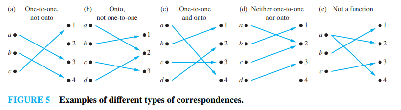
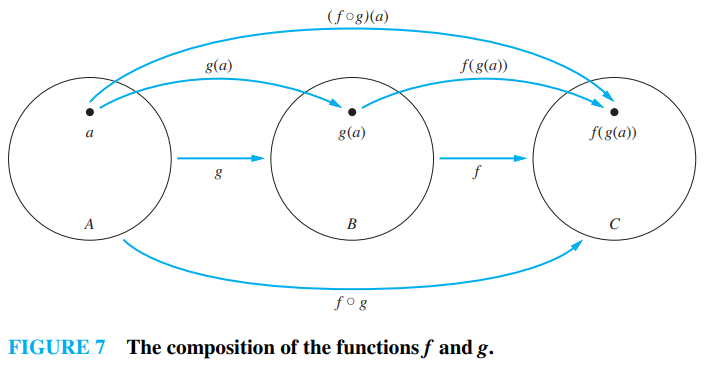
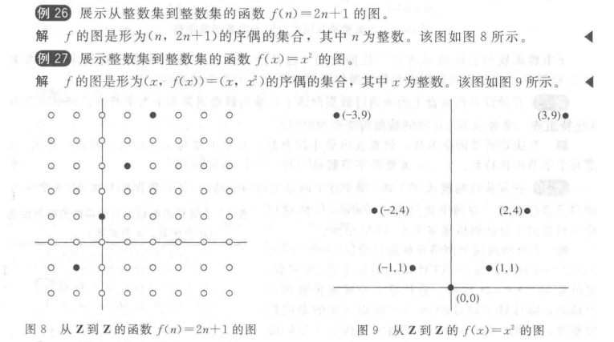
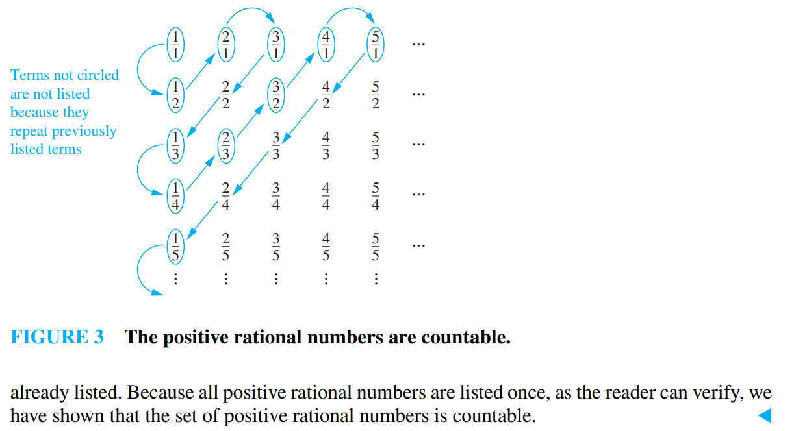

[从本章开始 彻底放弃讲解性质 因为离散数学中的内容理论上经过多年的数理训练应该掌握得不错了 迁移的最好方法是多看一些实例]

# chap2-Basic Structures: Sets, Functions, Sequences, Sums, and Matrices

引言中提到一个很重要的概念 也是我很喜欢的数学模型 函数(映射)

函数就是将一个集合中的元素唯一地映射到另一个集合中的元素的这个映射 . 这个可能高中正式接触函数的时候就会知道了 .

## 2.1 Sets

### 2.1. 明确我们讨论"集合"的范围

这里提到集合的一种表示方法是 **花名册方法 roster method** : `{a,b,c,d,}`

定义集合相等的方法 :

>Two sets are **equal** if and only if they have the same elements. 
>
>Therefore, if A and B are sets, then A and B are equal if and only if $\forall x (x \in A \leftrightarrow x \in B)$. We write A = B if A and B are equal sets .

只有一个元素的集合是"单元素集" , 注意 空集不是单元素集 因为它是"零元素集" 

我们讨论的集合是基于朴素集合论的 也就是没有完成公理化的版本 它会遇到的一个悖论是存不存在一个包含自己的集合 当然本书中不会考虑这类问题 .

### 2.1.4 集合的大小

>   Let S be a set. If there are exactly $n$ distinct elements in S where $n$ is a nonnegative integer, we say that S is a finite set and that n is the cardinality of S. The cardinality of S is denoted by |S|.
>
>   cardinality 是一个术语 表示 基数 , 也就是这个集合的**大小**
>
>   例如 A是小于10的正奇数的集合 则 |A| = 5

### 2.1.5 Power Sets 幂集

一个集合的幂集 就是这个集合所有子集的集合 .

$ \mathcal{P}(\{0, 1, 2\}) = \{\varnothing, \{0\}, \{1\}, \{2\}, \{0, 1\}, \{0, 2\}, \{1, 2\}, \{0, 1, 2\}\} $

注意空集 :
$$
\mathcal{P}(\varnothing) = \{\varnothing\} \\
\mathcal{P}(\{\varnothing\}) = \{\varnothing, \{\varnothing\}\}
$$

### 2.1.6 Cartesian Products

笛卡尔积 笛卡尔乘积 直积

>**有序n元组**
>
>The ordered n-tuple $(a_1, a_2, \cdots , a_n) $is the ordered collection that has $a_1$ as its first element, $a_2$ as its second element, … , and $a_n$ as its nth element.
>
>**笛卡尔积**
>
>Let A and B be sets. The Cartesian product of A and B, denoted by $A \times B$, is the set of all ordered pairs $(a, b)$, where $a \in A$ and $b \in B$. Hence:
>$$
>A \times B = {(a, b) ∣ a \in A \land b \in B}.
>$$
>当然 对多个集合的笛卡尔积也有定义如下 :
>$$
>A_1 \times A_2 \times \cdots \times A_n = \{(a_1, a_2, \cdots, a_n) \mid a_i \in A_i, i = 1, 2, \cdots, n\}
>$$
>
>$$
>A^n = \{(a_1, a_2, \cdots, a_n) \mid a_i \in A, i = 1, 2, \cdots, n\}
>$$
>
>注意 :
>$$
>A \times B \neq B \times A
>$$
>另外 我们定义 笛卡尔集$A \times B$的一个子集$R$ 是从集合$A$到集合$B$的一个**关系relation** 显然 这个关系是有序的

### 2.1.7 Using Set Notation with Quantifiers

$$
\forall x \in S(P(x)) \Leftrightarrow \forall x(x \in S \to P(x))
$$

$$
\exists x \in S(P(x)) \Leftrightarrow \exists X(x \in S \land P(x))
$$

### 2.1.8 Truth Sets and Quantifiers

现在我们把集合理论和谓词逻辑的一些概念结合起来.给定谓词 $ P $ 和论域 $ D $,定义 $ P $ 的**真值集truth set**为 $ D $ 中使 $ P(x) $ 为真的元素 $ x $ 组成的集合.$ P(x) $ 的真值集记为 $ \{x \in D \mid P(x)\} $

**例23** 谓词 $ P(x) $、$ Q(x) $、$ R(x) $ 的真值集都是什么？这里<u>论域是整数集合</u>,$ P(x) $ 是"$ |x| = 1 $",$ Q(x) $ 是"$ x^2 = 2 $",$ R(x) $ 是"$ |x| = x $".

解:

-   $ P $ 的真值集 $ \{x \in \mathbf{Z} \mid |x| = 1\} $ 是满足 $ |x| = 1 $ 的整数集合.因为当 $ x = 1 $ 或 $ x = -1 $ 时有 $ |x| = 1 $,而没有其他整数 $ x $ 能满足,因此 $ P $ 的真值集是 $ \{-1, 1\} $
-   $ Q $ 的真值集 $ \{x \in \mathbf{Z} \mid x^2 = 2\} $ 是满足 $ x^2 = 2 $ 的整数集合.因为没有整数 $ x $ 满足 $ x^2 = 2 $,所以这是个空集.
-   $ R $ 的真值集 $ \{x \in \mathbf{Z} \mid |x| = x\} $ 是满足 $ |x| = x $ 的整数集合.因为 $ |x| = x $ 当且仅当 $ x \geq 0 $,所以 $ R $ 的真值集是 $ \mathbf{N} $,非负整数集合.

注意 $ \forall x P(x) $ 在论域 $ U $ 上为真当且仅当 $ P $ 的真值集是集合 $ U $.同样,$ \exists x P(x) $ 在论域 $ U $ 上为真当且仅当 $ P $ 的真值集非空.

## 2.2 Set Operations

我们来定义一些集合上的运算 :

>并集 : $A \cup B = \{ x | x \in A \lor x \in B \} $ 
>
>交集 : $A \cap B = \{ x | x \in A \land x \in B \} $ 
>
>不相交 : 两个集合的交集是空集
>
>容斥原理(两个集合形式) : $| A \cup B | = |A| + |B| - |A \cap B|$
>
>A和B的差集/B相对于A的补集 : $A - B = \{ x | x \in A \land x \notin B \}$
>
>定义全集后相对全集的补集 : $\overline{A} = U - A = {x \in U | x \notin A}$
>$$
>A - B = A \cap \overline{B}
>$$
>
>---
>
>[多个集合情况]
>$$
>\bigcup_{i=1}^n A_i = A_1 \cup A_2 \cup \cdots \cup A_n \\
>\bigcap_{i=1}^n A_i = A_1 \cap A_2 \cap \cdots \cap A_n \\
>\bigcup_{i=1}^{\infin } A_i = A_1 \cup A_2 \cup \cdots \cup A_n \cdots \\
>\bigcap_{i=1}^{\infin } A_i = A_1 \cap A_2 \cap \cdots \cap A_n \cdots \\
>\bigcup_{i \in I} A_i = \{ x \mid \exists i \in I (x \in A_i) \} \\
>\bigcap_{i \in I} A_i = \{ x \mid \forall i \in I (x \in A_i) \} 
>$$
> 

### 2.2.2 Set Identities 集合恒等式

|                          恒等式                          | 名称      |
| :------------------------------------------------------: | --------- |
|                     $ A \cap U = A $                     | 恒等律    |
|                 $ A \cup \emptyset = A $                 | 恒等律    |
|                     $ A \cup U = U $                     | 支配律    |
|             $ A \cap \emptyset = \emptyset $             | 支配律    |
|                     $ A \cup A = A $                     | 幂等律    |
|                     $ A \cap A = A $                     | 幂等律    |
|             $ \overline{\overline{A}} = A $              | 补律      |
|                 $ A \cup B = B \cup A $                  | 交换律    |
|                 $ A \cap B = B \cap A $                  | 交换律    |
|        $ A \cup (B \cup C) = (A \cup B) \cup C $         | 结合律    |
|        $ A \cap (B \cap C) = (A \cap B) \cap C $         | 结合律    |
|    $ A \cup (B \cap C) = (A \cup B) \cap (A \cup C) $    | 分配律    |
|    $ A \cap (B \cup C) = (A \cap B) \cup (A \cap C) $    | 分配律    |
| $ \overline{A \cap B} = \overline{A} \cup \overline{B} $ | 德·摩根律 |
| $ \overline{A \cup B} = \overline{A} \cap \overline{B} $ | 德·摩根律 |
|                $ A \cup (A \cap B) = A $                 | 吸收律    |
|                $ A \cap (A \cup B) = A $                 | 吸收律    |
|               $ A \cup \overline{A} = U $                | 互补律    |
|           $ A \cap \overline{A} = \emptyset $            | 互补律    |

### 2.2.4 Computer Representation of Sets

在定义了全集$U$的情况下 我们可以将$U$排序 再用`01`串来表示集合 , 例如我有全集 $U = \{ 1,2,3,4,5 \}$ 那么集合 $B= \{ 2,4\}$ 则可以表示为 `01010` .这样做的好处是集合间运算可以用布尔运算直接对`01`串进行

### 2.2.5 Multisets 多重集

多重集(multiset,多重成员集的简称)就是一个元素的无序集,其中元素作为成员可以出现多于一次 . 我们用与集合相同的记号来表示多重集,但是每个元素在列表中的个数即作为成员出现的次数

我们用 $\{a, a, a, b, b\}$ 表示一个多重集包含三次 $a$ 和两次 $b$ 

我们也可以用另一种记号来避免二义性 : 记号 $\{m_1 \cdot a_1, m_2 \cdot a_2, \cdots, m_r \cdot a_r\}$ 表示多重集,其中元素 $a_i$ 出现了 $m_i$ 次 . 这里,$m_i, i=1, 2, \cdots, r$ 称为元素 $a_i, i=1, 2, \cdots, r$ 的**重复数multiplicity**

对于不在多重集中的元素,其在该集合中的重复数被置为0

多重集的基数是其元素的重复数的总和

其运算规律均符合直觉 注意元素个数不可为负数即可 会将个数小于$0$的元素的重复数置为$0$

## 2.3 Functions

**定义1** 令 $ A $ 和 $ B $ 为非空集合.从 $ A $ 到 $ B $ 的函数 $ f $ 是对元素的一种指派,对 $ A $ 的每个元素恰好指派 $ B $ 的一个元素.如果 $ B $ 中元素 $ b $ 是唯一由函数 $ f $ 指派给 $ A $ 中元素 $ a $ 的,则我们就写成 $ f(a) = b $.如果 $ f $ 是从 $ A $ 到 $ B $ 的函数,就写成 $ f : A \rightarrow B $.

**评注** 函数有时也称为**映射mapping**或者**变换transformation**

设 $f: A \to B$ 是一个函数,其中:$A$ 称为**定义域 domain** $B$ 称为**陪域 codomain**

如果 $f(a) = b$,则$b$ 称为 $a$ 的**像 image**  $a$ 称为 $b$ 的**原像 preimage**

函数 $f$ 的**值域 range**是 $B$ 中所有被映射到的元素的集合,即
$$
\{ f(x) \mid x \in A \}
$$
-   **值域是陪域的子集**

函数 $f$ 也称为从 $A$ 到 $B$ 的一个**映射 map**

函数 $ f : A \rightarrow B $ 也能由从 $ A $ 到 $ B $ 的关系来定义.回顾2.1节 $ A $ 到 $ B $ 的关系就是集合 $ A \times B $ 的子集.对于 $ A $ 到 $ B $ 的关系,如果对每一个元素 $ a \in A $ 都有且仅有一个序偶 $ (a, b) $,则它就定义了 $ A $ 到 $ B $ 的一个函数 $ f $.这个函数通过指派 $ f(a) = b $ 来定义,其中 $ (a, b) $ 是关系中唯一以 $ a $ 为第一个元素的序偶

### 2.3.2 One-to-One and Onto Functions

**定义 5** 函数 $ f $ 称为是一对一(one-to-one)或单射(injection)函数,当且仅当对于 $ f $ 的定义域中的任意 $ a $ 和 $ b $,若 $ f(a) = f(b) $,则 $ a = b $.一个函数如果是一对一的,就称为是单射的(injective)

**定义 6** 明确了什么是递增函数

**定义 7** 明确了什么是**满射surjection/映上onto**的 就是对每个$b \in B$都有存在至少一个元素$a \in A$使得$f(a) = b $.

**定义 8** 函数 $f$ 称为是一一对应(one-to-one correspondence)或双射(bijection)函数,如果它既是一对一的又是映上的.这样的函数称为是双射的(bijective)

假设 $f$ 是从集合 $A$ 到其自身的函数.如果 $A$ 是有限集,那么 $f$ 是单射当且仅当它是满射.如果 $A$ 是无限集,则情况不一定成立.

>   [!NOTE]
>
>   为什么A是无限集的时候不一定成立 有反例吗
>
>   ---
>
>   好的,这是一个非常重要且经典的概念.当集合 $A$ 是无限集时,"单射"与"满射"不再是等价的条件.我们可以通过一些经典的数学反例来清楚地看到这一点.
>
>   核心原因在于:**无限集可以与它的一个真子集具有相同的大小(即存在双射)**.这一特性是无限集的定义特征之一,但在有限集中是绝不可能发生的.
>
>   以下是两个经典的反例:
>
>   ---
>
>   ### 反例 1:函数 $f: \mathbb{N} \to \mathbb{N}$ ($\mathbb{N}$ 是自然数集 $\{0,1, 2, 3, ...\}$)
>
>   我们定义函数 $f(n) = n + 1$.
>   - **检查它是否是单射**:
>     假设 $f(a) = f(b)$,那么 $a + 1 = b + 1$,可以推出 $a = b$.所以,**$f$ 是单射**.
>   - **检查它是否是满射**:
>     满射要求对于任意的 $y \in \mathbb{N}$,都存在某个 $x \in \mathbb{N}$ 使得 $f(x) = y$.
>     即,对于任意自然数 $y$,都存在自然数 $x$ 使得 $x + 1 = y$.
>     但是,当 $y = 0$ 时,我们需要 $x + 1 = 0$,这意味着 $x = -1$.而 $-1$ 不在我们的自然数集 $\{0,1, 2, 3, ...\}$ 中.因此,**没有任何 $x$ 能映射到 $0$**.
>     **所以,$f$ 不是满射**.
>
>   在这个例子中,函数 $f$ 将自然数集映射到了它的一个真子集 $\{1,2, 3, 4, ...\}$ 上.它是"一对一"的,但却没有覆盖整个目标集合(原集合 $A$ 本身).
>
>   ---
>
>   ### 反例 2:函数 $g: \mathbb{Z} \to \mathbb{Z}$ ($\mathbb{Z}$ 是整数集 $\{..., -2, -1, 0, 1, 2, ...\}$)
>
>   我们定义函数 $g(n) = 2n$.
>   - **检查它是否是单射**:
>     假设 $g(a) = g(b)$,那么 $2a = 2b$,可以推出 $a = b$.所以,**$g$ 是单射**.
>   - **检查它是否是满射**:
>     满射要求对于任意的 $y \in \mathbb{Z}$,都存在某个 $x \in \mathbb{Z}$ 使得 $g(x) = y$,即 $2x = y$.
>     这意味着 $y$ 必须是偶数.对于所有奇数 $y$(例如 $y=1, y=-1$ 等),不存在一个整数 $x$ 能满足 $2x = y$.
>     **所以,$g$ 不是满射**.
>
>   这个函数将整个整数集"压缩"到了偶数集这个真子集上.它依然是"一对一"的,但不是"满射".
>
>   ---
>
>   ### 总结
>
>   | 集合类型       | 函数 $f: A \to A$ 的性质                                     |
>   | :------------- | :----------------------------------------------------------- |
>   | **有限集 $A$** | $f$ 是单射 $\iff$ $f$ 是满射 $\iff$ $f$ 是双射               |
>   | **无限集 $A$** | $f$ 是单射 $\nRightarrow$ $f$ 是满射 $f$ 是满射 $\nRightarrow$ $f$ 是单射 |
>
>   因此,对于从无限集到其自身的函数,单射性和满射性是**相互独立**的两个概念.一个成立并不能保证另一个也成立.你提供的文本中提到的 **2.5 节** 很可能会深入探讨集合的"基数"概念,并正式证明无限集的这种特性.

关于函数单射(injective)与满射(surjective)的证明方法总结

---

假设 $ f : A \to B $

**要证明 $ f $ 是单射的**:证明对于任意 $ x, y \in A $,如果 $ f(x) = f(y) $,则 $ x = y $.

**要证明 $ f $ 不是单射的**:找到特定的 $ x, y \in A $,使得 $ x \neq y $ 且 $ f(x) = f(y) $.

**要证明 $ f $ 是满射的**:考虑任意元素 $ y \in B $,并找到一个元素 $ x \in A $ 使得 $ f(x) = y $.

**要证明 $ f $ 不是满射的**:找到一个特定的 $ y \in B $,使得对于任意 $ x \in A $ 有 $ f(x) \neq y $.

### 2.3.3 Inverse Functions and Compositions of Functions

**定义9** 令$ f $为从集合$ A $到集合$ B $的一一对应.$ f $的反函数(或逆函数)是这样的函数,它指派给$ B $中元素$ b $的是$ A $中使得$ f(a)=b $唯一元素$ a $.$ f $的反函数用$ f^{-1} $表示.于是,当$ f(a)=b $时$ f^{-1}(b)=a $.

很显然地 我们要强调一点 这种可逆性的前提是一一对应关系 . 如果它没有一一对应关系 那么它就是不可逆的 .

**定义10** 令$ g $为从集合$ A $到集合$ B $的函数,$ f $是从集合$ B $到集合$ C $的函数,函数$ f $和$ g $的**合成 composition**记作$ f \circ g $,定义为对任意$ a \in A $,有 $$ (f \circ g)(a) = f(g(a)) $$

一般来说 $(f \circ g)(x) \neq (g \circ f)(x)$ , $(f^{-1})^{-1} = f$ , $(f \circ f^{-1})(x) = (f^{-1} \circ f)(x) = x $ .

### 2.3.4 The Graphs of Functions

**定义11** 令$f$为从集合$A$到集合$B$的函数 函数$f$的图就是序偶集合$\{ (a,b) | a \in A \land f(a)=b \}$ .

### 2.3.5 Some Important Functions

#### 上下取整函数

*   **下取整函数**$\lfloor x \rfloor$:定义为**不大于$x$ 的最大整数**.
*   **上取整函数**$\lceil x \rceil$:定义为**不小于$x$ 的最小整数**

|  序号   |             取整函数性质($n$ 为整数,$x$ 为实数)              |
| :-----: | :----------------------------------------------------------: |
|  (1a)   |  $\lfloor x \rfloor = n$ if and only if $n \leq x < n + 1$   |
|  (1b)   |  $\lfloor x \rfloor = n$ if and only if $n - 1 < x \leq n$   |
|  (1c)   |   $\lceil x \rceil = n$ if and only if $x - 1 < n \leq x$    |
|  (1d)   |   $\lceil x \rceil = n$ if and only if $x \leq n < x + 1$    |
| **(2)** | $x - 1 < \lfloor x \rfloor \leq x \leq \lceil x \rceil < x + 1$ |
|  (3a)   |           $\lfloor -x \rfloor = -\lceil x \rceil$            |
|  (3b)   |           $\lceil -x \rceil = -\lfloor x \rfloor$            |
|  (4a)   |       $\lfloor x + n \rfloor = \lfloor x \rfloor + n$        |
|  (4b)   |         $\lceil x + n \rceil = \lceil x \rceil + n$          |

-   其他性质

    -   $\lfloor 2x \rfloor = \lfloor x \rfloor + \lfloor x + \frac{1}{2} \rfloor$
        >   [!NOTE]
        >
        >   令$x = n + \epsilon$,其中$n$ 为整数,$0 \leq \epsilon < 1$.  
        >
        >   分两种情况讨论:  
        >   *   **情况 1 ($0 \leq \epsilon < \frac{1}{2}$):**  
        >       *   $\lfloor 2x \rfloor = \lfloor 2n + 2\epsilon \rfloor = 2n$  
        >       *   $\lfloor x \rfloor + \lfloor x + \frac{1}{2} \rfloor = n + n = 2n$  
        >       *   等式成立.  
        >   *   **情况 2 ($\frac{1}{2} \leq \epsilon < 1$):**  
        >       *   $\lfloor 2x \rfloor = \lfloor 2n + 2\epsilon \rfloor = 2n + 1$  
        >       *   $\lfloor x \rfloor + \lfloor x + \frac{1}{2} \rfloor = n + (n + 1) = 2n + 1$  

    -   判断是否对所有实数$x$ 和$y$,都有$\lfloor x + y \rfloor = \lfloor x \rfloor + \lfloor y \rfloor$

        -   可以找出反例 : $x = \frac{1}{2}$,$y = \frac{1}{2}$.

#### 斯特林公式

**斯特林公式 Stirling's Approximation**是用于估算n阶乘近似值的重要数学公式,尤其适合n取值较大的场景,在组合数学、概率论、统计物理等多个领域都有广泛应用,以下是其详细介绍:
$$
n!\approx\sqrt{2\pi n}\left({\frac{n}{e}}\right)^n
$$
其极限形式可准确体现这种渐近关系:
$$
\lim_{n\rightarrow\infty}\frac{n!}{\sqrt{2\pi n}\left({\frac{n}{e}}\right)^n}=1
$$
此外还有更精确的渐近展开版本,通过增加修正项进一步提升估算精度:
$$
n!\sim\sqrt{2\pi n}\left({\frac{n}{e}}\right)^n\left(1+\frac{1}{12n}+\frac{1}{288n^2}-\frac{139}{51840n^3}+\cdots\right)
$$

### 2.3.6 Partial Functions

在一些情况下 我们的函数并不能对所有情况都使用 比如算法题中可能会需要特判 在`for`循环中可能会跳过一些`i`值 等等 为了研究这种情形 我们需要引入**部分函数 partial function**的概念

一个从集合 A 到集合 B 的部分函数 $f$,是指:

-   仅对 A 的一个子集中的每个元素 a,指派 B 中唯一的元素 b；
-   集合 A 称为 $f$ 的域,集合 B 称为 $f$ 的陪域,真正有定义的部分才是定义域
-   对于 A 中但不在 $f$ 定义域里的元素,我们说 $f$ 对其**无定义 undefined**

特别地,当 $f$ 的定义域等于整个集合 $ A $ 时,就称 $f$ 是**全函数 total function** 也就是我们最常使用的函数定义 .

我们仍用 $f: A \to B$ 来表示 $f$ 是从 $A$ 到 $B$ 的部分函数 至于是权函数还是部分函数 要依据上下文来判断 .

>   函数 $f: \mathbf{Z} \to \mathbf{R}$,其中 $f(n) = \sqrt{n}$ 是一个从 $\mathbf{Z}$ 到 $\mathbf{R}$ 的部分函数,这里定义域是非负整数的集合.注意 $f$ 对于负整数无定义.

## 2.4 Sequences and Summations

### part 1 数列 序列 ...

这一段的深度不如高中的数列 下面是笔者认为有必要写下来的部分 :

-   从一个数列的前几项中推出整个数列的生成方式 或者 规律 是有趣且重要的技能 , Attention is all you need .
-   整数序列还出现在离散数学以外的相当广泛的领域,包括生物学、工程、化学、物理学以及谜题中.OEIS维护的一个有趣的数据库中可以找到超过250000个不同的整数序列.这个数据库起初是由内尔·斯朗在1964年创建的,现在由OEIS基金会维护.
-   这个网站笔者今天在学习ACM算法时正好访问过 : [The On-Line Encyclopedia of Integer Sequences (OEIS)](https://oeis.org/) .

### part 2 求和 ...

这一段的深度不如高中的数列 或许你会想要复习以下内容 :

[md 不想自己排版了 几个AI的效果有点差 直接找个知乎文章看看吧 就是一些高中学过的求和方法 ! ]

## 2.5 Cardinality of Sets

之前我们定义的基数是针对有限集的 现在我们要将它扩展到无限集 .

**定义 1** 集合A和集合B有相同的**基数 cardinality**,当且仅当存在从A到B的一一对应关系.当A和B有相同的基数时,可以写作 $|A| = |B|$

对于无限集,<u>基数的定义提供了一个衡量**两个**集合相对大小的方法</u>,而不是衡量一个集合大小的方法.

基于此我们还可以定义什么叫作一个集合的基数小于另一个集合的基数.

**定义 2** 如果存在一个从A到B的一对一函数,则A的基数小于或等于B的基数,并写成 $|A| \leq |B|$.再者,当 $|A| \leq |B|$ 并且A和B有不同的基数时,我们说A的基数小于B的基数,并写成 $|A| < |B|$.

>   [!NOTE]
>
>   这两个定义的前提是存在单射函数 . A和B是任意无限集时,这些定义并未单独赋予 $|A|$ 和 $|B|$ 任何具体含义

此时 我们就可以得到完善的可数集合的定义 :

**定义 3** 一个要么是有限的、要么与正整数集(这里最好模糊处理是否包含`0`的问题)有相同基数的集合被称为**可数集**.不是可数集的集合被称为**不可数集**.当一个无限集 $ S $ 是可数集时,我们用 $ \aleph_0 $ 表示 $ S $ 的基数(其中 $ \aleph $ 是希伯来字母表的第一个字母"阿列夫").我们记作 $ |S| = \aleph_0 $,并说 $ S $ 的基数是"阿列夫零".

>   [!CAUTION]
>
>   在诸多数学科普号中都涉及到的一个话题 **希尔伯特饭店**
>
>   可能会让你惊讶的是 有理数集也是可数集 可以通过下图的方式证明
>
>   

还有一些集合是不可数的 比如实数集 下面给出实数集不可数的证明 (这是一种很标准的证明方法 书上和AI的结果一致) :

>
>   #### 1. 问题转化
>   要证明实数集 $\mathbb{R}$ 不可数,只需要证明**区间 $(0,1)$ 内的实数不可数**即可,因为如果 $(0,1)$ 不可数,那么 $\mathbb{R}$ 也不可数(可通过建立双射或利用子集的性质得到).
>
>   ---
>
>   #### 2. 思路:反证法 + 对角线法
>   假设 $(0,1)$ 内的实数是**可数的**,那么我们可以把它们排成一个序列:
>   $$
>   r_1, r_2, r_3, \dots
>   $$
>   每个实数 $r_n$ 都可以写成**十进制无限小数**的形式(为避免表示不唯一,我们约定不使用从某位起全是 9 的表示,例如 0.1999... 统一为 0.2000...).
>
>   于是我们可以写出:
>   $$
>   \begin{aligned}
>   r_1 &= 0.a_{11}a_{12}a_{13}a_{14}\dots \\
>   r_2 &= 0.a_{21}a_{22}a_{23}a_{24}\dots \\
>   r_3 &= 0.a_{31}a_{32}a_{33}a_{34}\dots \\
>   &\vdots
>   \end{aligned}
>   $$
>   其中 $a_{ij} \in \{0,1,2,\dots,9\}$.
>
>   ---
>
>   #### 3. 构造不在列表中的实数
>   我们构造一个新的实数 $x = 0.b_1 b_2 b_3 b_4 \dots$,其中:
>   $$
>   b_n = 
>   \begin{cases}
>   1, & \text{如果 } a_{nn} \neq 1 \\
>   2, & \text{如果 } a_{nn} = 1
>   \end{cases}
>   $$
>   (这里选择 1 和 2 是为了避免出现 0 或 9 引起的表示不唯一问题,并且确保 $b_n \neq a_{nn}$.)
>
>   ---
>
>   #### 4. 推导矛盾
>   - $x \in (0,1)$,因为它的十进制表示是合法的且不以全 9 循环.
>   - 对每个 $n$,$x$ 与 $r_n$ 在第 $n$ 位小数不同(因为 $b_n \neq a_{nn}$).
>   - 因此 $x$ 不在列表 $\{r_1, r_2, r_3, \dots\}$ 中.
>
>   这与"列表包含 $(0,1)$ 中所有实数"矛盾.
>
> ---
>
>   #### 5. 结论
>   假设 $(0,1)$ 可数导致矛盾,所以 $(0,1)$ 不可数,从而 $\mathbb{R}$ 不可数.
>

有关基数的结果 我们现在讨论一些有关集合基数的**结论 results**.

>   [!IMPORTANT]
>
>   **定理 1** 如果 $A$ 和 $B$ 是可数集合,则 $A \cup B$ 也是可数集合.

> **证明** 假定 $A$ 和 $B$ 是可数集合,不妨设 $A$ 和 $B$ 是不相交的.如果它们不是不相交的,就可以用 $B-A$ 来代替 $B$,因为 $A \cap (B-A) = \varnothing$ 并且 $A \cup (B-A) = A \cup B$.再者,不妨,如果两个集合之一是可数无限的而另一个是有限的,则我们可以假设 $B$ 是那个有限集合.
> 
> 有三种情形需要考虑:(i) $A$ 和 $B$ 均为有限的；(ii) $A$ 是无限的而 $B$ 是有限的；(iii) $A$ 和 $B$ 均为可数无限的.
> 
> 情形(i):在适当 $A$ 和 $B$ 均为有限的时候,$A \cup B$ 也是有限的,因此是可数的.
>
> 情形(ii):因为 $A$ 是可数无限的,所以它的元素就可以排列成一个无限序列 $a_1, a_2, a_3, \dots, a_i, \dots$,同时因为 $B$ 是有限的,所以其元素可以排列成 $b_1, b_2, b_3, \dots, b_n, n$ 是某个正整数.我们可以把 $A \cup B$ 的元素排列成 $b_1, b_2, b_3, \dots, b_n, a_1, a_2, a_3, \dots, a_i, \dots$,这意味着 $A \cup B$ 是可数无限的.
> 
> 情形(iii):因为 $A$ 和 $B$ 均为可数无限的,可以分别把它们的元素排列成 $a_1, a_2, a_3, \dots, a_i, \dots$ 和 $b_1, b_2, b_3, \dots, b_i, \dots$.通过交替这两个序列的项,我们就可以把 $A \cup B$ 的元素排列成无限序列 $a_1, b_1, a_2, b_2, a_3, b_3, \dots, a_i, b_i, \dots$.这意味着 $A \cup B$ 是可数无限的.
> 
> 至此完成了证明,因为已经证明在所有三种情形下 $A \cup B$ 都是可数的.

>   [!IMPORTANT]
>
>   **定理2** (Schröder-Bernstein 定理) 如果 $A$ 和 $B$ 是集合且 $|A| \le |B|$ 和 $|B| \le |A|$,则 $|A| = |B|$.换言之,如果存在一个从 $A$ 到 $B$ 的单射且存在一个从 $B$ 到 $A$ 的单射,则存在 $A$ 到 $B$ 之间的一对一对应.

>   这个定理看起来简单证明起来却相当复杂 练习中有道题目给出证明的一点思路/启发/提示

下面用一个例子来解释定理2的应用.

>   **例6** 证明 $|(0, 1]| = |(0, 1)|$.
> 
>    **解** 如何寻找一个 $(0, 1)$ 和 $(0, 1]$ 之间的一对一双射证明 $|(0, 1]| = |(0, 1]|$ 完全不是显而易见的.幸运的是,可以采用 Schröder-Bernstein 定理.寻找一个 $(0, 1)$ 到 $(0, 1]$ 的一对一函数是很简单的,因为 $(0, 1) \subset (0, 1]$,所以 $f(x) = x$ 就是一个 $(0, 1)$ 到 $(0, 1]$ 的一对一函数.寻找一个 $(0, 1]$ 到 $(0, 1)$ 的一对一函数也不难.函数 $g(x) = x/2$ 显然是一对一且目标在 $(0, 1/2] \subset (0, 1)$.由于我们找到了从 $(0, 1]$ 到 $(0, 1)$ 的一对一函数,所以 $|(0, 1]| = |(0, 1)|$.

**定义4** 如果存在某种编程语言的计算机程序能计算一个函数的值,则该函数称为是**可计算的 computable**.反之则是**不可计算的 uncomputable**.

>   要证明存在不可计算函数,我们需要建立两个结果.
>
>   -   首先要证明用任何编程语言写的计算机程序的集合是可数的.注意用一种特定语言编写的一个计算机程序可以看作由有限字符表构造的字符串就可以证明该结论(参见练习 37).
>
>   -   接下来,我们证明从一个特定的可数无限集合到自身的函数有不可数无限多个.练习 38 证明了从正整数到自身的函数集合是不可数的.这是 $0-1$ 之间实数集的不可数性(参见例 5)的一个推论.
>
>  结合这两个结果(参见练习 39)可以证明存在不可计算函数.

>   [!IMPORTANT]
>
>   我们简单讨论一下有关基数的另一个著名开放问题以作为本节的结束.
>
>   -   连续统假设由康托尔于1877年提出。他耗费心血却未能成功证明,因无法攻克该难题而深感沮丧。直至1900年,解决连续统假设已被列为数学界最重要的未解难题之一,大卫·希尔伯特在其1900年公布的数学开放问题列表中将其置于首位。
>
>   -   如今,连续统假设仍是悬而未决的课题,并持续成为活跃的研究领域。然而,研究已表明:在现代数学的标准集合论公理——策梅洛-弗兰克尔公理体系下,该假设既不能被证明也不能被证伪。策梅洛-弗兰克尔(ZFC)公理体系的建立旨在规避朴素集合论中的悖论(如罗素悖论),但关于是否应当用其他集合论公理体系来取代该体系,目前仍存在较大争议。
>
>   ---
>
>   已知(练习38、40):
>
>   $$|\mathbb{Z}^+| = \aleph_0 < 2^{\aleph_0} = \mathfrak{c} = |\mathbb{R}| = |\mathcal{P}(\mathbb{Z}^+)|$$
>
>   也就是说,正整数集是可数无限的,而实数集(或正整数集的幂集)是不可数无限的,且<u>实数集</u>和<u>正整数集的幂集</u>的基数正好相等,都记作连续统基数 $\mathfrak{c}$(或 $c$)
>
>   连续统假设(Continuum Hypothesis,简称CH)断言:
>
>   > 在 $\aleph_0$ 与 $\mathfrak{c}$ 之间不存在任何基数。
>
>   换句话说,不存在集合 $A$ 使得
>
>   $$
>   \aleph_0 < |A| < \mathfrak{c}
>   $$
>   已知最小的无限基数严格递增排列为
>
>   $$
>   \aleph_0 < \aleph_1 < \aleph_2 < \aleph_3 < \cdots
>   $$
>   因此,若连续统假设为真,则必有
>
>   $$
>   \mathfrak{c} = \aleph_1 \quad \text{which means} \quad 2^{\aleph_0} = \aleph_1
>   $$
>   这便是"$\aleph_0$ 之后的下一个基数就是实数集的基数"这一漂亮猜想的数学表达。
>
>   然而,ZFC公理体系既无法推出 $2^{\aleph_0} = \aleph_1$,也无法推出 $2^{\aleph_0} > \aleph_1$(实际上可以构造出 $2^{\aleph_0} = \aleph_2, \aleph_{17}, \aleph_{287}$ 甚至更大的模型)。
>
>   这意味着,在当前标准集合论框架下,我们永远无法确定连续统基数到底排在第几位——它是一个真正的"不可判决"命题。

## 2.6 Matrices

本节的矩阵内容很简单 只涉及到最简单的运算

### 2.6.1  Introduction

**定义 1**  一个矩阵是一个数的矩形阵列。具有 $m$ 行 $n$ 列的矩阵称为 $m \times n$ 矩阵。矩阵的行数与列数相同的矩阵称为方阵。如果两个矩阵的对应位置元素完全相等，则称这两个矩阵相等。下面是一个 $2 \times 3$矩阵
$$
\begin{bmatrix}
0 & 1 \\
1 & 3
\end{bmatrix}
$$
**定义 2**  设 $m$ 和 $n$ 为正整数，令  
$$
A = \begin{bmatrix}
a_{11} & a_{12} & \cdots & a_{1n} \\
a_{21} & a_{22} & \cdots & a_{2n} \\
\vdots & \vdots & \ddots & \vdots \\
a_{m1} & a_{m2} & \cdots & a_{mn}
\end{bmatrix}
$$
则矩阵 A 的第 $i$ 行是 $1 \times n$ 矩阵 $[a_{i1}, a_{i2}, \dots, a_{in}]$。第 $j$ 列是 $m \times 1$  矩阵  
$$
\begin{bmatrix}
a_{1j} \\
a_{2j} \\
\vdots \\
a_{mj}
\end{bmatrix}
$$
矩阵 A 的第 $(i,j)$ 元素是 $a_{ij}$，即位于第 $i$ 行第 $j$ 列的数。为书写方便，常将 $a_{ij}$ 写成 $a_i,j$，这表示 A 的第 $i$ 行第 $j$ 列的元素。

### 2.6.2 Matrix Arithmetic

**定义 3**  设 $A = [a_{ij}]$ 和 $B = [b_{ij}]$ 是两个 $m \times n$ 矩阵。A 与 B 的和记作 $A + B$，其定义为  
$$
A + B = [a_{ij} + b_{ij}]
$$
即对应位置的元素相加。当且仅当两个矩阵的尺寸完全相同时，加法才有定义。

**例 2**  
$$
\begin{bmatrix}
1 & 0 & -1 \\
2 & 2 & -3 \\
3 & 4 & 0
\end{bmatrix}
+
\begin{bmatrix}
3 & 4 & -2 \\
1 & 1 & 2 \\
2 & 5 & 2
\end{bmatrix}
=
\begin{bmatrix}
4 & 4 & -3 \\
3 & 3 & -1 \\
5 & 9 & 2
\end{bmatrix}
$$

**定义 4**  设 A 是 $ m \times k $ 矩阵，B 是 $ k \times n $ 矩阵。A 与 B 的乘积记作 AB，是 $m \times n$ 矩阵，其 $ (i,j) $ 元素等于 A 的第 $i$ 行与 B 的第 $j$ 列对应元素乘积之和。即若 $AB = [c_{ij}]$，则  
$$
c_{ij} = a_{i1}b_{1j} + a_{i2}b_{2j} + \cdots + a_{ik}b_{kj}
$$

**例 3**  设  
$$
A = \begin{bmatrix}
1 & 0 & 4 \\
2 & 1 & 1 \\
3 & 1 & 0 \\
0 & 2 & 2
\end{bmatrix}
\quad\text{和}\quad
B = \begin{bmatrix}
2 & 4 \\
1 & 1 \\
5 & 0
\end{bmatrix}
$$
求 AB(如果有定义的话)。

**解**  因为 A 是 4 × 3 矩阵，B 是 3 × 2 矩阵，所以乘积 AB 有定义，且为 4 × 2 矩阵。为了求 AB 乘积中第 $ (i,j) $ 元素，需要把 A 的第 $i$ 行与 B 的第 $j$ 列对应相乘并求和。最终得到  
$$
AB = \begin{bmatrix}
22 & 4 \\
10 & 9 \\
7 & 13 \\
12 & 2
\end{bmatrix}
$$

**例 4**  设  
$$
A = \begin{bmatrix}
1 & 1 \\
2 & 1
\end{bmatrix}
\quad\text{和}\quad
B = \begin{bmatrix}
2 & 1 \\
1 & 1
\end{bmatrix}
$$
求 AB 与 BA。

**解**  
$$
AB = \begin{bmatrix}
3 & 2 \\
5 & 3
\end{bmatrix}
\quad\text{和}\quad
BA = \begin{bmatrix}
4 & 3 \\
3 & 2
\end{bmatrix}
$$
因此，AB ≠ BA。

虽然矩阵乘法满足结合律，但一般不满足交换律。即使 AB 和 BA 都定义，也不一定相等。事实上，如果 A 是 $m \times n$ 矩阵，B 是 $n \times m$ 矩阵$(m \times n)$，则 AB 是 $m \times m$ 矩阵，BA 是 $n \times n$ 矩阵，二者尺寸不同，自然不相等。

### 2.6.3 Transposes and Powers of Matrices

我们先引入一个重要的全为 0 和 1 的矩阵。

**定义 5**  **单位矩阵 identity matrix**是 $n \times n$ 方阵 $I_n = [\delta_{ij}]$，其中 Kronecker delta  克罗内克积
$$
\delta_{ij} = 
\begin{cases}
1 & \text{如果 } i = j \\
0 & \text{如果 } i \neq j
\end{cases}
$$
即  
$$
I_n = \begin{bmatrix}
1 & 0 & \cdots & 0 \\
0 & 1 & \cdots & 0 \\
\vdots & \vdots & \ddots & \vdots \\
0 & 0 & \cdots & 1
\end{bmatrix}
$$

将矩阵的行与列互换的操作在许多其他运算中都有用。

**定义 6**  设 $A = [a_{ij}]$ 是 $m \times n$ 矩阵。A 的**转置 transpose** 记作 $A^T$，是 $n \times m$ 矩阵，其 $ (i,j) $ 元素为 $a_{ji}$。即若 $A^T = [b_{ij}]$，则 $b_{ij} = a_{ji}$($i$ = 1, 2, …, $n$；$j$ = 1, 2, …, $m$)。

**例 5**  矩阵  
$$
\begin{bmatrix}
1 & 2 & 3 \\
4 & 5 & 6
\end{bmatrix}
$$
的转置是  
$$
\begin{bmatrix}
1 & 4 \\
2 & 5 \\
3 & 6
\end{bmatrix}
$$

如果一个方阵的行与列互换后不变，则称其为对称矩阵。

**定义 7**  方阵 A 称为**对称矩阵 symmetric**，如果 $A = A^T$。即 $a_{ij} = a_{ji}$ 对所有 $i$, $j$ 成立。

**例 6**  矩阵  
$$
\begin{bmatrix}
1 & 1 & 0 \\
1 & 0 & 1 \\
0 & 1 & 0
\end{bmatrix}
$$
是对称矩阵。

### 2.6.4 Zero–One Matrices

所有元素仅为 0 或 1 的矩阵称为**零一矩阵 zero-one matrix**。零一矩阵在表示离散结构(如通信网络)时非常有用。

**定义 8**  设 $A = [a_{ij}]$ 和 $B = [b_{ij}]$ 是 $m \times n$ 零一矩阵。A 与 B 的**联接 join**记作 $A \lor B$，是 $m \times n$ 零一矩阵，其 $ (i,j) $ 元素为 $a_{ij} \vee b_{ij}$。A 与 B 的**相遇 meet**记作 $A \land B$，其 $ (i,j) $ 元素为 $a_{ij} \wedge b_{ij}$。

**例 7**  求零一矩阵  
$$
A = \begin{bmatrix}
1 & 0 & 1 \\
0 & 1 & 0
\end{bmatrix},
\quad
B = \begin{bmatrix}
0 & 1 & 0 \\
1 & 1 & 0
\end{bmatrix}
$$
的联接与相遇。

**解**  
$$
A \vee B = \begin{bmatrix}
1 \vee 0 & 0 \vee 1 & 1 \vee 0 \\
0 \vee 1 & 1 \vee 1 & 0 \vee 0
\end{bmatrix}
= \begin{bmatrix}
1 & 1 & 1 \\
1 & 1 & 0
\end{bmatrix}
$$
$$
A \wedge B = \begin{bmatrix}
1 \wedge 0 & 0 \wedge 1 & 1 \wedge 0 \\
0 \wedge 1 & 1 \wedge 1 & 0 \wedge 0
\end{bmatrix}
= \begin{bmatrix}
0 & 0 & 0 \\
0 & 1 & 0
\end{bmatrix}
$$

**定义 9**  设 $A = [a_{ij}]$ 是 $ m \times k $ 零一矩阵，$B = [b_{ij}]$ 是 $ k \times n $ 零一矩阵。A 与 B 的**布尔积 Boolean product**记作 $A \odot B$，是 $m \times n$ 矩阵，其 $ (i,j) $ 元素为  
$$
c_{ij} = (a_{i1} \wedge b_{1j}) \vee (a_{i2} \wedge b_{2j}) \vee \cdots \vee (a_{ik} \wedge b_{kj})
$$

即按照矩阵乘法 逐一进行合取最后再析取

**例 8**  求 A 与 B 的布尔积，其中  
$$
A = \begin{bmatrix}
1 & 0 \\
0 & 1 \\
1 & 0
\end{bmatrix},
\quad
B = \begin{bmatrix}
1 & 1 & 0 \\
0 & 1 & 1
\end{bmatrix}
$$

**解**  
$$
A \odot B = \begin{bmatrix}
(1\wedge1)\vee(0\wedge0) & (1\wedge1)\vee(0\wedge1) & (1\wedge0)\vee(0\wedge1) \\
(0\wedge1)\vee(1\wedge0) & (0\wedge1)\vee(1\wedge1) & (0\wedge0)\vee(1\wedge1) \\
(1\wedge1)\vee(0\wedge0) & (1\wedge1)\vee(0\wedge1) & (1\wedge0)\vee(0\wedge1)
\end{bmatrix}
= \begin{bmatrix}
1 & 1 & 0 \\
0 & 1 & 1 \\
1 & 1 & 0
\end{bmatrix}
$$

我们还可以定义零一方阵的布尔幂。这些幂在求通信网络中的路径时非常有用。

**定义 10**  设 A 是零一方阵，$r$ 为正整数。A 的 $r$ 次布尔幂记作 $A^{[r]}$，定义为  
$$
A^{[1]} = A, \quad A^{[r]} = A \odot A \odot \cdots \odot A \quad (r \text{ 次})
$$
**例 9**  设  
$$
A = \begin{bmatrix}
0 & 0 & 1 \\
1 & 0 & 0 \\
1 & 1 & 0
\end{bmatrix}
$$
求 $A^{[r]}$($r$ 为所有正整数)。

**解**  我们发现  
$$
A^{[2]} = A \odot A = \begin{bmatrix}
1 & 1 & 0 \\
0 & 0 & 1 \\
1 & 0 & 1
\end{bmatrix},
\quad
A^{[3]} = A^{[2]} \odot A = \begin{bmatrix}
1 & 1 & 1 \\
1 & 1 & 0 \\
1 & 1 & 1
\end{bmatrix}
$$
进一步计算可得，当 $n \geq 3$ 时，$A^{[n]} = \begin{bmatrix} 1 & 1 & 1 \\ 1 & 1 & 1 \\ 1 & 1 & 1 \end{bmatrix}$。

读者不难验证，当 $n \geq 5$ 时，$A^{[n]}$ 对所有正整数 $n$ 都相等。

