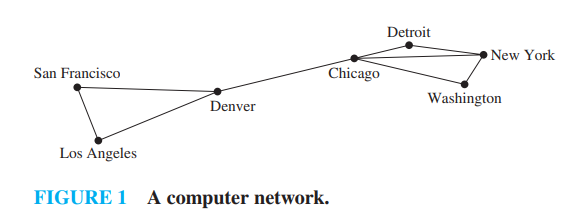
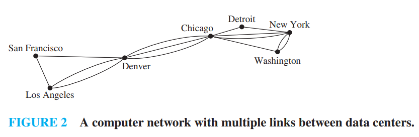
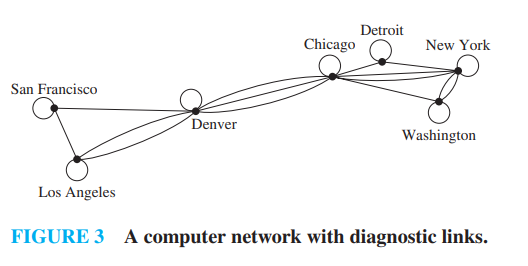
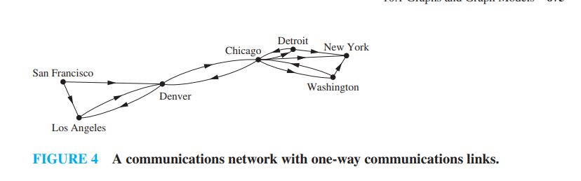
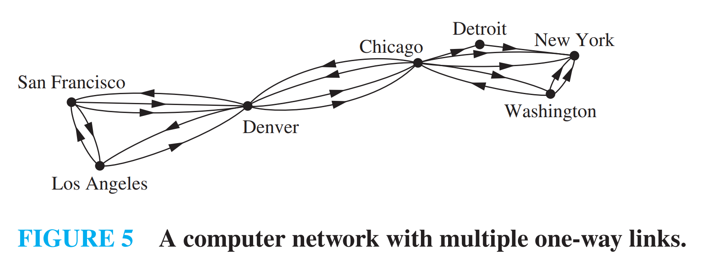
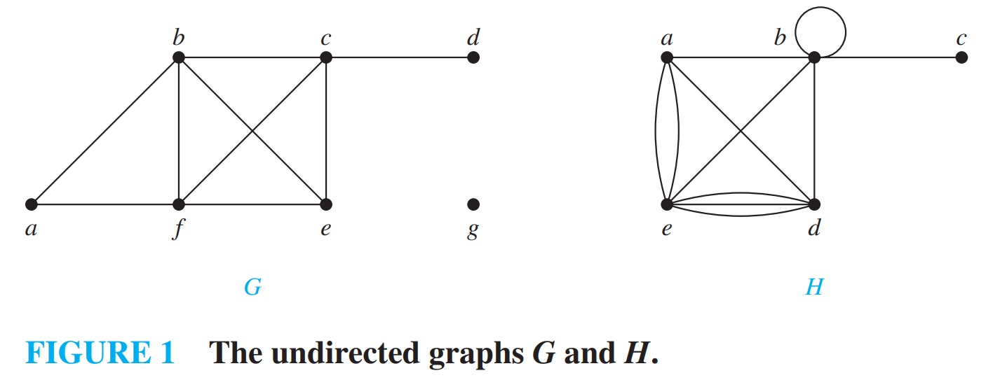
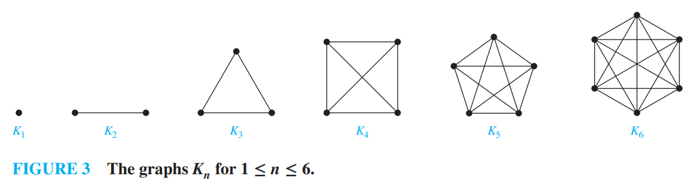
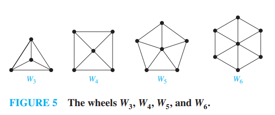
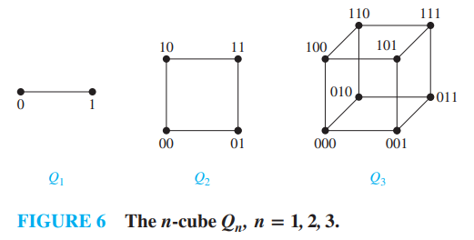

[本科教学版第6章]

# chap10-Graphs and Graph Models

## 10.1 Graphs and Graph Models

-   **定义 1 : 无向图** $G = (V, E)$ 由 $V$(非空的顶点集合或节点)和 $E$(边的集合)组成. 每条边关联一个或两个顶点, 称为其端点. 一条边称为连接其端点.

-   注: 图 $G$ 的顶点集合 $V$ 可能是无限的. 顶点集合无限或边的数量无限的图称为**无限图**; 相比之下, 顶点集合有限且边集合有限的图称为**有限图**. 本书通常只讨论<u>有限图</u>.

接下来我们利用计算机网络的模型来展示各种各样的图, 借此说明"图"中涉及到的各种概念 :

>   [!NOTE]
>
>   我们最好是将图的边用不相交的线段或者曲线画在平面上, 但是不是所有的图都能用不相交的线画出来, 只要能正确表示关系即可.

注意: 此计算机网络的每条边都连接两个不同的顶点, 也就是说, 没有边连接一个顶点到其自身; 并且不存在两条不同的边连接同一对顶点. 若每条边都连接两个不同的顶点, 且没有两条边连接同一对顶点, 则该图称为**简单图 simple graph**. 在简单图中, 每条边对应一个无序顶点对, 而没有其他边对应同一对顶点. 因此, 当存在一条简单图的边对应 $\{u, v\}$ 时, 也可以不引起混淆地说 $\{u, v\}$ 是该图的一条边.

一个计算机网络可能在数据中心之间有多条链路(如图 2 所示). 要描述这样的网络, 我们需要允许多条边连接同一对顶点的图. 允许同一对顶点之间出现重边的图称为**多重图 multigraphs**. 当存在 $m$ 条不同的边都对应同一无序顶点对 $\{u, v\}$ 时, 也说 $\{u, v\}$ 是一条重数为 $m$ 的边. 也就是说, 这组边可视为边 $\{u, v\}$ 的 $m$ 个不同副本.

有时一条通信链路会把某个数据中心与其自身相连, 例如用于诊断的反馈环路. 这样的网络如图 3 所示. 要对这种网络建模, 我们需要包含连接顶点自身的边. 这类边称为 **环 loops**, 有时在一个顶点还会有多于一个的 loop. 

<u>允许包含 loops, 并且可能包含连接同一对顶点或将顶点连接到自身的多条边的图, 有时称为 **伪图 pseudographs**.</u>

目前介绍的图都是 **无向图 undirected graphs**. 它们的边也称为 **undirected**. 但是, 在构造图模型时, 我们可能需要给边指定方向. 例如在计算机网络中, 某些链路可能只按一个方向工作(这类链路称为 **单工链路 single duplex lines**). 当大量流量发送到某些数据中心而反向几乎没有流量时, 就会出现这种情况. 这样的网络如图 4 所示. 为了描述这种计算机网络, 我们使用有向图. 有向图的每条边都对应一个有序对. 这里给出的有向图定义比第 9 章中用来表示关系的定义更一般.

-   **定义 2 : 有向图** $(V, E)$ 由一个非空顶点集 $V$ 和一个有向边(或弧)集 $E$ 组成. 每条有向边与一个顶点有序对相关联. 我们称与有序对 $< u, v >$ 相关联的有向边开始于 $u$, 结束于 $v$.

当一个有向图不包含环和多重有向边时, 就称为**简单有向图**. 因为在简单有向图中, 每个顶点有序对 $(u, v)$ 之间最多有一条边和它们相连, 如果在图中, $(u, v)$ 之间存在一条边, 则称 $(u, v)$ 为边.

我们来定义 **有向多重图** , 也就是有相同的弧的时候我们认为是有向多重图 也就是顺序也要相同 . 

当 $m$ 条有向边中的每一条都与顶点有序对 $(u, v)$ 相关联时, 我们称 $(u, v)$ 是一条**多重度**为 $m$ 的边.

对于某些模型, 我们可能需要这样的图, 其中有些边是无向的, 而另一些边是有向的. 既包含有向边又包含无向边的图称为**混合图** . 

| 类型 | 边 | 允许多重边 | 允许环 |
| :--- | :--- | :--- | :--- |
| 简单图 | 无向 | 否 | 否 |
| 多重图 | 无向 | 是 | 否 |
| 伪图 | 无向 | 是 | 是 |
| 简单有向图 | 有向 | 否 | 否 |
| 有向多重图 | 有向 | 是 | 是 |
| 混合图 | 有向的和无向的 | 是 | 是 |

### 10.1.1 Graph Models

很多场景都可以建模成图的数学模型 .

## 10.2 Graph Terminology and Special Types of Graphs

### 10.2.1 Introduction

### 10.2.2 Basic Terminology

#### 无向图中

首先, 我们给出一些描述无向图顶点和边的术语.

-   **Definition 1** : 如果无向图 $G$ 中的两个顶点 $u$ 和 $v$ 是 $G$ 的一条边 $e$ 的端点, 则称它们在 $G$ 中是 **相邻的 adjacent** (或 **邻居 neighbors**). 这样的边 $e$ 被称为与顶点 $u$ 和 $v$ **关联 incident with**, 并且称 $e$ **连接 connect** $u$ 和 $v$.

-   **Definition 2** : $G = (V, E)$ 中顶点 $v$ 的所有邻居的集合, 记为 $N(v)$, 被称为 $v$ 的 **邻域 neighborhood**. 如果 $A$ 是 $V$ 的子集, 我们用 $N(A)$ 表示 $G$ 中所有与 $A$ 中至少一个顶点相邻的顶点的集合. 因此, $N(A) = \bigcup_{v \in A} N(v)$.

-   **Definition 3** : **无向图中顶点的度 degree of a vertex in an undirected graph** 是与该顶点关联的边的数量, 唯一的例外是顶点处的环对该顶点的度贡献为 2. 顶点 $v$ 的度记为 $\deg(v)$.

其中第二个定义有些不好理解 其实就是声明了一个函数 $N$ , 它的作用域可以是一个顶点 也可以是顶点的集合 , 当然前者也可以当作是只有一个顶点的集合 , 函数 $N$ 就是求出这个顶点集合所有相邻顶点的集合 . **最后的Output**是一个集合 .

>   [!NOTE]
>
>   **EXAMPLE 1** 下图中显示的图 $G$ 和 $H$ 中顶点的度和邻域分别是什么?
>
>   
>
>   **Solution:**
>
>   -    在 $G$ 中, $\deg(a) = 2$, $\deg(b) = \deg(c) = \deg(f) = 4$, $\deg(d) = 1$, $\deg(e) = 3$, 且 $\deg(g) = 0$. 
>       -   这些顶点的邻域是 $N(a) = \{b, f\}$, $N(b) = \{a, c, e, f\}$, $N(c) = \{b, d, e, f\}$, $N(d) = \{c\}$, $N(e) = \{b, c, f\}$, $N(f) = \{a, b, c, e\}$, 且 $N(g) = \emptyset$. 
>   -   在 $H$ 中, $\deg(a) = 4$, $\deg(b) = \deg(e) = 6$, $\deg(c) = 1$, 且 $\deg(d) = 5$. 
>       -   这些顶点的邻域是 $N(a) = \{b, d, e\}$, $N(b) = \{a, b, c, d, e\}$, $N(c) = \{b\}$, $N(d) = \{a, b, e\}$, 且 $N(e) = \{a, b, d\}$.

-   度为 0 的顶点被称为 **孤立的 isolated**. 因此, 孤立顶点不与任何顶点相邻. 比如上面例子中的图$G$中的$g$ .

-   当一个顶点的度为 1 时, 它是 **悬挂的 pendant**. 因此, 悬挂顶点恰好与另一个顶点相邻. 比如上面例子中图 $G$ 中的顶点 $d$ 是悬挂的.

>   [!IMPORTANT]
>
>   **定理 1 : 握手定理 THE HANDSHAKING THEOREM** 
>
>   设 $G = (V, E)$ 是一个有 $m$ 条边的无向图. 则
>   $$
>   2m = \sum_{v \in V} \deg(v)
>   $$
>
>   (注意, 即使存在多重边和环, 这也适用.)

>   [!IMPORTANT]
>
>   **定理 2**
>
>   -   无向图中 度为奇数的顶点仅有偶数个 .
>
>   证明 : 在无向图 $G=(V, E)$ 中, 设 $V_1$ 和 $V_2$ 分别是度为偶数的顶点和度为奇数的顶点的集合. 于是
>   $$
>   2m = \sum_{v \in V} \deg(v) = \sum_{v \in V_1} \deg(v) + \sum_{v \in V_2} \deg(v)
>   $$
>
>   因为对 $v \in V_1$ 来说, $\deg(v)$ 是偶数, 所以上面等式右端的第一项是偶数. 另外, 上面等式右端的两项之和是偶数, 因为和是 $2m$. 因此, 和里的第二项也是偶数. 因为在这个和里的所有的项都是奇数,无向图有偶数个度为奇数的顶点.

#### 有向图中

因为有向性的存在 我们需要对定义做一些调整 :

带有有向边的图的术语反映出有向图中的边是有方向性的.

-   **Definition 4** 当 $(u, v)$ 是带有有向边的图 $G$ 的边时, 说 $u$ <u>邻接到</u> $v$, 而且说 $v$ <u>从</u> $u$ <u>邻接</u>. 顶点 $u$ 称为 $(u, v)$ 的<u>起点</u>, $v$ 称为 $(u, v)$ 的<u>终点</u>. 
    -   环的起点和终点是相同的.

-   **Definition 5** 
    -   在带有有向边的图里, 顶点 $v$ 的<u>入度</u>, 记作 $\deg^-(v)$, 是以 $v$ 作为终点的边数. 
    -   顶点 $v$ 的<u>出度</u>, 记作 $\deg^+(v)$, 是以 $v$ 作为起点的边数
    -   顶点上的环对这个顶点的入度和出度的贡献都是 1

>   [!IMPORTANT]
>
>   设 $G = (V, E)$ 是一个带有有向边的图. 则
>   $$
>   \sum_{v \in V} \deg^-(v) = \sum_{v \in V} \deg^+(v) = |E|
>   $$
>   
> 其中 $|E|$是边的条数 .

忽略边的方向所产生的无向图称为 **底层无向图 underlying undirected graph**. 它们具有相同数量的边.

### 10.2.3 Some Special Simple Graphs

**完全图 Complete Graphs** : $n$ 个顶点的 **完全图 complete graph**, 记为 $K_n$, 是一个在每对不同的顶点之间恰好包含一条边的简单图. 图 $K_n$ ($n=1, 2, 3, 4, 5, 6$) 显示在 Figure 3 中. 如果一个简单图中至少有一对不同的顶点没有被边连接, 则称该图为 **非完全的 noncomplete**.

**圈图 Cycles** : 一个 **圈图** $C_n$ ($n \ge 3$) 由 $n$ 个顶点 $v_1, v_2, \dots, v_n$ 和边 $\{v_1, v_2\}, \{v_2, v_3\}, \dots, \{v_{n-1}, v_n\}$, 以及 $\{v_n, v_1\}$组成. 圈 $C_3, C_4, C_5$, 和 $C_6$显示在 Figure 4 中.

**轮图 Wheels** 当我们向圈图 $C_n$ ($n \ge 3$) 添加一个额外的顶点, 并通过新边将这个新顶点连接到 $C_n$ 中的 $n$ 个顶点中的每一个时, 我们得到一个 **轮图 wheel** $W_n$. 轮图 $W_3$, $W_4$, $W_5$, 和 $W_6$ 显示在 Figure 5 中.

**n-立方体图 , n-Cubes** 一个 **n-维超立方体 n-dimensional hypercube**, 或 **n-立方体 n-cube**, 记为 $Q_n$是一个图, 其顶点代表长度为 $n$ 的 $2^n$ 个位串. 当且仅当两个顶点所代表的位串恰好在一个位位置上不同时, 它们是相邻的. 我们在 Figure 6 中展示了 $Q_1$, $Q_2$, 和 $Q_3$.

注意, 你可以通过制作 $Q_n$ 的两个副本, 在 $Q_n$ 的一个副本中的顶点标签前加上 0, 在 $Q_n$ 的另一个副本中的顶点标签前加上 1, 并添加连接标签仅在第一位不同的两个顶点的边, 从 $n$-立方体 $Q_n$ 构造 $(n + 1)$-立方体 $Q_{n+1}$. 

在 Figure 6 中, $Q_3$ 是通过将 $Q_2$ 的两个副本绘制为 $Q_3$ 的顶面和底面, 在底面每个顶点的标签开头添加 0, 在顶面每个顶点的标签开头添加 1 来从 $Q_2$ 构造的.

### 10.2.4 Bipartite Graphs

