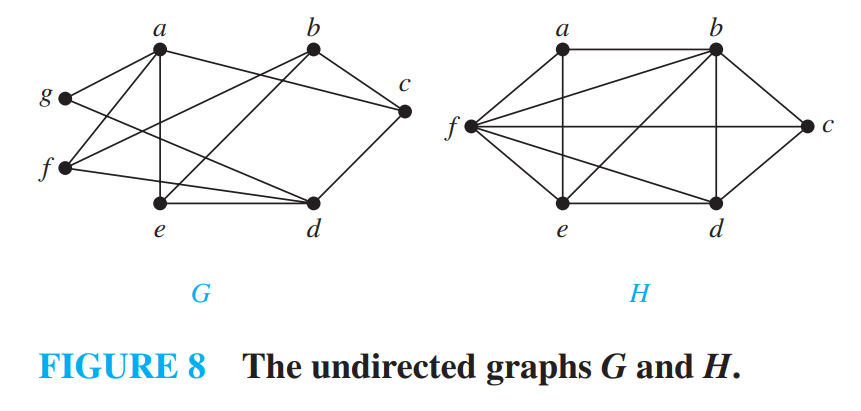
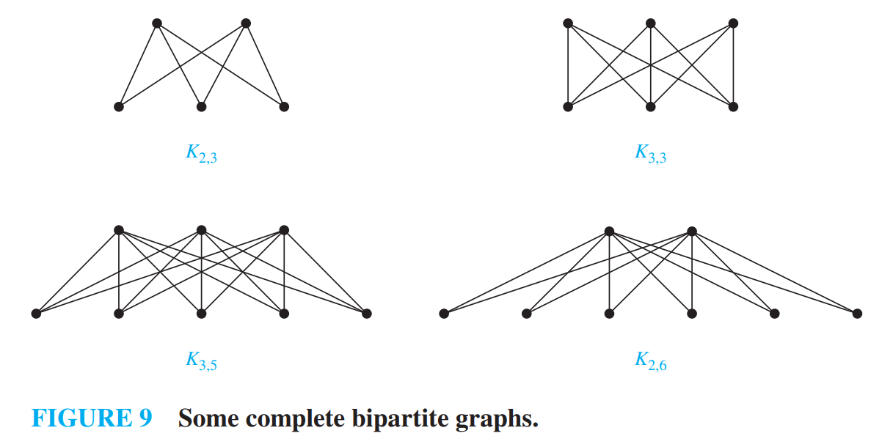
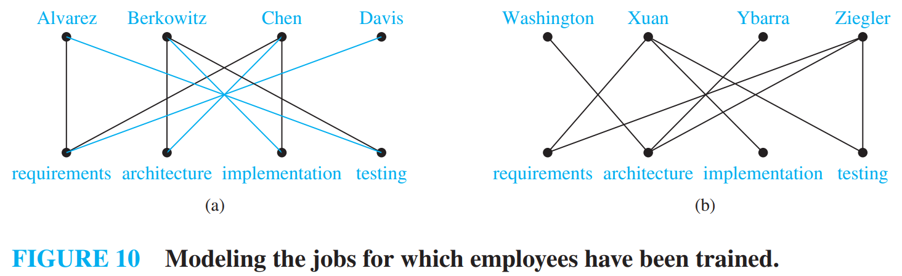
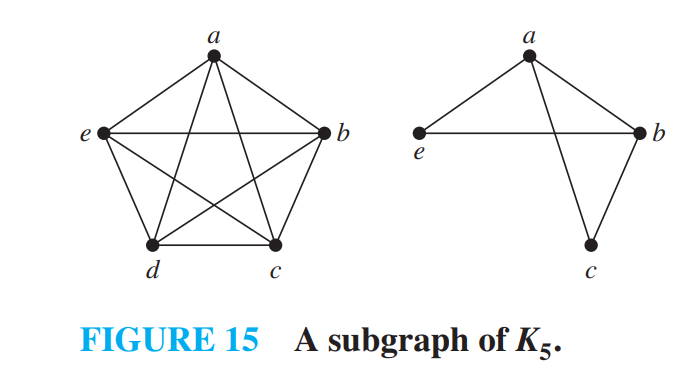
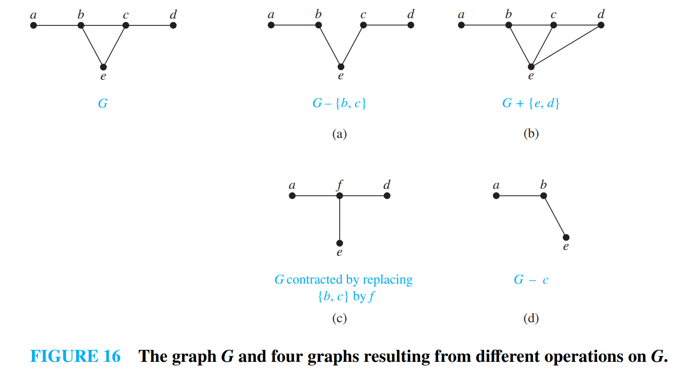
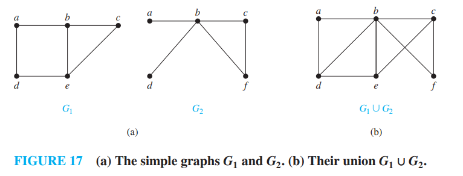

[本科教学版第6章] [英文完整版第10章]

# chap6-Graphs and Graph Models

## 6.1 Graphs and Graph Models

-   **定义 1 : 无向图** $G = (V, E)$ 由 $V$(非空的顶点集合或节点)和 $E$(边的集合)组成. 每条边关联一个或两个顶点, 称为其端点. 一条边称为连接其端点.

-   注: 图 $G$ 的顶点集合 $V$ 可能是无限的. 顶点集合无限或边的数量无限的图称为**无限图**; 相比之下, 顶点集合有限且边集合有限的图称为**有限图**. 本书通常只讨论<u>有限图</u>.

接下来我们利用计算机网络的模型来展示各种各样的图, 借此说明"图"中涉及到的各种概念 :

>   [!NOTE]
>
>   我们最好是将图的边用不相交的线段或者曲线画在平面上, 但是不是所有的图都能用不相交的线画出来, 只要能正确表示关系即可.

注意: 此计算机网络的每条边都连接两个不同的顶点, 也就是说, 没有边连接一个顶点到其自身; 并且不存在两条不同的边连接同一对顶点. 若每条边都连接两个不同的顶点, 且没有两条边连接同一对顶点, 则该图称为**简单图 simple graph**. 在简单图中, 每条边对应一个无序顶点对, 而没有其他边对应同一对顶点. 因此, 当存在一条简单图的边对应 $\{u, v\}$ 时, 也可以不引起混淆地说 $\{u, v\}$ 是该图的一条边.

一个计算机网络可能在数据中心之间有多条链路(如图 2 所示). 要描述这样的网络, 我们需要允许多条边连接同一对顶点的图. 允许同一对顶点之间出现重边的图称为**多重图 multigraphs**. 当存在 $m$ 条不同的边都对应同一无序顶点对 $\{u, v\}$ 时, 也说 $\{u, v\}$ 是一条重数为 $m$ 的边. 也就是说, 这组边可视为边 $\{u, v\}$ 的 $m$ 个不同副本.

有时一条通信链路会把某个数据中心与其自身相连, 例如用于诊断的反馈环路. 这样的网络如图 3 所示. 要对这种网络建模, 我们需要包含连接顶点自身的边. 这类边称为 **环 loops**, 有时在一个顶点还会有多于一个的 loop. 

<u>允许包含 loops, 并且可能包含连接同一对顶点或将顶点连接到自身的多条边的图, 有时称为 **伪图 pseudographs**.</u>

目前介绍的图都是 **无向图 undirected graphs**. 它们的边也称为 **undirected**. 但是, 在构造图模型时, 我们可能需要给边指定方向. 例如在计算机网络中, 某些链路可能只按一个方向工作(这类链路称为 **单工链路 single duplex lines**). 当大量流量发送到某些数据中心而反向几乎没有流量时, 就会出现这种情况. 这样的网络如图 4 所示. 为了描述这种计算机网络, 我们使用有向图. 有向图的每条边都对应一个有序对. 这里给出的有向图定义比第 9 章中用来表示关系的定义更一般.

-   **定义 2 : 有向图** $(V, E)$ 由一个非空顶点集 $V$ 和一个有向边(或弧)集 $E$ 组成. 每条有向边与一个顶点有序对相关联. 我们称与有序对 $< u, v >$ 相关联的有向边开始于 $u$, 结束于 $v$.

当一个有向图不包含环和多重有向边时, 就称为**简单有向图**. 因为在简单有向图中, 每个顶点有序对 $(u, v)$ 之间最多有一条边和它们相连, 如果在图中, $(u, v)$ 之间存在一条边, 则称 $(u, v)$ 为边.

我们来定义 **有向多重图** , 也就是有相同的弧的时候我们认为是有向多重图 也就是顺序也要相同 . 

当 $m$ 条有向边中的每一条都与顶点有序对 $(u, v)$ 相关联时, 我们称 $(u, v)$ 是一条**多重度**为 $m$ 的边.

对于某些模型, 我们可能需要这样的图, 其中有些边是无向的, 而另一些边是有向的. 既包含有向边又包含无向边的图称为**混合图** . 

| 类型 | 边 | 允许多重边 | 允许环 |
| :--- | :--- | :--- | :--- |
| 简单图 | 无向 | 否 | 否 |
| 多重图 | 无向 | 是 | 否 |
| 伪图 | 无向 | 是 | 是 |
| 简单有向图 | 有向 | 否 | 否 |
| 有向多重图 | 有向 | 是 | 是 |
| 混合图 | 有向的和无向的 | 是 | 是 |

### 6.1.1 Graph Models

很多场景都可以建模成图的数学模型 .

## 6.2 Graph Terminology and Special Types of Graphs

### 6.2.1 Introduction

### 6.2.2 Basic Terminology

#### 无向图中

首先, 我们给出一些描述无向图顶点和边的术语.

-   **Definition 1** : 如果无向图 $G$ 中的两个顶点 $u$ 和 $v$ 是 $G$ 的一条边 $e$ 的端点, 则称它们在 $G$ 中是 **相邻的 adjacent** (或 **邻居 neighbors**). 这样的边 $e$ 被称为与顶点 $u$ 和 $v$ **关联 incident with**, 并且称 $e$ **连接 connect** $u$ 和 $v$.

-   **Definition 2** : $G = (V, E)$ 中顶点 $v$ 的所有邻居的集合, 记为 $N(v)$, 被称为 $v$ 的 **邻域 neighborhood**. 如果 $A$ 是 $V$ 的子集, 我们用 $N(A)$ 表示 $G$ 中所有与 $A$ 中至少一个顶点相邻的顶点的集合. 因此, $N(A) = \bigcup_{v \in A} N(v)$.

-   **Definition 3** : **无向图中顶点的度 degree of a vertex in an undirected graph** 是与该顶点关联的边的数量, 唯一的例外是顶点处的环对该顶点的度贡献为 2. 顶点 $v$ 的度记为 $\deg(v)$.

其中第二个定义有些不好理解 其实就是声明了一个函数 $N$ , 它的作用域可以是一个顶点 也可以是顶点的集合 , 当然前者也可以当作是只有一个顶点的集合 , 函数 $N$ 就是求出这个顶点集合所有相邻顶点的集合 . **最后的Output**是一个集合 .

>   [!NOTE]
>
>   **EXAMPLE 1** 下图中显示的图 $G$ 和 $H$ 中顶点的度和邻域分别是什么?
>
>   
>
>   **Solution:**
>
>   -    在 $G$ 中, $\deg(a) = 2$, $\deg(b) = \deg(c) = \deg(f) = 4$, $\deg(d) = 1$, $\deg(e) = 3$, 且 $\deg(g) = 0$. 
>       -   这些顶点的邻域是 $N(a) = \{b, f\}$, $N(b) = \{a, c, e, f\}$, $N(c) = \{b, d, e, f\}$, $N(d) = \{c\}$, $N(e) = \{b, c, f\}$, $N(f) = \{a, b, c, e\}$, 且 $N(g) = \emptyset$. 
>   -   在 $H$ 中, $\deg(a) = 4$, $\deg(b) = \deg(e) = 6$, $\deg(c) = 1$, 且 $\deg(d) = 5$. 
>       -   这些顶点的邻域是 $N(a) = \{b, d, e\}$, $N(b) = \{a, b, c, d, e\}$, $N(c) = \{b\}$, $N(d) = \{a, b, e\}$, 且 $N(e) = \{a, b, d\}$.

-   度为 0 的顶点被称为 **孤立的 isolated**. 因此, 孤立顶点不与任何顶点相邻. 比如上面例子中的图$G$中的$g$ .

-   当一个顶点的度为 1 时, 它是 **悬挂的 pendant**. 因此, 悬挂顶点恰好与另一个顶点相邻. 比如上面例子中图 $G$ 中的顶点 $d$ 是悬挂的.

>   [!IMPORTANT]
>
>   **定理 1 : 握手定理 THE HANDSHAKING THEOREM** 
>
>   设 $G = (V, E)$ 是一个有 $m$ 条边的无向图. 则
>   $$
>   2m = \sum_{v \in V} \deg(v)
>   $$
>
>   (注意, 即使存在多重边和环, 这也适用.)

>   [!IMPORTANT]
>
>   **定理 2**
>
>   -   无向图中 度为奇数的顶点仅有偶数个 .
>
>   证明 : 在无向图 $G=(V, E)$ 中, 设 $V_1$ 和 $V_2$ 分别是度为偶数的顶点和度为奇数的顶点的集合. 于是
>   $$
>   2m = \sum_{v \in V} \deg(v) = \sum_{v \in V_1} \deg(v) + \sum_{v \in V_2} \deg(v)
>   $$
>
>   因为对 $v \in V_1$ 来说, $\deg(v)$ 是偶数, 所以上面等式右端的第一项是偶数. 另外, 上面等式右端的两项之和是偶数, 因为和是 $2m$. 因此, 和里的第二项也是偶数. 因为在这个和里的所有的项都是奇数,无向图有偶数个度为奇数的顶点.

#### 有向图中

因为有向性的存在 我们需要对定义做一些调整 :

带有有向边的图的术语反映出有向图中的边是有方向性的.

-   **Definition 4** 当 $(u, v)$ 是带有有向边的图 $G$ 的边时, 说 $u$ <u>邻接到</u> $v$, 而且说 $v$ <u>从</u> $u$ <u>邻接</u>. 顶点 $u$ 称为 $(u, v)$ 的<u>起点</u>, $v$ 称为 $(u, v)$ 的<u>终点</u>. 
    -   环的起点和终点是相同的.

-   **Definition 5** 
    -   在带有有向边的图里, 顶点 $v$ 的<u>入度</u>, 记作 $\deg^-(v)$, 是以 $v$ 作为终点的边数. 
    -   顶点 $v$ 的<u>出度</u>, 记作 $\deg^+(v)$, 是以 $v$ 作为起点的边数
    -   顶点上的环对这个顶点的入度和出度的贡献都是 1

>   [!IMPORTANT]
>
>   设 $G = (V, E)$ 是一个带有有向边的图. 则
>   $$
>   \sum_{v \in V} \deg^-(v) = \sum_{v \in V} \deg^+(v) = |E|
>   $$
>   
> 其中 $|E|$是边的条数 .

忽略边的方向所产生的无向图称为 **底层无向图 underlying undirected graph**. 它们具有相同数量的边.

### 6.2.3 Some Special Simple Graphs

**完全图 Complete Graphs** : $n$ 个顶点的 **完全图 complete graph**, 记为 $K_n$, 是一个在每对不同的顶点之间恰好包含一条边的简单图. 图 $K_n$ ($n=1, 2, 3, 4, 5, 6$) 显示在 Figure 3 中. 如果一个简单图中至少有一对不同的顶点没有被边连接, 则称该图为 **非完全的 noncomplete**.

**圈图 Cycles** : 一个 **圈图** $C_n$ ($n \ge 3$) 由 $n$ 个顶点 $v_1, v_2, \dots, v_n$ 和边 $\{v_1, v_2\}, \{v_2, v_3\}, \dots, \{v_{n-1}, v_n\}$, 以及 $\{v_n, v_1\}$组成. 圈 $C_3, C_4, C_5$, 和 $C_6$显示在 Figure 4 中.

**轮图 Wheels** 当我们向圈图 $C_n$ ($n \ge 3$) 添加一个额外的顶点, 并通过新边将这个新顶点连接到 $C_n$ 中的 $n$ 个顶点中的每一个时, 我们得到一个 **轮图 wheel** $W_n$. 轮图 $W_3$, $W_4$, $W_5$, 和 $W_6$ 显示在 Figure 5 中.

**n-立方体图 , n-Cubes** 一个 **n-维超立方体 n-dimensional hypercube**, 或 **n-立方体 n-cube**, 记为 $Q_n$是一个图, 其顶点代表长度为 $n$ 的 $2^n$ 个位串. 当且仅当两个顶点所代表的位串恰好在一个位位置上不同时, 它们是相邻的. 我们在 Figure 6 中展示了 $Q_1$, $Q_2$, 和 $Q_3$.

注意, 你可以通过制作 $Q_n$ 的两个副本, 在 $Q_n$ 的一个副本中的顶点标签前加上 0, 在 $Q_n$ 的另一个副本中的顶点标签前加上 1, 并添加连接标签仅在第一位不同的两个顶点的边, 从 $n$-立方体 $Q_n$ 构造 $(n + 1)$-立方体 $Q_{n+1}$. 

在 Figure 6 中, $Q_3$ 是通过将 $Q_2$ 的两个副本绘制为 $Q_3$ 的顶面和底面, 在底面每个顶点的标签开头添加 0, 在顶面每个顶点的标签开头添加 1 来从 $Q_2$ 构造的.

### 6.2.4 Bipartite Graphs

>   [!IMPORTANT]
>
>   **Definition 6** : 若把可以简单图$G$的顶点集分为两个不相交的非空集合 $V_1$ 和 $V_2$ , 使得图中每一条边都连接$V_1$中的一个顶点与$V_2$中的一个顶点 那么则称$G$为**二分图**     当此条件成立时 称 $(V_1 , V_2)$ 是一个**二部划分**

之前提到的 $C_6$ 就是一个二分图 , 而 $K_3$ 不是一个二分图 . 下图中 $G$是一个二分图 , $H$ 则不是一个二分图 .

>   [!IMPORTANT]
>
>   一个图是二分图(定义)等价于可以用两种颜色**染色** 书中给出的规范表述是 :
>
>   一个简单图是二分图当且仅当可以将两种不同的颜色分配给图的每个顶点, 使得没有两个相邻的顶点被分配相同的颜色.
>
>   [6.4.2 ](#6.4.2 Paths)中 我们学习路径后可以更深入的理解这个概念 

>   [!IMPORTANT]
>
>   **完全二分图 Complete Bipartite Graphs** 
>
>   一个 **完全二分图 complete bipartite graph** $K_{m,n}$ 是一个图, 它的顶点集被划分为两个分别包含 $m$ 和 $n$ 个顶点的子集,  并且两个顶点之间有一条边当且仅当一个顶点在第一个子集中而另一个顶点在第二个子集中. 完全二分图 $K_{2,3}$, $K_{3,3}$, $K_{3,5}$ 和 $K_{2,6}$ 显示在图 9 中.
>
>   通俗的说 可以想象成一个班级中的男生和女生 任何一个男生都认识所有的女生 任何的女生也都认识所有的男生 但是男生之间互相不认识 女生之间也互相不认识

### 6.2.5 Bipartite Graphs and Matchings

寻找一种将工作分配给员工的方案可以被看作是在图模型中寻找一个匹配, 其中简单图 $G = (V, E)$ 中的一个 **匹配 matching** $M$ 是图的边集 $E$ 的一个子集, 使得没有两条边与同一个顶点关联. 换句话说, 一个匹配是边的一个子集, 使得如果 $\{s, t\}$ 和 $\{u, v\}$ 是匹配中不同的边, 那么 $s, t, u,$ 和 $v$ 是互不相同的.

-   如果一个顶点是匹配$M$中一条边的端点 则称这个顶点是 **匹配的 matched**; 否则它被称为是 **未匹配的 unmatched**.

-   具有最大边数的匹配是 **最大匹配 maximum matching** .

-   如果二分图 $G = (V, E)$ 可以划分为 $(V_1,V_2)$ 且存在匹配 $M$ , 满足
    -   $V_1$ 中的每个顶点都是匹配中某条边的端点, 或者等价地, 如果 $|M| = |V_1|$,

    则称该匹配 $M$ 是 **从 $V_1$ 到 $V_2$ 的完全匹配 complete matching from $V_1$ to $V_2$**. 
    

例如, 为了将工作分配给员工使得分配的工作数量最大, 我们在模拟员工能力的图中寻找一个最大匹配. 为了将员工分配到所有工作, 我们寻找一个从工作集合到员工集合的完全匹配.

>   在书中提供的 [例 14] 中, 我们找到了项目 1 从工作集合到员工集合的一个完全匹配, 并且这个匹配是一个最大匹配, 同时我们展示了对于项目 2 不存在从工作集合到员工集合的完全匹配.

#### 岛上的婚配问题以及霍尔婚姻定理
假设有$m$名男性和$n$名女性生活在一座岛上，每个人都有一份名单，列出了自己认为可以作为配偶的异性。
于是可以构建一个二分图 $G = (V_1, V_2)$：

- $V_1$ 为男性的集合
- $V_2$ 为女性的集合
- 若一名男性和一名女性将彼此视为可接受的配偶，则在二人之间连一条边。

该图中的一个匹配对应一组边的集合，每条边的两个端点对应一对夫妻。
最大匹配是指能组成的**最多数量的夫妻组合**；而$V_1$的完全匹配是指能让**每一名男性都成婚**的夫妻组合，但女性可能并未全部成婚。

>   [!IMPORTANT]
>
>   #### 完全匹配的充要条件
>
>   现在我们将注意力转向如下问题：当 $(V_1, V_2)$ 是二分图 $G=(V, E)$ 的一个二分划时，是否存在从 $V_1$ 到 $V_2$ 的完全匹配。我们将介绍一个定理，它给出了完全匹配存在的一组充要条件。该定理由 Philip Hall 于 1935 年证明。
>
>
>   #### 霍尔婚姻定理
>
>   对于具有二分划 $(V_1, V_2)$ 的二分图 $G=(V, E)$，存在从 $V_1$ 到 $V_2$ 的完全匹配，当且仅当对 $V_1$ 的所有子集 $A$，都有 $|N(A)| \ge |A|$。
>
>   举例来说 要让**每个男生都能娶到能接受的女生**(也就是从男生到女生的完全匹配) , 等价于 : 随便挑几个男生出来，他们合起来能接受的女生数量，至少得和这几个男生的人数一样多。
>
>   比如有3个男生（A、B、C）：
>
>   - 若A能接受的女生是[甲]，B能接受的是[甲]，C能接受的是[乙]
>   - 这时挑A和B这2个男生，他们能接受的女生只有甲$1$个$ \rightarrow 1 < 2$，不满足条件 $\rightarrow$ 肯定没法让A和B都娶到女生。
>
>
>   #### 证明：
>
>   使用强归纳法可以半严格证明 见书对应章节 `6.2.6` 前面部分 但是还留有一些问题 此处我们只是简单理解一下 :
>
>   ---
>
>   >   以防你忘记了 $N(A)$：
>   >   比如 $V_1$ 是一群男生，$A$ 是其中几个男生的小团体，$N(A)$ 就是这几个男生都能接受的所有女生的集合。

### 6.2.6 Some Applications of Special Types of Graphs

[pass]

### 6.2.7 New Graphs from Old

[从旧图构造新图]

有时候我们只需要研究较大的图一部分 所以我们可以取出一部分 称为原图的**子图** .

>   [!IMPORTANT]
>
>   **定义 7** 图 $G=(V, E)$ 的子图是图 $H=(W, F)$, 其中 $W \subseteq V$ 且 $F \subseteq E$. 若 $H \neq G$, 则称图 $G$ 的子图 $H$ 是 $G$ 的真子图.

>   [!IMPORTANT]
>
>   **定义 8** 令 $G=(V, E)$ 是一个简单图. 则称图 $(W, F)$ 是由顶点集 $V$ 的子集 $W$ **导出的子图**, 其中边集 $F$ 包含 $E$ 中的一条边当且仅当这条边的两个端点都在 $W$ 中.

上图中 右图是左图$K_5$的子图 但是仅当$(e,c)$相连时 才能说右图是左图导出的子图 . 也就是说"导出"以为顶点子集中边的关系没有缺失 !

#### 边的删除和边的增加

是通过对边集$E$做集合`+`和`-`操作实现的 如 :

-   $$
    G-e=(V , E - \{e\})
    $$

-   $$
    G+e=(V , E + \{e\})
    $$

#### 边的收缩

有时，当我们从图中删除一条边后，不希望该边的端点作为独立的顶点保留在所得子图中。

此时进行**边的收缩**：删除端点为 $ u $ 和 $ v $ 的边 $ e $，将 $ u $ 和 $ v $ 合并成新顶点 $ w $；对每一条以 $ u $ 或 $ v $ 为端点的边，将 $ u $ 或 $ v $ 替换为 $ w $（另一个端点不变）。

因此，在图 $ G=(V, E) $ 中，对端点为 $ u $ 和 $ v $ 的边 $ e $ 进行收缩，得到新图 $ G'=(V', E') $（这不是 $ G $ 的子图），其中：
- $ V' = V - \{u, v\} \cup \{w\} $
- $ E' $ 包含 $ E $ 中不以 $ u $ 或 $ v $ 为端点的边，以及连接 $ w $ 与 $ V $ 中所有与 $ u $ 或 $ v $ 相邻的顶点的边。

例如，收缩图16中 $ G_1 $ 里连接顶点 $ e $ 和 $ c $ 的边，得到包含顶点 $ a、b、d、w $ 的新图 $ G_1' $：
- $ G_1' $ 中保留 $ G_1 $ 里连接 $ a $ 和 $ b $、$ a $ 和 $ d $ 的边；

- 新增连接 $ b $ 和 $ w $ 的边（替换 $ G_1 $ 中连接 $ b $ 和 $ c $、$ b $ 和 $ e $ 的边）；

- 新增连接 $ d $ 和 $ w $ 的边（替换 $ G_1 $ 中连接 $ d $ 和 $ e $ 的边）。

#### 从图中删除顶点
从图 $ G=(V, E) $ 删除顶点 $ v $ 及所有与其关联的边，得到子图 $ G - v $，其中：$ G - v = (V - v, E') $，$ E' $ 是 $ G $ 中不与 $ v $ 关联的边的集合。

类似地，若 $ V' $ 是 $ V $ 的子集，则图 $ G - V' $ 是子图 $ (V - V', E') $，其中 $ E' $ 是 $ G $ 中不与 $ V' $ 中顶点关联的边的集合。

#### 两个简单图的并
两个简单图 $ G_1 = (V_1, E_1) $ 和 $ G_2 = (V_2, E_2) $ 的**并**，是一个顶点集为 $ V_1 \cup V_2 $、边集为 $ E_1 \cup E_2 $ 的简单图，记作 $ G_1 \cup G_2 $。

如图 就是对两个图的顶点集和边集都求并集 .

## 6.3 Representing Graphs and Graph Isomorphism

[图的表示和图的同构]

### 6.4.2 Paths

