[本科教学版第6章] [英文完整版第10章]

# chap6-Graphs and Graph Models

## 6.1 Graphs and Graph Models

-   **定义 1 : 无向图** $G = (V, E)$ 由 $V$(非空的顶点集合或节点)和 $E$(边的集合)组成. 每条边关联一个或两个顶点, 称为其端点. 一条边称为连接其端点.

-   注: 图 $G$ 的顶点集合 $V$ 可能是无限的. 顶点集合无限或边的数量无限的图称为**无限图**; 相比之下, 顶点集合有限且边集合有限的图称为**有限图**. 本书通常只讨论<u>有限图</u>.

接下来我们利用计算机网络的模型来展示各种各样的图, 借此说明"图"中涉及到的各种概念 :

>   [!NOTE]
>
>   我们最好是将图的边用不相交的线段或者曲线画在平面上, 但是不是所有的图都能用不相交的线画出来, 只要能正确表示关系即可.

注意: 此计算机网络的每条边都连接两个不同的顶点, 也就是说, 没有边连接一个顶点到其自身; 并且不存在两条不同的边连接同一对顶点. 若每条边都连接两个不同的顶点, 且没有两条边连接同一对顶点, 则该图称为**简单图 simple graph**. 在简单图中, 每条边对应一个无序顶点对, 而没有其他边对应同一对顶点. 因此, 当存在一条简单图的边对应 $\{u, v\}$ 时, 也可以不引起混淆地说 $\{u, v\}$ 是该图的一条边.

一个计算机网络可能在数据中心之间有多条链路(如图 2 所示). 要描述这样的网络, 我们需要允许多条边连接同一对顶点的图. 允许同一对顶点之间出现重边的图称为**多重图 multigraphs**. 当存在 $m$ 条不同的边都对应同一无序顶点对 $\{u, v\}$ 时, 也说 $\{u, v\}$ 是一条重数为 $m$ 的边. 也就是说, 这组边可视为边 $\{u, v\}$ 的 $m$ 个不同副本.

有时一条通信链路会把某个数据中心与其自身相连, 例如用于诊断的反馈环路. 这样的网络如图 3 所示. 要对这种网络建模, 我们需要包含连接顶点自身的边. 这类边称为 **环 loops**, 有时在一个顶点还会有多于一个的 loop. 

<u>允许包含 loops, 并且可能包含连接同一对顶点或将顶点连接到自身的多条边的图, 有时称为 **伪图 pseudographs**.</u>

目前介绍的图都是 **无向图 undirected graphs**. 它们的边也称为 **undirected**. 但是, 在构造图模型时, 我们可能需要给边指定方向. 例如在计算机网络中, 某些链路可能只按一个方向工作(这类链路称为 **单工链路 single duplex lines**). 当大量流量发送到某些数据中心而反向几乎没有流量时, 就会出现这种情况. 这样的网络如图 4 所示. 为了描述这种计算机网络, 我们使用有向图. 有向图的每条边都对应一个有序对. 这里给出的有向图定义比第 9 章中用来表示关系的定义更一般.

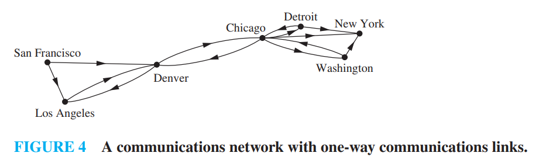

-   **定义 2 : 有向图** $(V, E)$ 由一个非空顶点集 $V$ 和一个有向边(或弧)集 $E$ 组成. 每条有向边与一个顶点有序对相关联. 我们称与有序对 $< u, v >$ 相关联的有向边开始于 $u$, 结束于 $v$.

当一个有向图不包含环和多重有向边时, 就称为**简单有向图**. 因为在简单有向图中, 每个顶点有序对 $(u, v)$ 之间最多有一条边和它们相连, 如果在图中, $(u, v)$ 之间存在一条边, 则称 $(u, v)$ 为边.

我们来定义 **有向多重图** , 也就是有相同的弧的时候我们认为是有向多重图 也就是顺序也要相同 . 

当 $m$ 条有向边中的每一条都与顶点有序对 $(u, v)$ 相关联时, 我们称 $(u, v)$ 是一条**多重度**为 $m$ 的边.

对于某些模型, 我们可能需要这样的图, 其中有些边是无向的, 而另一些边是有向的. 既包含有向边又包含无向边的图称为**混合图** . 

| 类型 | 边 | 允许多重边 | 允许环 |
| :--- | :--- | :--- | :--- |
| 简单图 | 无向 | 否 | 否 |
| 多重图 | 无向 | 是 | 否 |
| 伪图 | 无向 | 是 | 是 |
| 简单有向图 | 有向 | 否 | 否 |
| 有向多重图 | 有向 | 是 | 是 |
| 混合图 | 有向的和无向的 | 是 | 是 |

### 6.1.1 Graph Models

很多场景都可以建模成图的数学模型 .

## 6.2 Graph Terminology and Special Types of Graphs

### 6.2.1 Introduction

### 6.2.2 Basic Terminology

#### 无向图中

首先, 我们给出一些描述无向图顶点和边的术语.

-   **Definition 1** : 如果无向图 $G$ 中的两个顶点 $u$ 和 $v$ 是 $G$ 的一条边 $e$ 的端点, 则称它们在 $G$ 中是 **相邻的 adjacent** (或 **邻居 neighbors**). 这样的边 $e$ 被称为与顶点 $u$ 和 $v$ **关联 incident with**, 并且称 $e$ **连接 connect** $u$ 和 $v$.

-   **Definition 2** : $G = (V, E)$ 中顶点 $v$ 的所有邻居的集合, 记为 $N(v)$, 被称为 $v$ 的 **邻域 neighborhood**. 如果 $A$ 是 $V$ 的子集, 我们用 $N(A)$ 表示 $G$ 中所有与 $A$ 中至少一个顶点相邻的顶点的集合. 因此, $N(A) = \bigcup_{v \in A} N(v)$.

-   **Definition 3** : **无向图中顶点的度 degree of a vertex in an undirected graph** 是与该顶点关联的边的数量, 唯一的例外是顶点处的环对该顶点的度贡献为 2. 顶点 $v$ 的度记为 $\deg(v)$.

其中第二个定义有些不好理解 其实就是声明了一个函数 $N$ , 它的作用域可以是一个顶点 也可以是顶点的集合 , 当然前者也可以当作是只有一个顶点的集合 , 函数 $N$ 就是求出这个顶点集合所有相邻顶点的集合 . **最后的Output**是一个集合 .

>   [!NOTE]
>
>   **EXAMPLE 1** 下图中显示的图 $G$ 和 $H$ 中顶点的度和邻域分别是什么?
>
>   
>
>   **Solution:**
>
>   -    在 $G$ 中, $\deg(a) = 2$, $\deg(b) = \deg(c) = \deg(f) = 4$, $\deg(d) = 1$, $\deg(e) = 3$, 且 $\deg(g) = 0$. 
>       -   这些顶点的邻域是 $N(a) = \{b, f\}$, $N(b) = \{a, c, e, f\}$, $N(c) = \{b, d, e, f\}$, $N(d) = \{c\}$, $N(e) = \{b, c, f\}$, $N(f) = \{a, b, c, e\}$, 且 $N(g) = \emptyset$. 
>   -   在 $H$ 中, $\deg(a) = 4$, $\deg(b) = \deg(e) = 6$, $\deg(c) = 1$, 且 $\deg(d) = 5$. 
>       -   这些顶点的邻域是 $N(a) = \{b, d, e\}$, $N(b) = \{a, b, c, d, e\}$, $N(c) = \{b\}$, $N(d) = \{a, b, e\}$, 且 $N(e) = \{a, b, d\}$.

-   度为 0 的顶点被称为 **孤立的 isolated**. 因此, 孤立顶点不与任何顶点相邻. 比如上面例子中的图$G$中的$g$ .

-   当一个顶点的度为 1 时, 它是 **悬挂的 pendant**. 因此, 悬挂顶点恰好与另一个顶点相邻. 比如上面例子中图 $G$ 中的顶点 $d$ 是悬挂的.

>   [!IMPORTANT]
>
>   **定理 1 : 握手定理 THE HANDSHAKING THEOREM** 
>
>   设 $G = (V, E)$ 是一个有 $m$ 条边的无向图. 则
>   $$
>   2m = \sum_{v \in V} \deg(v)
>   $$
>
>   (注意, 即使存在多重边和环, 这也适用.)

>   [!IMPORTANT]
>
>   **定理 2**
>
>   -   无向图中 度为奇数的顶点仅有偶数个 .
>
>   证明 : 在无向图 $G=(V, E)$ 中, 设 $V_1$ 和 $V_2$ 分别是度为偶数的顶点和度为奇数的顶点的集合. 于是
>   $$
>   2m = \sum_{v \in V} \deg(v) = \sum_{v \in V_1} \deg(v) + \sum_{v \in V_2} \deg(v)
>   $$
>
>   因为对 $v \in V_1$ 来说, $\deg(v)$ 是偶数, 所以上面等式右端的第一项是偶数. 另外, 上面等式右端的两项之和是偶数, 因为和是 $2m$. 因此, 和里的第二项也是偶数. 因为在这个和里的所有的项都是奇数,无向图有偶数个度为奇数的顶点.

#### 有向图中

因为有向性的存在 我们需要对定义做一些调整 :

带有有向边的图的术语反映出有向图中的边是有方向性的.

-   **Definition 4** 当 $(u, v)$ 是带有有向边的图 $G$ 的边时, 说 $u$ <u>邻接到</u> $v$, 而且说 $v$ <u>从</u> $u$ <u>邻接</u>. 顶点 $u$ 称为 $(u, v)$ 的<u>起点</u>, $v$ 称为 $(u, v)$ 的<u>终点</u>. 
    -   环的起点和终点是相同的.

-   **Definition 5** 
    -   在带有有向边的图里, 顶点 $v$ 的<u>入度</u>, 记作 $\deg^-(v)$, 是以 $v$ 作为终点的边数. 
    -   顶点 $v$ 的<u>出度</u>, 记作 $\deg^+(v)$, 是以 $v$ 作为起点的边数
    -   顶点上的环对这个顶点的入度和出度的贡献都是 1

>   [!IMPORTANT]
>
>   设 $G = (V, E)$ 是一个带有有向边的图. 则
>   $$
>   \sum_{v \in V} \deg^-(v) = \sum_{v \in V} \deg^+(v) = |E|
>   $$
>   
> 其中 $|E|$是边的条数 .

忽略边的方向所产生的无向图称为 **底层无向图 underlying undirected graph**. 它们具有相同数量的边.

### 6.2.3 Some Special Simple Graphs

**完全图 Complete Graphs** : $n$ 个顶点的 **完全图 complete graph**, 记为 $K_n$, 是一个在每对不同的顶点之间恰好包含一条边的简单图. 图 $K_n$ ($n=1, 2, 3, 4, 5, 6$) 显示在 Figure 3 中. 如果一个简单图中至少有一对不同的顶点没有被边连接, 则称该图为 **非完全的 noncomplete**.

**圈图 Cycles** : 一个 **圈图** $C_n$ ($n \ge 3$) 由 $n$ 个顶点 $v_1, v_2, \dots, v_n$ 和边 $\{v_1, v_2\}, \{v_2, v_3\}, \dots, \{v_{n-1}, v_n\}$, 以及 $\{v_n, v_1\}$组成. 圈 $C_3, C_4, C_5$, 和 $C_6$显示在 Figure 4 中.

**轮图 Wheels** 当我们向圈图 $C_n$ ($n \ge 3$) 添加一个额外的顶点, 并通过新边将这个新顶点连接到 $C_n$ 中的 $n$ 个顶点中的每一个时, 我们得到一个 **轮图 wheel** $W_n$. 轮图 $W_3$, $W_4$, $W_5$, 和 $W_6$ 显示在 Figure 5 中.

**n-立方体图 , n-Cubes** 一个 **n-维超立方体 n-dimensional hypercube**, 或 **n-立方体 n-cube**, 记为 $Q_n$是一个图, 其顶点代表长度为 $n$ 的 $2^n$ 个位串. 当且仅当两个顶点所代表的位串恰好在一个位位置上不同时, 它们是相邻的. 我们在 Figure 6 中展示了 $Q_1$, $Q_2$, 和 $Q_3$.

注意, 你可以通过制作 $Q_n$ 的两个副本, 在 $Q_n$ 的一个副本中的顶点标签前加上 0, 在 $Q_n$ 的另一个副本中的顶点标签前加上 1, 并添加连接标签仅在第一位不同的两个顶点的边, 从 $n$-立方体 $Q_n$ 构造 $(n + 1)$-立方体 $Q_{n+1}$. 

在 Figure 6 中, $Q_3$ 是通过将 $Q_2$ 的两个副本绘制为 $Q_3$ 的顶面和底面, 在底面每个顶点的标签开头添加 0, 在顶面每个顶点的标签开头添加 1 来从 $Q_2$ 构造的.

### 6.2.4 Bipartite Graphs

>   [!IMPORTANT]
>
>   **Definition 6** : 若把可以简单图$G$的顶点集分为两个不相交的非空集合 $V_1$ 和 $V_2$ , 使得图中每一条边都连接$V_1$中的一个顶点与$V_2$中的一个顶点 那么则称$G$为**二分图**     当此条件成立时 称 $(V_1 , V_2)$ 是一个**二部划分**

之前提到的 $C_6$ 就是一个二分图 , 而 $K_3$ 不是一个二分图 . 下图中 $G$是一个二分图 , $H$ 则不是一个二分图 .

>   [!IMPORTANT]
>
>   一个图是二分图(定义)等价于可以用两种颜色**染色** 书中给出的规范表述是 :
>
>   一个简单图是二分图当且仅当可以将两种不同的颜色分配给图的每个顶点, 使得没有两个相邻的顶点被分配相同的颜色.
>
>   [6.4.2 ](#6.4.2 Paths)中 我们学习路径后可以更深入的理解这个概念 

>   [!IMPORTANT]
>
>   **完全二分图 Complete Bipartite Graphs** 
>
>   一个 **完全二分图 complete bipartite graph** $K_{m,n}$ 是一个图, 它的顶点集被划分为两个分别包含 $m$ 和 $n$ 个顶点的子集,  并且两个顶点之间有一条边当且仅当一个顶点在第一个子集中而另一个顶点在第二个子集中. 完全二分图 $K_{2,3}$, $K_{3,3}$, $K_{3,5}$ 和 $K_{2,6}$ 显示在图 9 中.
>
>   通俗的说 可以想象成一个班级中的男生和女生 任何一个男生都认识所有的女生 任何的女生也都认识所有的男生 但是男生之间互相不认识 女生之间也互相不认识

### 6.2.5 Bipartite Graphs and Matchings

寻找一种将工作分配给员工的方案可以被看作是在图模型中寻找一个匹配, 其中简单图 $G = (V, E)$ 中的一个 **匹配 matching** $M$ 是图的边集 $E$ 的一个子集, 使得没有两条边与同一个顶点关联. 换句话说, 一个匹配是边的一个子集, 使得如果 $\{s, t\}$ 和 $\{u, v\}$ 是匹配中不同的边, 那么 $s, t, u,$ 和 $v$ 是互不相同的.

-   如果一个顶点是匹配$M$中一条边的端点 则称这个顶点是 **匹配的 matched**; 否则它被称为是 **未匹配的 unmatched**.

-   具有最大边数的匹配是 **最大匹配 maximum matching** .

-   如果二分图 $G = (V, E)$ 可以划分为 $(V_1,V_2)$ 且存在匹配 $M$ , 满足
    -   $V_1$ 中的每个顶点都是匹配中某条边的端点, 或者等价地, 如果 $|M| = |V_1|$,

    则称该匹配 $M$ 是 **从 $V_1$ 到 $V_2$ 的完全匹配 complete matching from $V_1$ to $V_2$**. 
    

例如, 为了将工作分配给员工使得分配的工作数量最大, 我们在模拟员工能力的图中寻找一个最大匹配. 为了将员工分配到所有工作, 我们寻找一个从工作集合到员工集合的完全匹配.

>   在书中提供的 [例 14] 中, 我们找到了项目 1 从工作集合到员工集合的一个完全匹配, 并且这个匹配是一个最大匹配, 同时我们展示了对于项目 2 不存在从工作集合到员工集合的完全匹配.

#### 岛上的婚配问题以及霍尔婚姻定理
假设有$m$名男性和$n$名女性生活在一座岛上 , 每个人都有一份名单 , 列出了自己认为可以作为配偶的异性 . 
于是可以构建一个二分图 $G = (V_1, V_2)$ : 

- $V_1$ 为男性的集合
- $V_2$ 为女性的集合
- 若一名男性和一名女性将彼此视为可接受的配偶 , 则在二人之间连一条边 . 

该图中的一个匹配对应一组边的集合 , 每条边的两个端点对应一对夫妻 . 
最大匹配是指能组成的**最多数量的夫妻组合** ; 而$V_1$的完全匹配是指能让**每一名男性都成婚**的夫妻组合 , 但女性可能并未全部成婚 . 

>   [!IMPORTANT]
>
>   #### 完全匹配的充要条件
>
>   现在我们将注意力转向如下问题 : 当 $(V_1, V_2)$ 是二分图 $G=(V, E)$ 的一个二分划时 , 是否存在从 $V_1$ 到 $V_2$ 的完全匹配 . 我们将介绍一个定理 , 它给出了完全匹配存在的一组充要条件 . 该定理由 Philip Hall 于 1935 年证明 . 
>
>
>   #### 霍尔婚姻定理
>
>   对于具有二分划 $(V_1, V_2)$ 的二分图 $G=(V, E)$ , 存在从 $V_1$ 到 $V_2$ 的完全匹配 , 当且仅当对 $V_1$ 的所有子集 $A$ , 都有 $|N(A)| \ge |A|$ . 
>
>   举例来说 要让**每个男生都能娶到能接受的女生**(也就是从男生到女生的完全匹配) , 等价于 : 随便挑几个男生出来 , 他们合起来能接受的女生数量 , 至少得和这几个男生的人数一样多 . 
>
>   比如有3个男生(A、B、C ) : 
>
>   - 若A能接受的女生是[甲] , B能接受的是[甲] , C能接受的是[乙]
>   - 这时挑A和B这2个男生 , 他们能接受的女生只有甲$1$个$ \rightarrow 1 < 2$ , 不满足条件 $\rightarrow$ 肯定没法让A和B都娶到女生 . 
>
>
>   #### 证明 : 
>
>   使用强归纳法可以半严格证明 见书对应章节 `6.2.6` 前面部分 但是还留有一些问题 此处我们只是简单理解一下 :
>
>   ---
>
>   >   以防你忘记了 $N(A)$ : 
>   >   比如 $V_1$ 是一群男生 , $A$ 是其中几个男生的小团体 , $N(A)$ 就是这几个男生都能接受的所有女生的集合 . 

### 6.2.6 Some Applications of Special Types of Graphs

[pass]

### 6.2.7 New Graphs from Old

[从旧图构造新图]

有时候我们只需要研究较大的图一部分 所以我们可以取出一部分 称为原图的**子图** .

>   [!IMPORTANT]
>
>   **定义 7** 图 $G=(V, E)$ 的子图是图 $H=(W, F)$, 其中 $W \subseteq V$ 且 $F \subseteq E$. 若 $H \neq G$, 则称图 $G$ 的子图 $H$ 是 $G$ 的真子图.

>   [!IMPORTANT]
>
>   **定义 8** 令 $G=(V, E)$ 是一个简单图. 则称图 $(W, F)$ 是由顶点集 $V$ 的子集 $W$ **导出的子图**, 其中边集 $F$ 包含 $E$ 中的一条边当且仅当这条边的两个端点都在 $W$ 中.

上图中 右图是左图$K_5$的子图 但是仅当$(e,c)$相连时 才能说右图是左图导出的子图 . 也就是说"导出"以为顶点子集中边的关系没有缺失 !

#### 边的删除和边的增加

是通过对边集$E$做集合`+`和`-`操作实现的 如 :

-   $$
    G-e=(V , E - \{e\})
    $$

-   $$
    G+e=(V , E + \{e\})
    $$

#### 边的收缩

有时 , 当我们从图中删除一条边后 , 不希望该边的端点作为独立的顶点保留在所得子图中 . 

此时进行**边的收缩** : 删除端点为 $ u $ 和 $ v $ 的边 $ e $ , 将 $ u $ 和 $ v $ 合并成新顶点 $ w $ ; 对每一条以 $ u $ 或 $ v $ 为端点的边 , 将 $ u $ 或 $ v $ 替换为 $ w $(另一个端点不变 ) . 

因此 , 在图 $ G=(V, E) $ 中 , 对端点为 $ u $ 和 $ v $ 的边 $ e $ 进行收缩 , 得到新图 $ G'=(V', E') $(这不是 $ G $ 的子图 ) , 其中 : 
- $ V' = V - \{u, v\} \cup \{w\} $
- $ E' $ 包含 $ E $ 中不以 $ u $ 或 $ v $ 为端点的边 , 以及连接 $ w $ 与 $ V $ 中所有与 $ u $ 或 $ v $ 相邻的顶点的边 . 

例如 , 收缩图16中 $ G_1 $ 里连接顶点 $ e $ 和 $ c $ 的边 , 得到包含顶点 $ a、b、d、w $ 的新图 $ G_1' $ : 
- $ G_1' $ 中保留 $ G_1 $ 里连接 $ a $ 和 $ b $、$ a $ 和 $ d $ 的边 ; 

- 新增连接 $ b $ 和 $ w $ 的边(替换 $ G_1 $ 中连接 $ b $ 和 $ c $、$ b $ 和 $ e $ 的边 ) ; 

- 新增连接 $ d $ 和 $ w $ 的边(替换 $ G_1 $ 中连接 $ d $ 和 $ e $ 的边 ) . 

#### 从图中删除顶点
从图 $ G=(V, E) $ 删除顶点 $ v $ 及所有与其关联的边 , 得到子图 $ G - v $ , 其中 : $ G - v = (V - v, E') $ , $ E' $ 是 $ G $ 中不与 $ v $ 关联的边的集合 . 

类似地 , 若 $ V' $ 是 $ V $ 的子集 , 则图 $ G - V' $ 是子图 $ (V - V', E') $ , 其中 $ E' $ 是 $ G $ 中不与 $ V' $ 中顶点关联的边的集合 . 

#### 两个简单图的并
两个简单图 $ G_1 = (V_1, E_1) $ 和 $ G_2 = (V_2, E_2) $ 的**并** , 是一个顶点集为 $ V_1 \cup V_2 $、边集为 $ E_1 \cup E_2 $ 的简单图 , 记作 $ G_1 \cup G_2 $ . 

如图 就是对两个图的顶点集和边集都求并集 .

## 6.3 Representing Graphs and Graph Isomorphism

[图的表示和图的同构]

### 6.3.1 Introduction

### 6.3.2 Representing Graphs

邻接表和邻接矩阵这里简单提一下 : 

-   有向图的邻接表应当设置起点和终点
-   邻接矩阵可以使用自然数表示多重边的条数
-   它们的取舍和图的稀疏/稠密有关

其他参照数据结构部分 , 一种新的表示方法是 **关联矩阵** :

#### 关联矩阵

设 $ G=(V, E) $ 是无向图 , 设 $ v_1, v_2, \dots, v_n $ 是图的顶点 , $ e_1, e_2, \dots, e_m $ 是图的边 . 相对于 $ V $ 和 $ E $ 的这个顺序的关联矩阵是 $ n \times m $ 的矩阵 $ \boldsymbol{M}=[m_{ij}] $ , 其中 : 
$$
m_{ij}=
\begin{cases}
1 & \text{当边 } e_j \text{ 关联 } v_i \text{ 时} \\
0 & \text{否则}
\end{cases}
$$

>   [!NOTE]
>
>   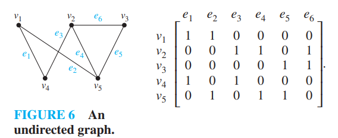
>
>   
>
>   关联矩阵也可用来表示**多重边和环** . 在关联矩阵中 , 用各项相等的列来表示多重边(因为这些边关联同一对顶点 ) ; 只用有一项等于1的列来表示环 , 它对应于环所关联的顶点 . 
>
>   用关联矩阵表示图7所示的伪图
>
>   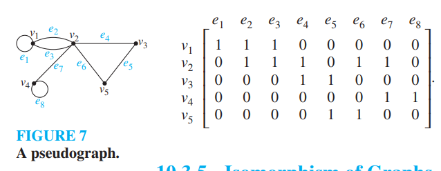

### 6.3.5 Isomorphism of Graphs

>   [!IMPORTANT]
>
>   **Definition 1** 设 $ G_1=(V_1, E_1) $ 和 $ G_2=(V_2, E_2) $ 是简单图 , 若存在一对一的和映上的从 $ V_1 $ 到 $ V_2 $ 的函数 $ f $ , 且 $ f $ 具有这样的性质 : 对 $ V_1 $ 中所有的 $ a $ 和 $ b $ 来说 , $ a $ 和 $ b $ 在 $ G_1 $ 中相邻当且仅当 $ f(a) $ 和 $ f(b) $ 在 $ G_2 $ 中相邻 , 则称 $ G_1 $ 与 $ G_2 $ 是**同构的** . 这样的函数 $ f $ 称为**同构** . 两个不同构的简单图称为**非同构的** . 
>
>   换句话说 , 当两个简单图同构时 , 两个图的顶点之间具有保持相邻关系的一一对应 . 简单图的同构是一个等价关系(我们把这个验证留作练习49 ) . 

>   [!NOTE]
>
>   #### 例8 证明 : 图8所示的图 $ G=(V, E) $ 和 $ H=(W, F) $ 同构 . 
>
>   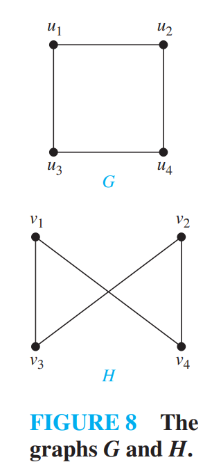
>
>   **解** 函数 $ f $ 定义为 $ f(u_1)=v_1 $ , $ f(u_2)=v_4 $ , $ f(u_3)=v_3 $ , $ f(u_4)=v_2 $ , 它是 $ V $ 和 $ W $ 之间的一一对应 . 为了看出这个对应保持相邻关系 , 注意 $ G $ 中相邻的顶点是 $ u_1 $ 和 $ u_2 $、$ u_1 $ 和 $ u_3 $、$ u_2 $ 和 $ u_4 $ , 以及 $ u_3 $ 和 $ u_4 $ , 由 $ f(u_1)=v_1 $ 和 $ f(u_2)=v_4 $、$ f(u_1)=v_1 $ 和 $ f(u_3)=v_3 $、$ f(u_2)=v_4 $ 和 $ f(u_4)=v_2 $ , 以及 $ f(u_3)=v_3 $ 和 $ f(u_4)=v_2 $ 所组成的每一对顶点都是在 $ H $ 中相邻的 . 

### 6.3.6 Determining whether Two Simple Graphs are Isomorphic
判断两个简单图是否同构常常是一件困难的事情 . 在两个带有 $ n $ 个顶点的简单图的顶点集之间有 $ n! $ 种可能的一一对应 . 若 $ n $ 太大 , 则通过检验每一种对应来看它是否保持相邻关系是不可行的 . 

有时说明两个图不同构并不困难 . 特别是 , 如果能找到某个属性 , 两个图中只有一个图具有这个属性 , 但该属性应该在同构时保持 , 就可以说这两个图不同构 . 这种在图的同构中保持的属性称为**图形不变量** . 下面是图形不变量的三个方面的体现 :

-   同构的简单图必须具有**相同的顶点数** . 
-   同构的简单图还必须有**相同的边数** . 
-   同构的简单图的**对应顶点的度必须相同** . 

#### 例9 说明图9所示的图不同构 . 

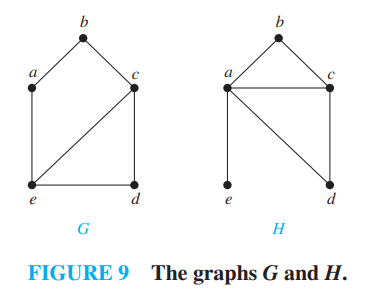

**解** $ G $ 和 $ H $ 都具有5个顶点6条边 . 不过 , $ H $ 有1个度为1的顶点 $ e $ , 而 $ G $ 没有度为1的顶点 . 所以 $ G $ 与 $ H $ 不是同构的 . 

>   顶点数、边数以及顶点的度都是在同构下的不变量 . 若两个简单图的这些量有任何不同 , 则这两个图就不是同构的 . 不过 , 当这些不变量都相同时 , 也不一定意味着两个图是同构的 . 目前还没有已知的用来判定简单图是否同构的不变量集 . 

#### 例10 判定图10所示的图是否是同构的 . 

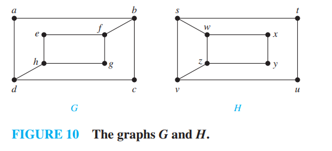

**解** 图 $ G $ 和 $ H $ 都具有8个顶点和10条边 . 它们都具有4个度为2的顶点和4个度为3的顶点 . 因为这些不变量都相同 , 所以它们可能会是同构的 . 

然而 $ G $ 和 $ H $ 不是同构的 . 注意因为在 $ G $ 中 $ \deg(a)=2 $ , 所以 $ a $ 必然对应于 $ H $ 中的 $ t $、$ u $、$ x $ 或 $ y $ , 因为这些顶点是 $ H $ 中的度为2的顶点 . 然而 , $ H $ 中的这4个顶点的每一个都与 $ H $ 中另一个度为2的顶点相邻 , 但是在 $ G $ 中 $ a $ 却不是这样的 . 

看出 $ G $ 与 $ H $ 不同构的另一种方式是 , 注意 , 若这两个图同构 , 则由度为3的顶点和连接它们的边所组成的 $ G $ 和 $ H $ 的子图一定是同构的 . 然而图11所示的这些子图却不是同构的 . 

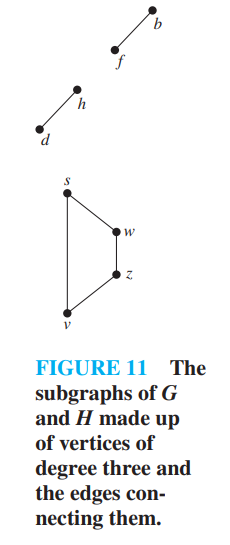

#### 例11 判定图12所示的图 $ G $ 和 $ H $ 是否是同构的 . 

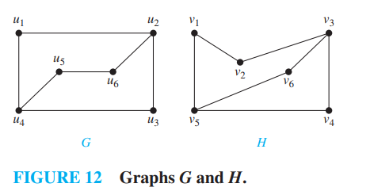

为了说明从图 $ G $ 的顶点集到图 $ H $ 的顶点集的函数 $ f $ 是一个同构 , 需要说明 $ f $ 保持边的存在和缺失关系 . 一种有助于这样做的方式是利用邻接矩阵 . 具体地说 , 为了说明 $ f $ 是一个同构 , 可以说明 $ G $ 的邻接矩阵与 $ H $ 的邻接矩阵相同 , 其中 $ G $ 的邻接矩阵的行和列的标记都是 $ G $ 的顶点 , $ H $ 的邻接矩阵的行和列的标记都是 $ G $ 的对应顶点在 $ f $ 下的像 . 

下面解释如何这样做 . 

**解** $ G $ 和 $ H $ 都有6个顶点和7条边 , 都有4个度为2的顶点和2个度为3的顶点 . 还容易看出由度为2的顶点和连接它们的边所组成的 $ G $ 和 $ H $ 的子图(这是由这些度为2的顶点的边的闭包所组成的 )是同构的 , 因为每个子图都是由两个顶点连接两条边的环 . 

现在定义函数 $ f $ , 然后判定它是否为同构 . 因为 $ \deg(u_1)=2 $ 且 $ u_1 $ 不与任何其他度为2的顶点相邻 , 所以 $ u_1 $ 的像必然是 $ v_4 $ , 因为 $ v_4 $ 是 $ H $ 中仅有的不与度为2的顶点相邻的度为2的顶点 . 任取 $ f(u_1)=v_4 $ . 如果发现这个选择不合适的话 , 就接着试验 $ f(u_1)=v_6 $ . 因为 $ u_1 $ 与 $ u_2 $ 相邻 , 所以 $ u_2 $ 的像必然是与 $ v_4 $ 相邻的顶点 , 所以令 $ f(u_2)=v_3 $ 和 $ f(u_3)=v_6 $ . 以这样继续下去 , 现在已有了相关顶点的相 , 所以令 $ f(u_4)=v_5 $ , $ f(u_5)=v_1 $ , $ f(u_6)=v_2 $ . 用现有的 $ G $ 的顶点集与 $ H $ 的顶点集之间的一一对应 , 即 $ f(u_1)=v_4 $ , $ f(u_2)=v_3 $ , $ f(u_3)=v_6 $ , $ f(u_4)=v_5 $ , 以及 $ f(u_6)=v_2 $ , 为了查看 $ f $ 是否保持边 , 就检查 $ G $ 的邻接矩阵 : 

$$
\boldsymbol{A}_G=
\begin{pmatrix}
0 & 1 & 0 & 0 & 0 & 1 \\
1 & 0 & 1 & 0 & 0 & 0 \\
0 & 1 & 0 & 1 & 0 & 0 \\
0 & 0 & 1 & 0 & 1 & 0 \\
0 & 0 & 0 & 1 & 0 & 1 \\
1 & 0 & 0 & 0 & 1 & 0
\end{pmatrix}
$$
和 $ H $ 的邻接矩阵 , 其中用 $ G $ 中对应顶点的像来标记行和列 : 

$$
\boldsymbol{A}_H=
\begin{pmatrix}
0 & 1 & 0 & 1 & 0 & 0 \\
1 & 0 & 1 & 0 & 0 & 0 \\
0 & 1 & 0 & 0 & 1 & 0 \\
1 & 0 & 0 & 0 & 0 & 1 \\
0 & 0 & 1 & 0 & 0 & 1 \\
0 & 0 & 0 & 1 & 1 & 0
\end{pmatrix}
$$
因为 $ \boldsymbol{A}_G = \boldsymbol{A}_H $ , 所以 $ f $ 是保持边的 . 由此得出 $ f $ 是同构 , 所以 $ G $ 与 $ H $ 是同构的 . 

>   注意 , 这个方法不能得出两个图不同构的结论 , 因为它只验证了一些情况 , 更多的情况没有验证到 .

---

>   [!NOTE]
>
>   ### 图同构算法
>   已知的最好的判定两个图是否同构的算法具有指数的最坏情形时间复杂度(对图的顶点数来说) . 然而 , 2017年年初 , László Babai宣布 , 他找到了一种用$2^{f(n)}$时间来确定两个具有$n$个顶点的图是否同构的算法 , 其中$f(n)$是$O((\log n)^3)$ . Babai的这一发现还没有得到充分的同行评审 , 但能够缩小他在2015年发明的那种算法存在的严重差距 . 专家认为他现在的结果是正确的 . 
>
>   尽管目前还没有找到解决这个问题的多项式时间算法 , 但可以通过线性平均情形时间复杂度的算法进行求解 . 
>
>
>   一种名为`NAUTY`的算法是用于<u>测试图同构的最佳实用算法</u> , 在现代个人计算机上可在1秒内判定具有100个顶点的两个图是否是同构的 . 可以在因特网上下载NAUTY软件并用它做实验 . 对于有严格限制的图 , 如顶点的最大度很小 , 存在着判断两个图是否同构的实用算法 . 判断任意两个图是否同构的问题是一个特别有趣的问题 , 因为这是少有的几个不知是理论可行的或NP完全的NP问题之一 . 
>

## 6.4 Connectivity

### 6.4.2 Paths

这里仅列出**通路 Path** 需要注意的一些要点 综合有向图和无向图 :

-   是$n$条边$e_1,\dots,e_n$的序列 , 对应顶点序列$x_0=u,x_1,\dots,x_n=v$($e_i$以$x_{i-1}$和$x_i$为端点)
-   只要不会造成歧义 都可以只用顶点表示 , 使用边表示不会造成歧义 , 有多重边的时候需要额外考虑
-   点=终点($u=v$)且长度$>0$的通路是**回路**
-   不重复包含相同边的通路/回路 , 则称他们是 **简单的** ;
-   单个顶点组成的回路的长度为 0 .

---

-   如果图中的任意两个点都存在简单路径 那么这个图就是**连通**的
-   **连通分支**就是指连通图的极大连通子图 不连通的图的其中一个极大连通子图; "极大"的形式化定义是 不是任何一个连通子图的真子集 ; 例如在[Figure 3]中 它的连通分支就是 $H_1 , H_2 , H_3$

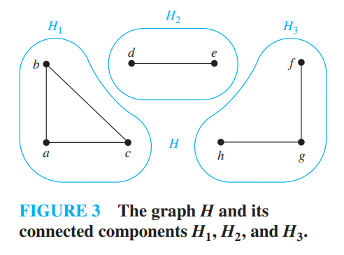

### 6.4.3 Connectedness in Undirected Graphs

[已和`Path`部分合并]

### 6.4.4 How Connected is a Graph

-   如果删除图中的一个顶点 就产生更多的连通分支 这样的顶点就是**割点 cut vertices**或者是 **关节点 articulation points**
-   如果删除图中的一条边 就产生更多的连通分支 这条边就称为 **割边 cut edge** 或者 **桥 bridge** .
-   **点连通性** : 并不是所有的图都有割点 . 例如 , 完全图$ K_n $(其中$ n \geq 3 $)就没有割点 : 当从$ K_n $中删除一个顶点及其相关联的边时 , 得到的子图是一个连通的完全图$ K_{n-1} $ . 
-   不含割点的连通图称为**不可分割图** , 它比有割点的连通图具有更好的连通性 . 

我们可以扩展这个概念 : 基于"使一个图不连通需要删除的最小的顶点数" , 定义一个与图的连通性相关的<u>更精细化的,颗粒度更高的(granulated)</u>方法 . 

>   [!IMPORTANT]
>
>   若$ G-V^{'} $是不连通的 , 则称$ G=(V, E) $的顶点集$ V $的子集$ V' $是点割集 , 或分割集 . 
>
>   **点割集 vertex cut** 或 **分割集 separating set** 是顶点集$V$的子集 , 记为$V^{'}$ , 使得$ G-V^{'}$是不连通图 .
>
>   一个图的点割集通常可以有很多个 .
>
>   例如 , 在图1中 , 集合$\{b, c, e\}$是一个含有3个顶点的点割集 . 
>
>   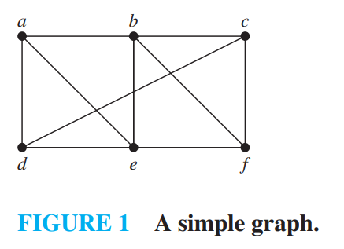
>
>   除了完全图以外 , 每一个连通图都有至少一个点割集 .
>

>   [!IMPORTANT]
>
>   ### 点连通度
>
>   我们定义非完全图的**点连通度**为点割集中最小的顶点数 , 记作$\kappa(G)$ . 
>
>   -   对于一个完全图$K_n$ , 由于它没有点割集 , 我们定义它为 $\kappa(K_n)=n-1$ .
>   -   显然 , 若$ G $含有$ n $个顶点 , 则$ 0 \leq \kappa(G) \leq n-1 $ , $\kappa(G)=0$当且仅当$ G $是不连通的或$ G=K_1 $ .
>   -    $\kappa(G)=n-1$当且仅当$ G $是完全图 .
>
>   最后书中才给出 点连通度 $\kappa(G)$ 的通用定义 : 对于每一个图$ G $ , $\kappa(G)$是使$ G $变成不连通的图或只含有一个顶点的图所需删除的最小的顶点数 . 
>
>   -   显然 , $\kappa(G)$越大 , 我们认为$ G $的连通性越好 .
>   -   若$\kappa(G) \geq k$ , 我们称图为$ k $连通的(或$ k $顶点-连通的) .
>       -   若图是连通的且不是只含1个顶点的图 , 则称该图是1连通的
>       -   若图是不可分割的 , 即不含有割点 , 且至少含有3个顶点 , 则称该图为2连通的或双连通的 .
>       -   注意若$ G $是一个$ k $连通图 , 则对所有的$ j $ , $ 0 \leq j \leq k $ , $ G $是一个$ j $连通图 . 

>   [!IMPORTANT]
>
>   ### 边连通度
>   类似的 , 我们可以通过 " 把连通图$ G=(V, E) $变成不连通所需删除的最小边数 "  , 来度量连通图$ G $的连通性 : 
>   - 若$ G $含有割边 , 删除该割边即可使$ G $不连通；
>   - 若$ G $不含割边 , 则寻找**边割集**(删除边集$ E' $后$ G-E' $不连通 , 称$ E' $为$ G $的边割集) , 取其中边数最小的那个 . 
>
>
>   图$ G $的**边连通度**(记作$ \lambda(G) $) , 是图$ G $边割集中的最小边数 . 
>   - 该定义适用于顶点数大于1的所有连通图(删除某顶点的所有关联边 , 可使图不连通)；
>   - 若$ G $不连通 , 或$ G $仅含1个顶点 , 则定义$ \lambda(G)=0 $ . 
>
>
>   对于含$ n $个顶点的图$ G $ , 有$ 0 \leq \lambda(G) \leq n-1 $ : 
>   - $ \lambda(G)=n-1 \iff G=K_n $(完全图)；
>   - 若$ G $不是完全图 , 则$ \lambda(G) \leq n-2 $ . 
>

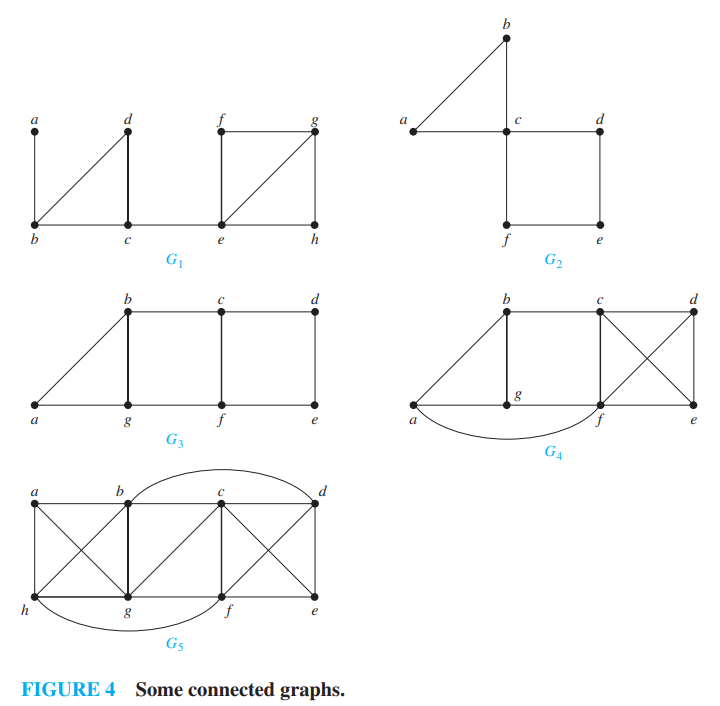

#### 例8 求Figure4中各图的点连通度$\kappa(G)$
- $ \kappa(G_1) = 1 $(含1个割点)
- $ \kappa(G_2) = 1 $(含1个割点)
- $ \kappa(G_3) = 2 $(无割点 , 最小点割集含2个顶点)
- $ \kappa(G_4) = 2 $(无割点 , 最小点割集含2个顶点)
- $ \kappa(G_5) = 3 $(最小点割集含3个顶点)

#### 例9 求Figure4中各图的边连通度$\lambda(G)$
- $ \lambda(G_1) = 1 $(含1条割边)
- $ \lambda(G_2) = 2 $(无割边 , 最小边割集含2条边)
- $ \lambda(G_3) = 2 $(无割边 , 最小边割集含2条边)
- $ \lambda(G_4) = 3 $(最小边割集含3条边)
- $ \lambda(G_5) = 3 $(最小边割集含3条边)

#### 点连通度与边连通度的不等式
当$ G=(V,E) $是**至少含3个顶点的非完全连通图**时 , 图$ G $中顶点的最小度是点连通度和边连通度的上界 , 即 : 
$$
\kappa(G) \leq \min_{v \in V}\deg(v),\quad \lambda(G) \leq \min_{v \in V}\deg(v)
$$

- 原理 : 删除最小度顶点的所有邻居"可使$ G $不连通(对应点连通度)；删除"以最小度顶点为端点的所有边"可使$ G $不连通(对应边连通度) . 

进一步 , 对**连通的非完全图** , 有 : 
$$
\kappa(G) \leq \lambda(G) \leq \min_{v \in V}\deg(v)
$$

- 特殊情况 : 
  - 完全图$ K_n $ : $ \kappa(K_n) = \lambda(K_n) = \min_{v \in V}\deg(v) = n-1 $；
  - 不连通图 : $ \kappa(G) = \lambda(G) = 0 $ . 

#### 点连通度与边连通度的应用
图的连通性常用于**网络可靠性建模** , 核心对应关系 : 
1. **数据网络(顶点=路由器 , 边=链路)** : 
   - 点连通度 : 使网络瘫痪的最少路由器故障数(故障数少于此 , 仍能数据传输)；
   - 边连通度 : 使网络瘫痪的最少链路故障数(故障数少于此 , 仍能数据传输) . 

2. **高速公路网(顶点=交叉点 , 边=公路)** : 
   - 点连通度 : 使任意交叉点无法通行的最少交叉点关闭数(关闭数少于此 , 仍能通行)；
   - 边连通度 : 使公路网瘫痪的最少公路关闭数(关闭数少于此 , 仍能通行) . 
   - 应用 : 辅助公路维修计划设计(避免过度关闭影响通行) . 

### 6.4.5 Connectedness in Directed Graphs

>   [!IMPORTANT]
>
>   -   对于有向图中任意的两个顶点$a$和$b$ , 都存在从$a$到$b$的通路也存在从$b$到$a$的通路 , 那么这个图就是强连通的 .
>   -   对于有向图中任意的两个顶点$a$和$b$ , 都存在通路 , 则这个图是弱连通的 .
>       -   弱连通的图 可以存在两个点 $a$不能到 $b$ , $b$不能到$a$ , 然后忽略方向的话它们可以连通
>
>   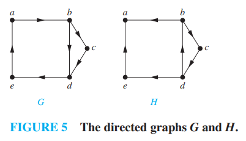
>
>   图中$G$是强连通的 $H$是弱连通的 ; $G$ 当然也是弱连通的 .

>   [!IMPORTANT]
>
>   ### 有向图的强连通分支
>
>   图$G$的子图是强连通的 而且不包含在更大的强连通子图中 ; 等价的说法 : <u>极大连通子图</u> <u>强连通分支</u> <u>强分支</u> 
>
>   [Figure 5](#image-20251222132713198) 中就包含三个强连通分支 1. 顶点$a$ 2. 顶点$e$ 3. 顶点$b,c,d$和边$(b,c),(c,d),(d,b)$组成的子图 

### 6.4.6 Paths and Isomorphism

[pass]

### 6. 4.7 Counting Paths Between Vertices

>   [!IMPORTANT]
>
>   设 $ G $ 是一个图 , 该图的邻接矩阵 $ A $ 相对于图中的顶点顺序 $ v_1, v_2, \dots, v_n $(  允许带有无向或有向边、带有多重边和环)   . 从 $ v_i $ 到 $ v_j $ 长度为 $ r $ 的不同通路的数目等于 $ A^r $ 的第 $ (i,j) $ 项 , 其中 $ r $ 是正整数 . 
>
>   ---
>
>   证明 用数学归纳法证明 . 
>
>   -   可以想象 $r=1$ 时 , 标记为$1$的位置表明两顶点之间有一条边 , 因此两点之间长度为 $1$ 的路径仅有一条 .
>   -   令 $r=2$ , 将两个矩阵相乘 , 得到的新矩阵中 , 每一个位置是上一层$1 \times 1$的相加 (因为有`0`的位置不贡献) .
>   -   依次类推 ... 
>
>   ---
>
>   [书中的详细证明]
>
>   设G是带有邻接矩阵$\mathbf{A}$的图(假设G的顶点具有顺序$v_1, v_2, \dots, v_n$) . 从$v_i$到$v_j$长度为1的通路数是$\mathbf{A}$的第$(i,j)$项 , 因为该项是从$v_i$到$v_j$的边数 . 
>
>   假设$\mathbf{A}^r$的第$(i,j)$项是从$v_i$到$v_j$长度为$r$的不同通路的个数 . 这是归纳假设 . 因为$\mathbf{A}^{r+1} = \mathbf{A}^r\mathbf{A}$ , 所以$\mathbf{A}^{r+1}$的第$(i,j)$项等于
>   $$
>   b_{i1}a_{1j} + b_{i2}a_{2j} + \dots + b_{in}a_{nj}
>   $$
>   其中$b_{ik}$是$\mathbf{A}^r$的第$(i,k)$项 . 根据归纳假设 , $b_{ik}$是从$v_i$到$v_k$长度为$r$的通路数 . 
>
>   从$v_i$到$v_j$长度为$r+1$的通路 , 包括从$v_i$到某个中间顶点$v_k$长度为$r$的通路以及从$v_k$到$v_j$的边 . 根据计数的乘积法则 , 这样的通路个数是从$v_i$到$v_k$长度为$r$的通路数(即$b_{ik}$)与从$v_k$到$v_j$的边数(即$a_{kj}$)的积 . 当对所有可能的中间顶点$v_k$求这些乘积之和时 , 根据计数的求和法则 , 就可以得出所需要的结果 . 

>   [!NOTE]
>
>   在图8中的**简单图 simple graph**G中 , 从a到d的长度为4的路径有多少条？
>
>   解答 :   将顶点按a, b, c, d排序后 , G的邻接矩阵为
>   $$
>   \mathbf{A} = \begin{bmatrix}
>   0 & 1 & 1 & 0 \\
>   1 & 0 & 0 & 1 \\
>   1 & 0 & 0 & 1 \\
>   0 & 1 & 1 & 0
>   \end{bmatrix}
>   $$
>   因此 , 从a到d的长度为4的路径数是$\mathbf{A}^4$的(1,4)元 . 因为
>   $$
>   \mathbf{A}^4 = \begin{bmatrix}
>   8 & 0 & 0 & 8 \\
>   0 & 8 & 8 & 0 \\
>   0 & 8 & 8 & 0 \\
>   8 & 0 & 0 & 8
>   \end{bmatrix}
>   $$
>   发现确实有 8 条这样的路径 .

## 6.5 Euler and Hamilton Paths

### 6.5.2 Euler Paths and Circuits

>   [!IMPORTANT]
>
>   在图G中 , **欧拉回路 Euler Circuit**是包含G中每一条边的简单回路 . **欧拉通路 Euler Path**是包含G中每一条边的简单路径 . 显然 , 前者更强 , 有欧拉回路一定有欧拉通路 .
>
>   >   简单 : 不包含重复的边
>
>   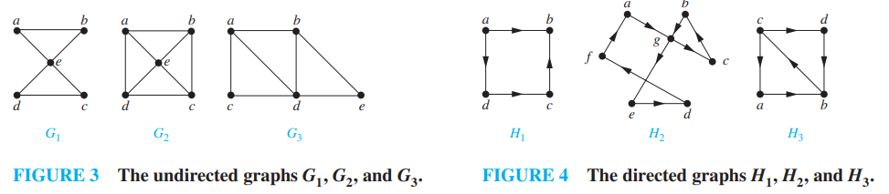
>
>   $G_1 , H_2$ 具有欧拉回路 , 其他没有欧拉回路 ; $G_3 , H_3$ 具有欧拉通路 ; $G_2 , H_1$ 没有欧拉通路 . 

#### 欧拉回路和欧拉通路的充要条件

-   如果一个图有欧拉回路 , 那么其中的每一个点的度都应该是偶数 , 记作$\forall a \in V , 2 | deg(a)$ , 因为回路上的点必然是一进一出(循环的) . 

-   通过构造我们发现 这个性质也是充分的 . 因此有

-   >   [!IMPORTANT]
    >
    >   含有至少两个顶点的连通多重图**具有欧拉回路** $\Leftrightarrow$ 每个顶点的度都是偶数
    
-   使用这个条件可以在最坏时间复杂度$O(m)$内找到欧拉回路 , 其中 $m$是 边数 .

-   Another algorithm for constructing Euler circuits, called **Fleury’s algorithm** (弗勒里算法) [见书本练习50]

欧拉通路才是我们熟悉的一笔画问题 欧拉回路更苛刻一些 约束更多 也显得更简明 . 下面我们来考虑**欧拉通路** .

>   [!IMPORTANT]
>
>   连通多重图**具有欧拉通路但没有欧拉回路** $\Leftrightarrow$ 有且仅有两个顶点度数为奇数
>
>   -   可以想象 如果一个连通多重图有欧拉回路但没有欧拉通路 , 起点和终点记为$a$和$b$ , 那么只要连上$(a,b) $它就具有欧拉回路 , 现在没有这条边 , 那么有且仅有这两个点的度数为奇数 .
>
>   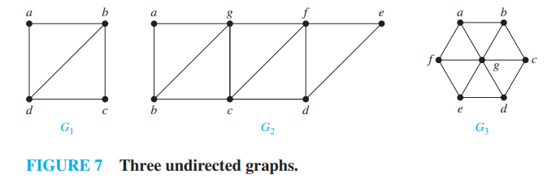
>
>   $G_1 , G_2$ 都具有欧拉通路 , $G_3$中有6个奇数度顶点 , 不具有欧拉通路 .

**这个问题有一些有用的应用 这里省略**

### 6.5.3 Hamilton Paths and Circuit

**每个顶点恰好经过一次的通路和回路对应的就是哈密顿通路和哈密顿回路** .

-   对于哈密顿通路和哈密顿回路, 目前还没有找到简明的充分必要条件. 

-   事实上, 判断一个图是否含有哈密顿通路或回路是著名的 **NP完全问题**. 

下面我们仅介绍一些哈密顿回路的充分性条件 .

书中主要介绍了以下两个定理:

> [!IMPORTANT]
>
> **Dirac's Theorem (狄拉克定理)**
>
> 如果 $G$ 是一个有 $n$ 个顶点的简单图, 其中 $n \ge 3$, 并且 $G$ 中每个顶点的度数都至少为 $n/2$, 也就是 $\forall v \in V, \deg(v) \ge n/2$, 那么 $G$ 具有哈密顿回路.

> [!IMPORTANT]
>
> **Ore's Theorem (欧尔定理)**
>
> 如果 $G$ 是一个有 $n$ 个顶点的简单图, 其中 $n \ge 3$, 并且对于 $G$ 中每一对**不相邻**的顶点 $u$ 和 $v$, 都有 $\deg(u) + \deg(v) \ge n$, 那么 $G$ 具有哈密顿回路.

注意: `Dirac` 定理是 `Ore` 定理的特例 (如果所有点度数都 $\ge n/2$, 那么任意两点度数之和肯定 $\ge n$). 这两个定理给出的都只是充分条件, 也就是说, 即使不满足这些条件, 图也**可能**存在哈密顿回路.

### 6.5.4 Applications of Hamilton Circuits

[pass] Hint : TSP旅行商问题

## 6.6 Shortest-Path Problems

本节主要介绍了:

-   用于解决单源最短路径的**Dijkstra 迪杰斯特拉算法** 书中详细介绍了 但是此处我们讲省略 **数据结构** 部分
-   TSP旅行商问题 它可以化归成哈密顿回路问题 你肯定可以注意到它和最短路径问题之间的区别
    -   **计算复杂性**: TSP 是一个著名的 **NP-hard** 问题. 这意味着目前没有已知的多项式时间算法可以解决它. 随着城市数量 $n$ 的增加, 寻找精确最优解的计算量呈指数级增长 (例如暴力搜索是 $O(n!)$, 动态规划是 $O(n^2 2^n)$).
    -   **近似算法**: 由于求精确解非常困难, 实际应用中通常寻求**近似解**.
        -   对于满足**三角不等式**的 TSP (Metric TSP), 简单的基于最小生成树 (MST) 的算法可以保证解不超过最优解的 2 倍; **Christofides 算法** 可以保证解不超过最优解的 1.5 倍.
        -   在工程实践中, 常用启发式算法 (如模拟退火、遗传算法) 或局部搜索算法 (如 Lin-Kernighan), 它们能在合理时间内找到非常接近最优的解.
        -   目前最先进的算法(你需要考虑到成书时间 书中的数据可能落后了) 可以在几分钟的计算机时间内完成1000个顶点的TSP问题 并保证误差小于`2%` .

## 6.7 Planar Graphs

[平面图]

### 6.7.1 Introduction

>   [!IMPORTANT]
>
>   如果一个图可以画在平面上且没有任何边相交(  边的相交是指表示边的直线或弧线在除它们公共端点之外的某一点处交汇)   ,  则称该图为**平面图 planar** . 
>
>   这样的画法被称为该图的**平面表示 planar representation** .  
>
>   一个图即使通常画法存在相交 ,  也可能是平面图 ,  因为或许可以通过另一种方式将其画出而不产生相交 . 
>
>   ---
>
>   有了例子很容易理解 左图看上去都不是平面图 但是右图证明了它们其实是平面图 :
>
>   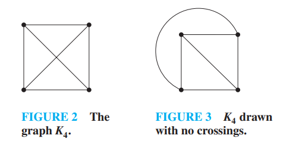
>
>   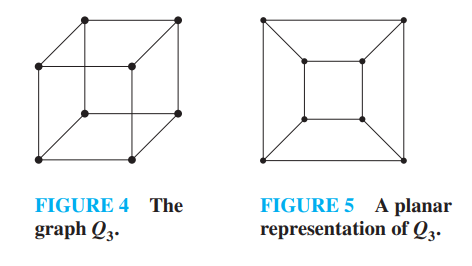

证明一个图是非平面图通常很难 下面的过程证明了$K_{3,3}$是一个非平面图 

> 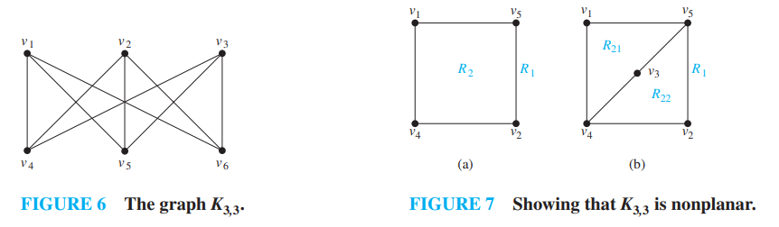
>
> 在 $K_{3,3}$ 的任何平面表示中 ,  顶点 $v_1$ 和 $v_2$ 都必须同时与 $v_4$ 和 $v_5$ 连接 . 这四条边所形成的封闭曲线把平面分割成两个区域 $R_1$ 和 $R_2$ ,  如图 7a 所示 . 顶点 $v_3$ 属于 $R_1$ 或 $R_2$ . 当 $v_3$ 属于闭曲线的内部 $R_2$ 时 ,  在 $v_3$ 和 $v_4$ 之间以及在 $v_3$ 和 $v_5$ 之间的边 ,  把 $R_2$ 分割成两个子区域 $R_{21}$ 和 $R_{22}$ ,  如图 7b 所示 . 
>
> 下一步 ,  已经没有办法不交叉地放置最后一个顶点 $v_6$ . 因为若 $v_6$ 属于 $R_1$ ,  则不能不交叉地画出 $v_6$ 和 $v_3$ 之间的边 . 若 $v_6$ 属于 $R_{21}$ ,  则不能不交叉地画出 $v_2$ 和 $v_6$ 之间的边 . 若 $v_6$ 属于 $R_{22}$ ,  则不能不交叉地画出 $v_1$ 和 $v_6$ 之间的边 . 
>
> 当 $v_3$ 属于 $R_1$ 时 ,  可以使用类似的论证 . 所以 $K_{3,3}$ 是非平面图 . 

平面图的应用有 : 电路板走线设计 , 城市公路网设计 .

### 6.7.2 Euler’s Formula

> 当我们确定一个图 **连通** 且 **平面** 且 **简单(没有多重边)** 之后 可以使用欧拉定理 . 之后我们可以得出一些推论 , 有了这些推论 , 通常是不等式形式的 , 我们可以做下面的事情 :
>
> -   如果一个连通简单图不满足这些推论 那么它一定不是平面图
> -   使用欧拉定理前要先确保图是平面图 而这又不一定很简单 所以最最一般的情况下 欧拉定理的用途就是利用推论否定一个图不是平面图

一个图的平面表示把平面分割成一些**面 region**, 包括一个无界的面. 

例如, 图 8 所示的图的平面表示把平面分割成 6 个面并加以标记. 

欧拉证明并总结了下面的公式 :

>   [!IMPORTANT]
>
>   **欧拉公式** 设 $G$ 是带 $e$ 条边和 $v$ 个顶点的连通平面简单图. 设 $r$ 是 $G$ 的平面图表示中的面数. 则有
>   $$
>   r=e-v+2
>   $$
>   或者表述成
>   $$
>   2 = F + V - E ,  F \, for \, faces
>   $$
>   这个公式表明 对于任何 **连通平面简单图** 只要边数$e$和顶点数$v$确定了 , 面数$r$也就唯一确定了 . 
>
>   ---
>
>   欧拉公式有很多证明 书中给出的方法是归纳法 :
>
>   -   对任何一个图 (我们假设它的边数$n \geq 1$) 我们逐步选取边 直到把所有的边都加进去 过程中我们可以用归纳法证明 这些子图都是满足的
>       -   当然 因为是连通图 我们选边的时候总要保证至少有一个端点是在已有图中的 也就是保证连通性
>   -   [Figure 9] 当仅有一条边的时候 有两个端点 和一个无穷大的面 , 满足 $ 1 = 1 - 2 + 2$ .
>   -   [Figure 10]假设 已经加入 $k$ 条边 现在考虑 $k+1$ 条边的情况 : 可以发现无论是情况$(a)$还是情况$(b)$ , 欧拉公式均成立 .
>   -   $Q.E.D.$
>
>   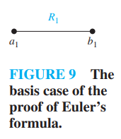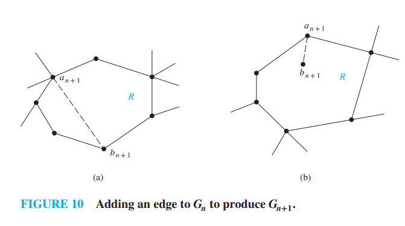

#### 推论1

若$  G $ 是具有 $  e $ 条边和 $  v $ 个顶点的连通平面简单图 ,  且$  v \geq 3 $  ,  则
$$
e \leq 3v - 6
$$

>   [!NOTE]
>
>   ##### 证明(涉及到<u>面的度</u>)
>
>   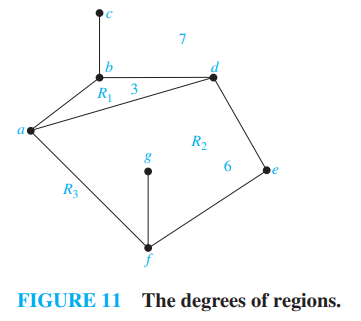
>
>   图中标明了各个面的度 下面中也体现 值得注意的是在计算 $deg(R_2)$时 $(g,f)$ 被计算了两次 , 计算外界面的时候 $(c,b)$ 也被计算了两次 .
>
>   1.   在平面中 , <u>连通平面简单图</u>把平面分割成若干个面 ,  记为 $  r $ 个面 .  
>
>   2.   每个面的度至少为3 .  也就是说每个面至少有三条边围成(<u>面的度</u>的定义) , 包括无界面的度也为$3$ . (这点由简单图约束得到 存在多重边的情况会更复杂)
>
>   3.   各面的度之和恰好是图中边数的两倍 ,  因为每条边都在面的边界上出现两次 (可能在两个不同面中 ,  或者两次都在相同面中)
>   4.   因为每个面的度都大于或等于3 ,  所以有
>
>   $$
>   2e = \sum_{all \, faces \, : R} \deg(R) \geq 3r
>   $$
>   因此 ,  
>   $$
>   \frac{2}{3} e \geq r
>   $$
>
>   利用$  r = e - v + 2 $ (  欧拉公式)   ,  就得到
>   $$
>   e - v + 2 \leq \frac{2}{3}e
>   $$
>   整理得 $  e \leq 3v - 6 $  .  
>
>   ---
>
>   可以利用这个推论证明 $K_5$ 不是平面图 . $K_{3,3}$不是平面图(前面证明过)却满足推论1 , 但是不满足推论3(见后).

#### 推论2
若$  G $ 是连通平面简单图 ,  则$  G $ 中存在度数不超过5的顶点 .  

>   [!NOTE]
>
>   ##### 证明
>
>   -   如果$  G $ 有1个或2个顶点 ,  则结果为真 .  
>   -   如果$  G $ 至少有3个顶点 ,  则根据推论1知道$  e \leq 3v - 6 $  ,  所以$  2e \leq 6v - 12 $  . 
>   -   假如每个顶点的度数至少是6 ,  则由于$  2e = \sum_{v \in V} \deg(v) $ (握手定理) ,  所以就有$  2e \geq 6v $  . 
>   -   但是这与$  2e \leq 6v - 12 $ 相矛盾 . 
>   -   所以必定存在度数不超过5的顶点 .

#### 推论3

若连通平面简单图有 $e$  条边和 $v$  个顶点 , $v \geq 3 $  并且没有长度为3的回路 ,   则 $e \leq 2v - 4$  . 

该推论的证明类似于推论1的证明 ,  不同之处在于 ,  在这种情形下 ,  没有长度为3的回路意味着面的度必然至少为4 . 

这和高中数学中 数列放缩时 多保留前面几项的思路一致 . 

### 6.7.3 Kuratowski’s Theorem

[库拉图斯基定理] 表述如下 :

>   [!IMPORTANT]
>
>   一个图是非平面图 当且仅当 它包含一个同胚于$K_5$或$K_{3,3}$的子图 .

---

-   我们已经看到$   K_{3,3} $ 和$   K_5 $ 都不是平面图 . 显然 , 若一个图包含这两个图之一作为子图 , 则它不是平面图 .
-   另外 , 所有非平面图必然包含一个从 $ K_{3,3}$ 或$K_5$ 利用某些允许的操作来获得的子图 . 
-   [这两个说法个人感觉对理解这个定理没什么帮助 都是书上的说法 证明起来比较复杂 也没有必要 "了解一下"]

---

-   若一个图是平面图 ,   则通过删除一条边$ \{u, v\}$  并且添加一个新顶点 $ w $ 和两条边$  \{u, w\}$  与$ \{w, v\}$  获得的任何图也是平面图 .  这样的操作称为**初等细分** .   若可以从相同的图通过一系列初等细分来获得图$   G_1=(V_1, E_1) $  和图$   G_2=(V_2, E_2) $   ,   则称它们是**同胚**的 . 例如下面的三个图都是同胚的 :

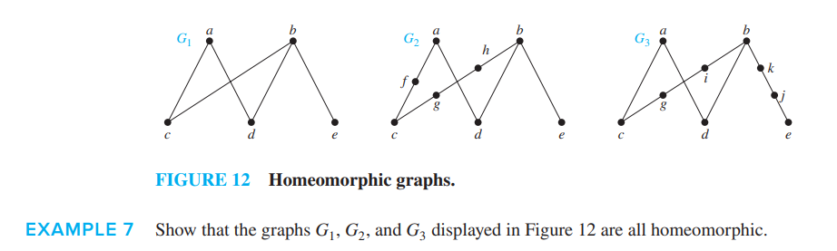

---

下面的图都是非平面图 体现了定理的用法

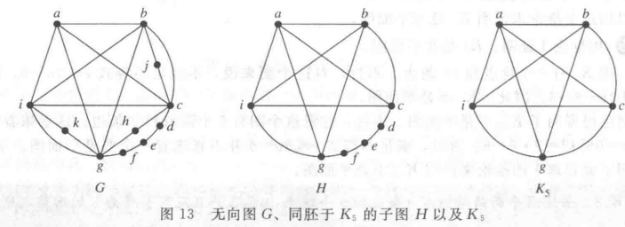

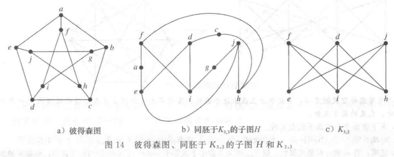

## 6.8 Graph Coloring

[让人想到小学奥数中的一些题目 ] [笑 :)]

### 6.8.1 Introduction

最经典的表述还是来自于地图中的<u>四色问题</u> . 地图和我们之前讨论的图是对偶图的关系 , 从地图到图模型的过程是 : 每一块都表示为顶点 把相邻的块对应的点用边连起来 . 下面是一些示例 [Figure 1]的对偶图如[Figure 2]中所示 :

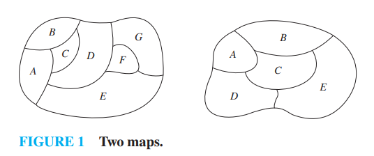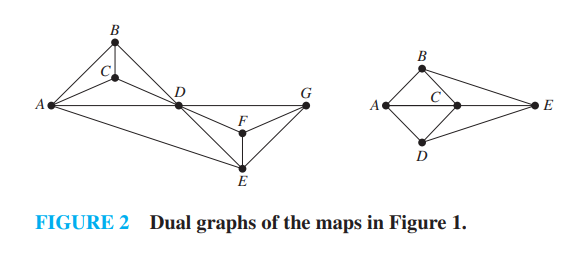

>   [!IMPORTANT]
>
>   #### 定义1
>
>   简单图的着色是对该图的每个<u>顶点</u>都指定一种颜色 , 使得没有两个相邻的顶点颜色相同 .
>
>
>   #### 定义2
>
>   图的着色数是着色这个图所需要的最少颜色数 . 图$G$的着色数记作$\chi(G)$ .

#### 四色定理

>   [!IMPORTANT]
>
>   平面图的着色书不超过 4 . 
>
>   -   本来打算省略的 但是主要地图转换过来的图一定是平面图 实际上非平面图可以有任意大的着色数
>
>   ---
>
>   [以下来自ai 还有一些问题其实]
>
>   #### 早期的证明思路
>
>   1.  **肯普的思路(1879年)  **
>       这个证明有错 但是核心思路是对的 .
>   2.  **后续的人工推进**
>       之后的研究者 , 把问题进一步细化 :   
>       -   找到平面图的**不可避免集** 这个不可避免集应该这样理解 :
>           -   自然数中的数要么是奇数 要么是偶数 , 那么$\{ \text{奇数},\text{偶数}\}$ 就是自然数的不可避免集 .
>       -   同时证明不可避免集中的结构都是"可约的" : 也就是如果一个平面图包含这种结构 , 那么只要比它小的平面图可以4染色 , 它也可以4染色
>       -   这个思路的目标是 : 找到一个完整的、由可约结构组成的不可避免集 , 就可以证明四色定理
>
>   #### 最终的计算机证明思路(1976年)  
>
>   1976年 ,   阿佩尔和哈肯完成了四色定理的证明 ,   这个证明借助了计算机的帮助 ,   思路是对之前人工思路的完成 :   
>
>   1.  **找到不可避免集** :   他们通过计算机 ,   找到了一个包含1936种(之后被简化到1476种) 可约结构的不可避免集 , 证明了任何平面图 ,  必然包含这1936种结构中的一种
>   2.  **验证可约性** : 然后使用计算机 , 逐一验证这1936种结构都是可约的
>   3.  基于这两点 , 结合数学归纳法 , 就证明了四色定理
>
>   #### 后续
>   在1976年的证明之后 ,   有研究者简化了这个证明 :   
>   -   把不可避免集的结构数量 , 从1936种减少到了633种
>   -   同时优化了计算机验证的过程 ,   让证明的可靠性和简洁性都有所提升
>

已知最好的求图的着色数的算法(对图的顶点数来说)具有指数的最坏情形时间复杂度。即使求图的着色数的近似值也是很难的。

已经证明，假如存在具有多项式最坏情形时间复杂度的可以达到2倍地近似图的着色数的算法(即构造出一个不超过图的着色数的两倍的界限)，那么也存在具有多项式最坏情形时间复杂度的求图的着色数的算法。

### 6.8.2 Applications of Graph Colorings

染色的应用有很多 除了地图染色以外 还有 <u>安排课程</u> <u>频率分配</u> 等等 , 总之是用来解决一些冲突的 .
