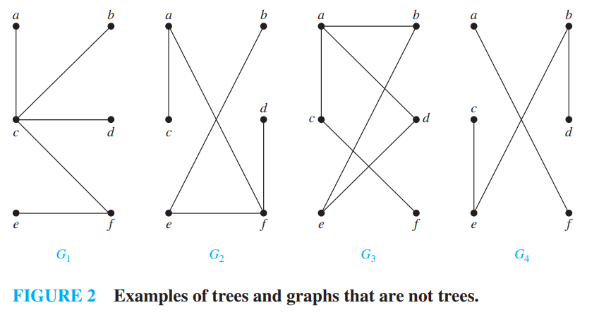
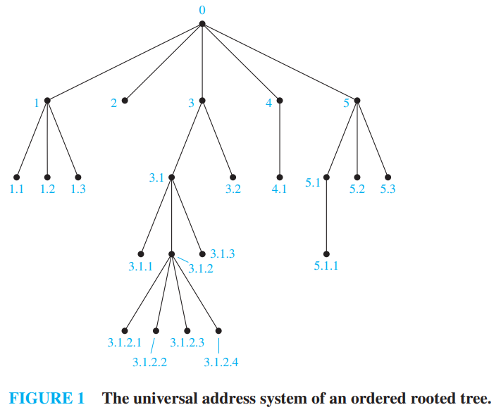

[本科教学版第7章] [英文完整版第11章]

这一段和数据结构重合得更多了 读起来也比较通畅 建议直接看原文 .

# chap7-Trees

## 7.1 Introduction to Trees

-   树是没有简单回路连通无向图 (<u>这一点的定义和数据结构中有些不同 它是无向的</u>)
-   一个无向图是树 当且仅当它在没对顶点之间存在唯一的简单路径

$G_1,G_2$是树 , $G_3,G_4$不是树

-   如果仅仅是不连通的(在上面的基础上改动这一点) 就是森林

### 7.1.1 有根树

-   有根树实际上是一个有向图 方向是原理根的方向 

### 7.1.3 性质和计算

-   内点 就是非叶节点 形式化定义是 **至少有一个子节点的节点**

- 带有 $n$ 个顶点的树含有 $n-1$ 条边。

- 设一棵树有 $i$ 个内点，且每个内点都有 $m$ 个儿子，则顶点数 $n = mi + 1$。

- 一个满 $m$ 叉树若有
  (i) $n$ 个顶点，则有 $i = (n-1)/m$ 个内点和 $l = [(m-1)n+1]/m$ 个树叶；
  (ii) $i$ 个内点，则有 $n = mi + 1$ 个顶点和 $l = (m-1)i + 1$ 个树叶；
  (iii) $l$ 个树叶，则有 $n = (ml-1)/(m-1)$ 个顶点和 $i = (l-1)/(m-1)$ 个内点。

- 在高度为 $h$ 的 $m$ 叉树中至多有 $m^h$ 个树叶。

- 若一棵高度为 $h$ 的 $m$ 叉树的所有树叶都在 $h$ 层或 $h-1$ 层，则此树是平衡的，则 $h = \lceil \log_m l \rceil$，其中 $l$ 是树叶数，$\lceil x \rceil$ 表示不小于 $x$ 的最小整数。

## 7.2 Applications of Trees

[pass]

## 7.3 Tree Traversal

### 7.3.2 Universal Address Systems

下图展示了树的**通用地址系统** .

---

[pass]
